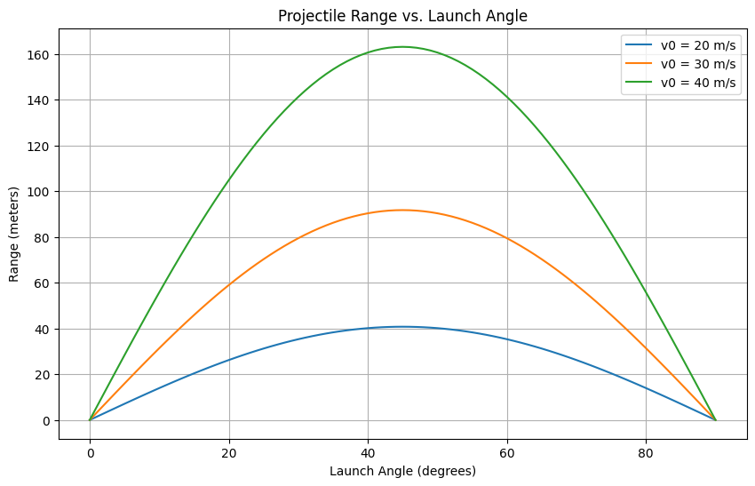

# 1. Theoretical Foundation: Equations of Motion

Projectile motion can be understood by decomposing it into horizontal and vertical components. Assuming no air resistance and that the projectile is launched from ground level, the motion is governed by the following kinematic equations:

## Horizontal Motion

**Velocity:**

$$ v_x = v_0 \cdot \cos(\theta) $$

**Displacement:**

$$ x(t) = v_0 \cdot \cos(\theta) \cdot t $$

## Vertical Motion

**Velocity:**

$$ v_y = v_0 \cdot \sin(\theta) - g \cdot t $$

**Displacement:**

$$ y(t) = v_0 \cdot \sin(\theta) \cdot t - \frac{1}{2} g \cdot t^2 $$

Here:

- $v_0$ is the initial launch speed.
- $\theta$ is the angle of projection.
- $g$ is the acceleration due to gravity (approximately 9.8 m/s²).
- $t$ is the time elapsed.

The time of flight $T$ can be found by setting $y(T) = 0$:

$$ 0 = v_0 \cdot \sin(\theta) \cdot T - \frac{1}{2} g \cdot T^2 $$

Solving for $T$:

$$ T = \frac{2 v_0 \cdot \sin(\theta)}{g} $$

The range $R$, which is the horizontal distance traveled, is then:

$$ R = x(T) = v_0 \cdot \cos(\theta) \cdot T = \frac{v_0^2 \cdot \sin(2\theta)}{g} $$

This equation shows that the range depends on both the initial speed and the angle of projection.


# 2. Analysis of the Range

The horizontal range $R$ of a projectile is influenced by several factors, including the angle of projection $\theta$, the initial velocity $v_0$, and the acceleration due to gravity $g$. Let's analyze how each of these parameters affects the range.

## 1. Dependence on the Angle of Projection

The range equation for a projectile launched from ground level is:

$$ R = \frac{v_0^2 \sin(2\theta)}{g} $$

This equation indicates that the range depends on $\sin(2\theta)$:

- **Maximum Range:** The function $\sin(2\theta)$ reaches its maximum value of 1 when $2\theta = 90^\circ$, or $\theta = 45^\circ$. Therefore, the projectile achieves its maximum range when launched at a 45-degree angle.
- **Symmetric Angles:** Angles equidistant from 45 degrees (e.g., 30° and 60°) yield the same range because $\sin(60^\circ) = \sin(120^\circ)$. However, the trajectories differ; a lower angle results in a flatter trajectory with shorter flight time, while a higher angle produces a steeper trajectory with longer flight time.

## 2. Influence of Initial Velocity

The initial velocity $v_0$ has a quadratic effect on the range:

- **Direct Relationship:** Since $R \propto v_0^2$, doubling the initial velocity quadruples the range. This quadratic relationship underscores the significant impact of initial speed on how far the projectile travels.

## 3. Effect of Gravitational Acceleration

Gravity $g$ inversely affects the range:

- **Inverse Relationship:** An increase in gravitational acceleration results in a decrease in range. For instance, on the Moon, where gravity is weaker than on Earth, a projectile would travel farther than it would with the same initial conditions on Earth.


# 3. Practical Applications

Projectile motion models, while foundational in physics, often assume ideal conditions such as uniform terrain and negligible air resistance. However, real-world scenarios frequently involve complexities like uneven terrain and aerodynamic forces. Adapting the basic projectile motion model to account for these factors enhances its applicability across various fields.

## 1. Basic Projectile Motion (Neglecting Air Resistance)

**Time of Flight (T):**

$$ T = \frac{2 v_0 \sin(\theta)}{g} $$

**Maximum Height (H):**

$$ H = \frac{(v_0 \sin(\theta))^2}{2g} $$

**Horizontal Range (R):**

$$ R = \frac{v_0^2 \sin(2\theta)}{g} $$

The range is maximized when $\theta = 45^\circ$.

Where:
- $v_0$ = initial velocity
- $\theta$ = launch angle
- $g$ = acceleration due to gravity

## 2. Uneven Terrain

When launching from a height $y_0$, the range equation adjusts to:

$$ R = \frac{v_0 \cos(\theta)}{g} \left( v_0 \sin(\theta) + \sqrt{(v_0 \sin(\theta))^2 + 2 g y_0} \right) $$

## 3. Air Resistance

Accounting for air resistance complicates the equations, often requiring numerical methods for precise solutions. However, for small projectiles at high speeds, the range $R$ can be approximated by:

$$ R \approx \frac{v_0 v_t}{g} $$

Where $v_t$ is the terminal velocity.

# 4. Implementation

```python
import numpy as np
import matplotlib.pyplot as plt

# Constants
g = 9.81  # Acceleration due to gravity (m/s²)

# Function to calculate the range of a projectile
def calculate_range(v0, theta):
    theta_rad = np.radians(theta)
    range = (v0**2) * np.sin(2 * theta_rad) / g
    return range

# Function to plot range vs. launch angle for different initial velocities
def plot_range_vs_angle(initial_velocities, angles):
    plt.figure(figsize=(10, 6))
    for v in initial_velocities:
        ranges = [calculate_range(v, angle) for angle in angles]
        plt.plot(angles, ranges, label=f'v0 = {v} m/s')
    plt.title('Projectile Range vs. Launch Angle')
    plt.xlabel('Launch Angle (degrees)')
    plt.ylabel('Range (meters)')
    plt.legend()
    plt.grid(True)
    plt.show()

# Function to simulate and plot projectile motion
def plot_trajectory(v0, theta):
    theta_rad = np.radians(theta)
    t_flight = 2 * v0 * np.sin(theta_rad) / g
    t = np.linspace(0, t_flight, num=500)
    x = v0 * np.cos(theta_rad) * t
    y = v0 * np.sin(theta_rad) * t - 0.5 * g * t**2
    plt.plot(x, y, label=f'v0 = {v0} m/s, θ = {theta}°')

# Main execution
if __name__ == "__main__":
    # Parameters
    initial_velocities = [20, 30, 40]  # Different initial velocities in m/s
    angles = np.linspace(0, 90, num=91)  # Angles from 0 to 90 degrees

    # Plot range vs. launch angle for different initial velocities
    plot_range_vs_angle(initial_velocities, angles)

    # Plot trajectories for different initial conditions
    plt.figure(figsize=(10, 6))
    for v0 in initial_velocities:
        for theta in [30, 45, 60]:  # Example angles
            plot_trajectory(v0, theta)
    plt.title('Projectile Motion Trajectories')
    plt.xlabel('Horizontal Distance (meters)')
    plt.ylabel('Vertical Distance (meters)')
    plt.legend()
    plt.grid(True)
    plt.show()
```





# Explanation:


## Constants and Functions

- **Gravitational Acceleration**: The constant $g$ represents gravitational acceleration, typically defined as $9.8 \, \text{m/s}^2$.  
  
- **calculate_range**: Computes the horizontal range $R$ for a given initial velocity $v_0$ and launch angle $\theta$. The standard formula is:  
  $$ R = \frac{v_0^2 \sin(2\theta)}{g} $$

- **plot_range_vs_angle**: Generates a plot of range $R$ versus launch angle $\theta$ for a list of initial velocities $v_0$. This visualizes how $R$ peaks at $\theta = 45^\circ$ and varies with $v_0$.

- **plot_trajectory**: Simulates and plots the projectile’s trajectory ($x-y$ path) for given initial conditions. The parametric equations are:  
  $$ x(t) = v_0 \cos(\theta) \cdot t $$  
  $$ y(t) = v_0 \sin(\theta) \cdot t - \frac{1}{2} g t^2 $$

## Main Execution

The simulation follows these steps:

1. **Input Definition**: 
   - A list of initial velocities $v_0$ is defined (e.g., [$10, 20, 30$] m/s).
   - A range of launch angles $\theta$ is specified (e.g., $0^\circ$ to $90^\circ$ in increments).

2. **Range Visualization**: 
   - The plot_range_vs_angle function is called to plot $R$ versus $\theta$ for each $v_0$. This shows the maximum range at $\theta = 45^\circ$ and the quadratic effect of $v_0$.

3. **Trajectory Visualization**: 
   - The plot_trajectory function plots trajectories for combinations of the specified $v_0$ values and example angles: $30^\circ$, $45^\circ$, and $60^\circ$. This illustrates differences in height, range, and flight time.
