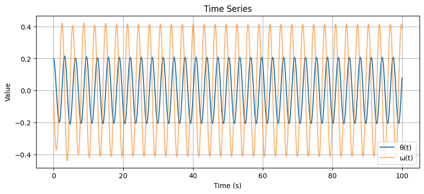

### **1. Differential Equation for Forced Damped Pendulum**

The general form of the equation of motion for a forced damped pendulum is:

$$
\theta''(t) + \gamma \theta'(t) + \omega_0^2 \sin(\theta(t)) = A \cos(\omega t)
$$

Where:
- \(\theta(t)\) is the angular displacement of the pendulum as a function of time.
- \(\gamma\) is the damping coefficient (measuring the rate of energy dissipation).
- \(\omega_0\) is the natural frequency of the pendulum (without damping or external driving force).
- \(A\) is the amplitude of the external driving force.
- \(\omega\) is the driving frequency of the external force.

### **2. Small-Angle Approximation**

For small oscillations where \(\theta(t)\) is small (usually in radians), we can make the approximation:

$$
\sin(\theta(t)) \approx \theta(t)
$$

This leads to the simplified linear equation:

$$
\theta''(t) + \gamma \theta'(t) + \omega_0^2 \theta(t) = A \cos(\omega t)
$$

This is a second-order linear ordinary differential equation with constant coefficients, which is much easier to solve.

### **3. Solution for the Undamped, Unforced Case (Free Pendulum)**

For the case when there is no damping (\(\gamma = 0\)) and no external driving force (\(A = 0\)), the equation simplifies to:

$$
\theta''(t) + \omega_0^2 \theta(t) = 0
$$

This is a simple harmonic oscillator, and its solution is:

$$
\theta(t) = \theta_0 \cos(\omega_0 t + \phi)
$$

Where:
- \(\theta_0\) is the initial amplitude.
- \(\phi\) is the phase constant determined by initial conditions.

### **4. Solution for the Damped, Unforced Case (Damped Pendulum)**

When we add damping but no external forcing (i.e., \(A = 0\)), the equation becomes:

$$
\theta''(t) + \gamma \theta'(t) + \omega_0^2 \theta(t) = 0
$$

The solution to this equation depends on the value of the damping coefficient \(\gamma\). It can be categorized as:

- **Underdamped **(\(\gamma^2 < 4 \omega_0^2\))**: The pendulum oscillates with exponentially decaying amplitude.
- **Critically damped (\(\gamma^2 = 4 \omega_0^2\))**: The pendulum returns to equilibrium as quickly as possible without oscillating.
- **Overdamped (\(\gamma^2 > 4 \omega_0^2\))**: The pendulum returns to equilibrium without oscillating, but slower than in the critically damped case.

The solution for the underdamped case is:

$$
\theta(t) = \theta_0 e^{-\gamma t / 2} \cos(\omega_d t + \phi)
$$

Where:
- \(\omega_d = \sqrt{\omega_0^2 - \left(\frac{\gamma}{2}\right)^2}\) is the damped frequency.
- \(\theta_0\) and \(\phi\) are determined by initial conditions.
- The exponential term \(e^{-\gamma t / 2}\) represents the decaying amplitude.

### **5. Forced, Undamped Case (Driven Pendulum)**

When there is no damping (\(\gamma = 0\)), but there is an external driving force, the equation becomes:

$$
\theta''(t) + \omega_0^2 \theta(t) = A \cos(\omega t)
$$

The solution to this equation is:

$$
\theta(t) = \frac{A}{\sqrt{(\omega_0^2 - \omega^2)^2 + (\gamma \omega)^2}} \cos(\omega t - \delta)
$$

Where:
- \(\delta = \tan^{-1}\left(\frac{\gamma \omega}{\omega_0^2 - \omega^2}\right)\) is the phase shift.
- \(A\) is the driving amplitude.
- \(\omega\) is the driving frequency.
- \(\omega_0\) is the natural frequency of the pendulum.

### **6. Forced and Damped Case (Complete System)**

For the complete system with both damping and external driving force, the general solution is given by the combination of the transient and steady-state solutions:

$$
\theta(t) = \theta_{\text{transient}}(t) + \theta_{\text{steady}}(t)
$$

- The **transient** part of the solution represents the initial conditions and will decay over time due to damping.
- The **steady-state** part of the solution represents the long-term behavior of the system, which oscillates with a constant amplitude at the driving frequency.

For steady-state oscillations, the solution is:

$$
\theta(t) = \frac{A}{\sqrt{(\omega_0^2 - \omega^2)^2 + (\gamma \omega)^2}} \cos(\omega t - \delta)
$$

This shows how the system responds to the periodic driving force in the long run.

### **7. Energy Considerations**

The total mechanical energy \(E(t)\) of the system is the sum of the kinetic energy and the potential energy:

$$
E(t) = \frac{1}{2} m l^2 \left( \theta'(t)^2 + \omega_0^2 \theta(t)^2 \right)
$$

Where:
- \(m\) is the mass of the pendulum.
- \(l\) is the length of the pendulum.
- \(\theta'(t)\) is the angular velocity.
- \(\theta(t)\) is the angular displacement.

For the forced damped pendulum, the energy fluctuates due to the energy supplied by the external driving force and the energy dissipated by damping. At resonance (\(\omega = \omega_0\)), the energy absorption is maximized.

### **8. Resonance and Frequency Response**

In resonance, the system oscillates with maximum amplitude. The resonance condition occurs when the driving frequency \(\omega\) equals the natural frequency \(\omega_0\). In this case, the amplitude of the oscillations grows, which can be expressed as:

$$
\theta_{\text{max}} = \frac{A}{\gamma \omega_0}
$$

This shows that resonance can lead to large oscillations, especially if the damping is small. If the damping is large, the resonance effect is reduced.

### **Summary of Key Formulas**

- **Undamped, Free Pendulum (Simple Harmonic Motion)**:  
  $$
  \theta(t) = \theta_0 \cos(\omega_0 t + \phi)
  $$
  
- **Damped, Free Pendulum**:  
  $$
  \theta(t) = \theta_0 e^{-\gamma t / 2} \cos(\omega_d t + \phi)
  $$

- **Forced, Damped Pendulum**:  
  $$
  \theta(t) = \frac{A}{\sqrt{(\omega_0^2 - \omega^2)^2 + (\gamma \omega)^2}} \cos(\omega t - \delta)
  $$

- **Energy**:  
  $$
  E(t) = \frac{1}{2} m l^2 \left( \theta'(t)^2 + \omega_0^2 \theta(t)^2 \right)
  $$

- **Maximum Amplitude at Resonance**:  
  $$
  \theta_{\text{max}} = \frac{A}{\gamma \omega_0}
  $$


We'll use numerical methods to solve the differential equation for the forced damped pendulum. The script will use the `solve_ivp` function from SciPy to solve the system, and visualize the results with Matplotlib.

### Python Script for Simulating the Forced Damped Pendulum:

```python
import numpy as np
import matplotlib.pyplot as plt
from scipy.integrate import solve_ivp

# Parameters
gamma = 0.2  # Damping coefficient (can adjust for underdamped, overdamped cases)
omega_0 = 2  # Natural frequency (rad/s)
A = 1        # Amplitude of the driving force
omega = 1.8  # Frequency of the driving force (change to test resonance behavior)
t_span = (0, 100)  # Time span for the simulation
initial_conditions = [0.5, 0]  # Initial conditions: [theta(0), theta'(0)]

# Differential equation for the forced damped pendulum
def forced_damped_pendulum(t, y):
    theta, theta_dot = y
    dtheta_dt = theta_dot
    dtheta_dot_dt = -gamma * theta_dot - omega_0**2 * np.sin(theta) + A * np.cos(omega * t)
    return [dtheta_dt, dtheta_dot_dt]

# Solve the differential equation using Runge-Kutta method (via solve_ivp)
solution = solve_ivp(forced_damped_pendulum, t_span, initial_conditions, t_eval=np.linspace(0, 100, 10000))

# Extract solution
t = solution.t
theta = solution.y[0]
theta_dot = solution.y[1]

# Plotting the solution: Angular displacement vs. Time
plt.figure(figsize=(10, 6))
plt.plot(t, theta)
plt.title('Forced Damped Pendulum Motion')
plt.xlabel('Time (s)')
plt.ylabel('Angular Displacement (rad)')
plt.grid(True)
plt.show()

# Plotting the Phase Portrait: theta vs. theta'
plt.figure(figsize=(8, 6))
plt.plot(theta, theta_dot)
plt.title('Phase Portrait of the Forced Damped Pendulum')
plt.xlabel('Theta (rad)')
plt.ylabel('Theta\' (rad/s)')
plt.grid(True)
plt.show()

# Frequency Response: The steady-state amplitude vs driving frequency (if needed)
# This could involve running simulations for different values of omega and plotting the resulting amplitude.
def compute_amplitude(omega_values):
    amplitudes = []
    for omega_val in omega_values:
        # Update the global omega
        global omega
        omega = omega_val
        solution = solve_ivp(forced_damped_pendulum, t_span, initial_conditions, t_eval=np.linspace(0, 100, 10000))
        amplitudes.append(np.max(np.abs(solution.y[0])))  # Maximum amplitude observed in the solution
    return amplitudes

omega_values = np.linspace(0.5, 2.5, 100)  # Driving frequency range
amplitudes = compute_amplitude(omega_values)

# Plot Frequency Response
plt.figure(figsize=(10, 6))
plt.plot(omega_values, amplitudes)
plt.title('Frequency Response of the Forced Damped Pendulum')
plt.xlabel('Driving Frequency (omega)')
plt.ylabel('Maximum Amplitude (rad)')
plt.grid(True)
plt.show()
```



### **Explanation of the Python Code**:

1. **Parameters**:
   - **gamma**: Damping coefficient, controlling the rate at which energy is dissipated from the system.
   - **omega_0**: Natural frequency of the pendulum.
   - **A**: Amplitude of the driving force.
   - **omega**: Driving frequency of the external force.
   - **initial_conditions**: The initial angular displacement (\(\theta(0)\)) and angular velocity (\(\theta'(0)\)).

2. **Forced Damped Pendulum Differential Equation**:
   The function `forced_damped_pendulum(t, y)` represents the system of ordinary differential equations:
   $$
   \theta''(t) + \gamma \theta'(t) + \omega_0^2 \sin(\theta(t)) = A \cos(\omega t)
   $$
   We return the derivatives of \(\theta(t)\) and \(\theta'(t)\) in this function for numerical integration.


