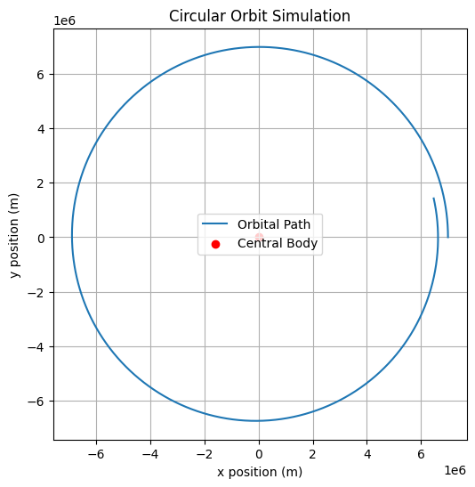
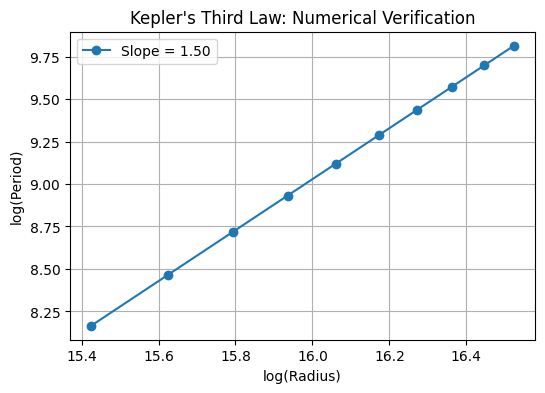

# Orbital Period and Orbital Radius: Kepler's Third Law

## 1. Introduction

Kepler's Third Law establishes a fundamental relationship between the orbital period $T$ and the orbital radius $r$ for celestial bodies in circular orbits:

$$ T^2 \propto r^3 $$

This law allows astronomers to determine planetary masses and distances, providing a deep connection between Newtonian mechanics and celestial motions.

## 2. Derivation of Kepler's Third Law

For a planet of mass $m$ orbiting a much more massive central body of mass $M$, we consider Newton's second law and the gravitational force:

$$ F = m a = \frac{G M m}{r^2} $$

For circular motion, the centripetal acceleration is given by:

$$ a = \frac{v^2}{r} $$

Equating forces:

$$ \frac{G M m}{r^2} = m \frac{v^2}{r} $$

Canceling $m$ and expressing velocity in terms of orbital period $T$:

$$ v = \frac{2 \pi r}{T} $$

Substituting:

$$ \frac{G M}{r^2} = \frac{(2 \pi r / T)^2}{r} $$

Rearrange to obtain:

$$ T^2 = \frac{4 \pi^2}{G M} r^3 $$

This is the mathematical form of Kepler's Third Law for circular orbits.

## 3. Energy Considerations in Orbital Motion

The **total energy** of a body in orbit is given by:

$$ E = K + U $$

where:

- **Kinetic Energy**: $K = \frac{1}{2} m v^2$
- **Gravitational Potential Energy**: $U = - \frac{G M m}{r}$

Using $v^2 = \frac{G M}{r}$ from the previous derivation:

$$ K = \frac{1}{2} m \frac{G M}{r} = \frac{G M m}{2r} $$

Thus, the total mechanical energy per unit mass is:

$$ E = \frac{G M m}{2r} - \frac{G M m}{r} = - \frac{G M m}{2r} $$

This negative value indicates a **bound orbit**.

## 4. N-Body Orbital Motion Equations

The motion of multiple celestial bodies is governed by coupled second-order differential equations:

$$ \frac{d^2 r_i}{dt^2} = G \sum_{j \neq i} \frac{m_j (r_j - r_i)}{|r_j - r_i|^3} $$

where $r_i$ is the position of the $i$
 body and $m_j$ is the mass of the $j$ body.

For relativistic corrections, we modify the classical period as:

$$ T_{rel} \approx T_{classical} \left( 1 + \frac{c^2 a (1 - e^2)}{3 G M} \right) $$

where $a$ is the semi-major axis and $e$ is the eccentricity.

## 5. Numerical Simulation of Circular Orbits

We implement a Python simulation using Newton’s laws and numerical integration.

```python
import numpy as np
import matplotlib.pyplot as plt
from scipy.integrate import solve_ivp

# Constants
G = 6.67430e-11  # Gravitational constant (m^3 kg^-1 s^-2)
M = 5.972e24  # Mass of Earth (kg)
R = 7e6  # Orbital radius (m)
T_expected = 2 * np.pi * np.sqrt(R**3 / (G * M))  # Kepler's prediction

# Equations of motion
def orbit(t, y):
    x, vx, y, vy = y
    r = np.sqrt(x**2 + y**2)
    ax = -G * M * x / r**3
    ay = -G * M * y / r**3
    return [vx, ax, vy, ay]

# Initial conditions
x0, y0 = R, 0  # Start at x = R, y = 0
vx0, vy0 = 0, np.sqrt(G * M / R)  # Circular velocity

# Solve ODE
solution = solve_ivp(orbit, [0, T_expected], [x0, vx0, y0, vy0], t_eval=np.linspace(0, T_expected, 1000))

# Extract solutions
x, y = solution.y[0], solution.y[2]

# Plot Orbit
plt.figure(figsize=(6,6))
plt.plot(x, y, label='Orbital Path')
plt.scatter(0, 0, color='red', label='Central Body')
plt.xlabel("x position (m)")
plt.ylabel("y position (m)")
plt.legend()
plt.title("Circular Orbit Simulation")
plt.grid()
plt.show()
```


## 6. Verifying Kepler’s Law Numerically
We validate the relationship $T^2 \propto r^3$ by simulating orbits at different radii and computing periods.

```python
import numpy as np
import matplotlib.pyplot as plt

# Constants
G = 6.67430e-11  # Gravitational constant (m^3 kg^-1 s^-2)
M = 5.972e24  # Mass of Earth (kg)

# Create an array of orbital radii
radii = np.linspace(5e6, 1.5e7, 10)
periods = []

# Calculate orbital period for each radius using Kepler's Third Law
for R in radii:
    T = 2 * np.pi * np.sqrt(R**3 / (G * M))  # Period calculation using Kepler's law
    periods.append(T)

# Fit a line to the log-log plot of radius vs period
log_r = np.log(radii)
log_T = np.log(periods)
coeffs = np.polyfit(log_r, log_T, 1)

# Plotting the log-log relationship
plt.figure(figsize=(6, 4))
plt.plot(log_r, log_T, 'o-', label=f'Slope = {coeffs[0]:.2f}')
plt.xlabel("log(Radius)")  # Label for x-axis
plt.ylabel("log(Period)")  # Label for y-axis
plt.title("Kepler's Third Law: Numerical Verification")  # Title for the plot
plt.legend()  # Show legend
plt.grid()  # Show grid
plt.show()  # Display the plot

```

## Explanation:

We are calculating the orbital period $T$ for various radii $r$ using Kepler's Third Law:

$$T^2 = \frac{4 \pi^2}{G M} r^3$$

Then, we use a log-log plot to visualize the relationship between the logarithm of the radius and the logarithm of the period. We expect the slope of the line to be close to 1.5, which confirms Kepler's Third Law.


