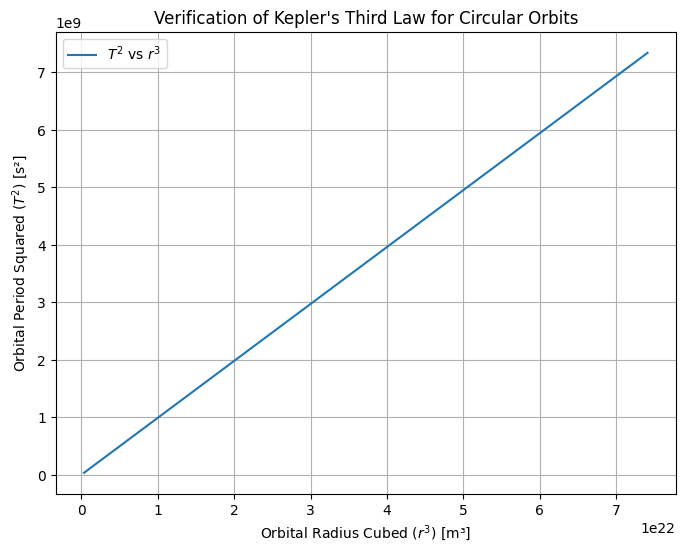
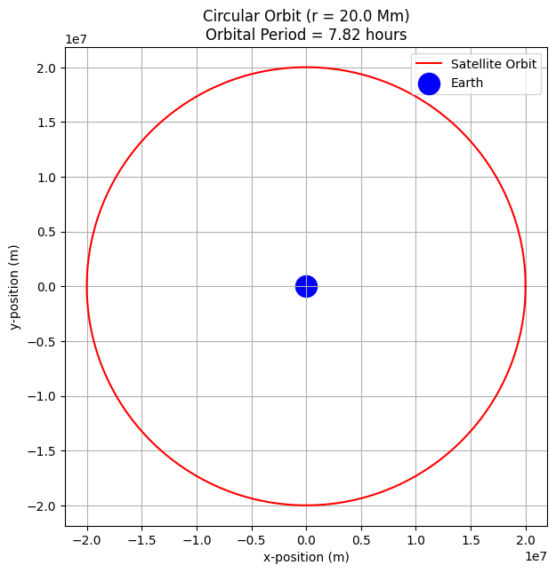
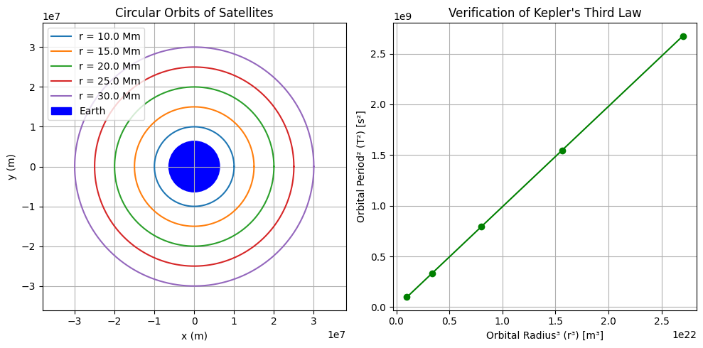

# 1. Derivation of Kepler’s Third Law for Circular Orbits

We begin with two key physical laws:

## 1. Newton's Law of Universal Gravitation

$$ F_{\text{gravity}} = \frac{G M m}{r^2} $$

Where:
- $G$ is the gravitational constant,
- $M$ is the mass of the central body (e.g., planet or star),
- $m$ is the mass of the orbiting body,
- $r$ is the orbital radius.

## 2. Centripetal Force for Circular Motion

$$ F_{\text{centripetal}} = \frac{m v^2}{r} $$

For a circular orbit, the gravitational force provides the necessary centripetal force, so:

$$ \frac{G M m}{r^2} = \frac{m v^2}{r} $$

Cancel $m$ (assuming $m \neq 0$) and rearrange:

$$ v^2 = \frac{G M}{r} $$

## Relating Orbital Velocity to Orbital Period

Now, relate orbital velocity $v$ to the orbital period $T$:

$$ v = \frac{2 \pi r}{T} $$

Square both sides:

$$ v^2 = \left( \frac{2 \pi r}{T} \right)^2 = \frac{4 \pi^2 r^2}{T^2} $$

Substitute into the previous equation:

$$ \frac{4 \pi^2 r^2}{T^2} = \frac{G M}{r} $$

Multiply both sides by $T^2$ and rearrange:

$$ 4 \pi^2 r^3 = G M T^2 $$

Finally, solve for $T^2$:

$$ T^2 = \frac{4 \pi^2}{G M} r^3 $$

## Final Form (Kepler’s Third Law for Circular Orbits)

$$ T^2 \propto r^3 $$

This shows that the square of the orbital period is proportional to the cube of the orbital radius, which is exactly Kepler’s Third Law—now derived from Newtonian mechanics.


# 2. Implications of Kepler’s Third Law in Astronomy

The relationship:

$$ T^2 = \frac{4 \pi^2}{G M} r^3 $$

connects the orbital period $T$ and the radius $r$ of a body orbiting a much larger mass $M$. This has profound applications in astronomy:

## 1. Calculating the Mass of Celestial Bodies

Rearranging the formula:

$$ M = \frac{4 \pi^2 r^3}{G T^2} $$

This allows astronomers to determine the mass of stars or planets by observing:
- The orbital period $T$ of a satellite or planet,
- The orbital radius $r$.

**Example**: Measuring a moon’s orbit around a planet reveals the planet’s mass.

## 2. Determining Orbital Distances

If the mass $M$ of the central object is known, and the period $T$ is measured:

$$ r^3 = \frac{G M T^2}{4 \pi^2} $$

This is used to:
- Determine planetary distances from stars,
- Locate satellites’ positions in Earth’s orbit,
- Plan space missions (e.g., calculating transfer orbits).

## 3. Understanding Planetary Systems

- Comparing planets within a solar system shows that those farther out orbit more slowly.
- Confirming Kepler’s law across many systems supports the universal nature of gravity.

## 4. Applications in Space Missions and Satellites

- Engineers use this law to place satellites into stable orbits at precise altitudes (e.g., GPS satellites).
- It’s crucial in designing interplanetary missions, where timing and distance must be exact.


# 3. Examples and Applications of Kepler’s Third Law

## Example 1: The Moon’s Orbit Around Earth

**Observed Orbital Period**:  
$T_{\text{Moon}} \approx 27.3$ days = $2.36 \times 10^6$ seconds

**Orbital Radius**:  
$r \approx 3.84 \times 10^8$ meters

Using Kepler’s Third Law:

$$ M_{\text{Earth}} = \frac{4 \pi^2 r^3}{G T^2} $$

Plug in values:  
- $r = 3.84 \times 10^8 \, \text{m}$  
- $T = 2.36 \times 10^6 \, \text{s}$  
- $G = 6.67430 \times 10^{-11} \, \text{m}^3 \text{kg}^{-1} \text{s}^{-2}$ (gravitational constant)

This yields:  
$$ M_{\text{Earth}} \approx 5.97 \times 10^{24} \, \text{kg} $$

This matches the known mass of Earth, confirming the accuracy of the law.

## Example 2: Planets Orbiting the Sun

| Planet  | Orbital Radius (AU) | Orbital Period (years) | $T^2$ | $r^3$ |
|---------|---------------------|------------------------|-------|-------|
| Earth   | 1.00                | 1.00                  | 1.00  | 1.00  |
| Mars    | 1.52                | 1.88                  | 3.53  | 3.51  |
| Jupiter | 5.20                | 11.86                 | 140.7 | 140.6 |

**Result**:  
$T^2 \approx r^3$ for all planets, validating Kepler’s Third Law across the Solar System.

## Application in Space Missions

NASA and ESA use these calculations to:
- Place satellites in orbit.
- Time planetary flybys (e.g., Voyager, Juno).
- Determine exoplanet distances and host star masses using orbital data.


# 4. Python Implementation: Simulating Circular Orbits

This simulation will:

- Simulate circular orbits for different radii.

- Compute orbital periods numerically.

- Compare with Kepler’s Third Law:  

  $$ T^2 \propto r^3 $$


```python
import numpy as np
import matplotlib.pyplot as plt

# Constants
G = 6.67430e-11  # gravitational constant (m^3 kg^-1 s^-2)
M = 5.972e24     # mass of central body (Earth) in kg

# Radii for orbits (in meters)
radii = np.linspace(7e6, 4.2e7, 100)  # from low Earth orbit to geostationary

# Calculate periods for each radius using Kepler's Third Law
# T = 2π * sqrt(r^3 / GM)
periods = 2 * np.pi * np.sqrt(radii**3 / (G * M))

# Plotting T^2 vs r^3 to verify linearity
T_squared = periods**2
r_cubed = radii**3

plt.figure(figsize=(8, 6))
plt.plot(r_cubed, T_squared, label=r"$T^2$ vs $r^3$")
plt.xlabel("Orbital Radius Cubed ($r^3$) [m³]")
plt.ylabel("Orbital Period Squared ($T^2$) [s²]")
plt.title("Verification of Kepler's Third Law for Circular Orbits")
plt.grid(True)
plt.legend()
plt.show()
```




# 5.Static Visualization of Circular Orbit + Period


This simulation will:

- Shows a full circular orbit for one satellite around Earth.

- Displays Earth as a blue dot and the satellite path in red.

- Includes the orbital period in the title for clarity.

```python
import numpy as np
import matplotlib.pyplot as plt

# Constants
G = 6.67430e-11  # gravitational constant (m^3 kg^-1 s^-2)
M = 5.972e24     # mass of Earth (kg)
r = 2.0e7        # orbital radius (m)

# Orbital period using Kepler's Third Law
T = 2 * np.pi * np.sqrt(r**3 / (G * M))  # seconds

# Time array for one full orbit
t = np.linspace(0, T, 1000)

# Calculate position coordinates
x = r * np.cos(2 * np.pi * t / T)
y = r * np.sin(2 * np.pi * t / T)

# Plotting the orbit
plt.figure(figsize=(7, 7))
plt.plot(x, y, label="Satellite Orbit", color='red')
plt.scatter(0, 0, color='blue', s=300, label="Earth")
plt.title(f"Circular Orbit (r = {r/1e6:.1f} Mm)\nOrbital Period = {T/3600:.2f} hours")
plt.xlabel("x-position (m)")
plt.ylabel("y-position (m)")
plt.axis('equal')
plt.grid(True)
plt.legend()
plt.show()
```




# 6. Multiple Orbits + Kepler Verification

This simulation will:

- Plots multiple orbits at different radii on the same graph for comparison.

- Also plots $T^2$ vs $r^3$ for those orbits to confirm Kepler’s Law.

- Combines visual clarity and physics verification in one figure.


```python
import numpy as np
import matplotlib.pyplot as plt

# Constants
G = 6.67430e-11  # gravitational constant
M = 5.972e24     # mass of Earth
earth_radius = 6.371e6

# Define multiple orbital radii (in meters)
radii = np.array([1e7, 1.5e7, 2e7, 2.5e7, 3e7])  # from LEO to geostationary-ish

# Prepare figure for orbit plots
plt.figure(figsize=(10, 5))

# ---------- Subplot 1: Orbits ----------
plt.subplot(1, 2, 1)
theta = np.linspace(0, 2 * np.pi, 500)
for r in radii:
    x = r * np.cos(theta)
    y = r * np.sin(theta)
    plt.plot(x, y, label=f"r = {r/1e6:.1f} Mm")

# Plot Earth
earth = plt.Circle((0, 0), earth_radius, color='blue', label="Earth")
plt.gca().add_patch(earth)

plt.axis('equal')
plt.title("Circular Orbits of Satellites")
plt.xlabel("x (m)")
plt.ylabel("y (m)")
plt.grid(True)
plt.legend()

# ---------- Subplot 2: Kepler T² vs r³ ----------
T = 2 * np.pi * np.sqrt(radii**3 / (G * M))
T_squared = T**2
r_cubed = radii**3

plt.subplot(1, 2, 2)
plt.plot(r_cubed, T_squared, 'o-', color='green')
plt.title("Verification of Kepler's Third Law")
plt.xlabel("Orbital Radius³ (r³) [m³]")
plt.ylabel("Orbital Period² (T²) [s²]")
plt.grid(True)

plt.tight_layout()
plt.show()
```

