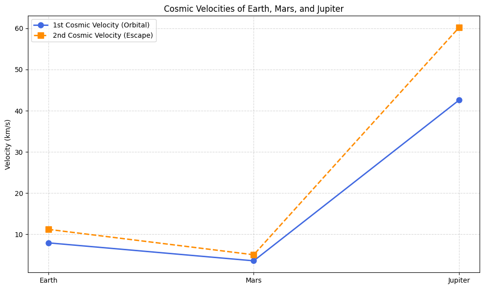
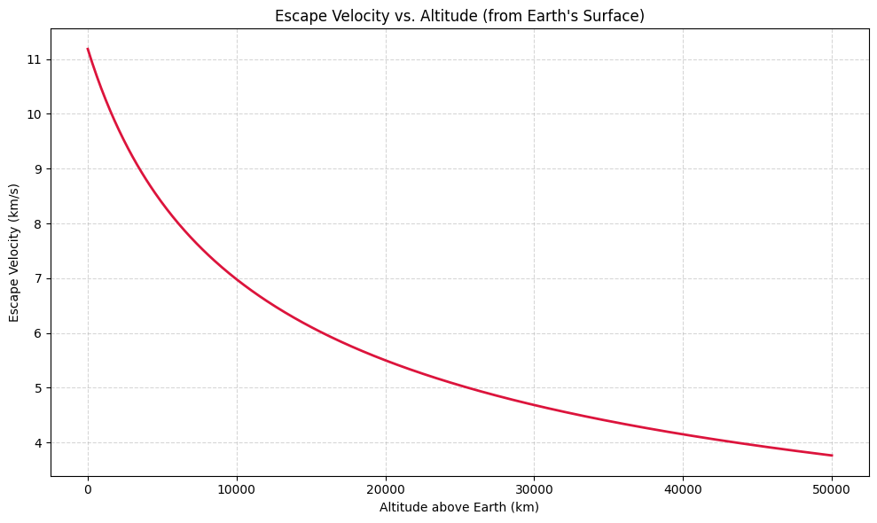
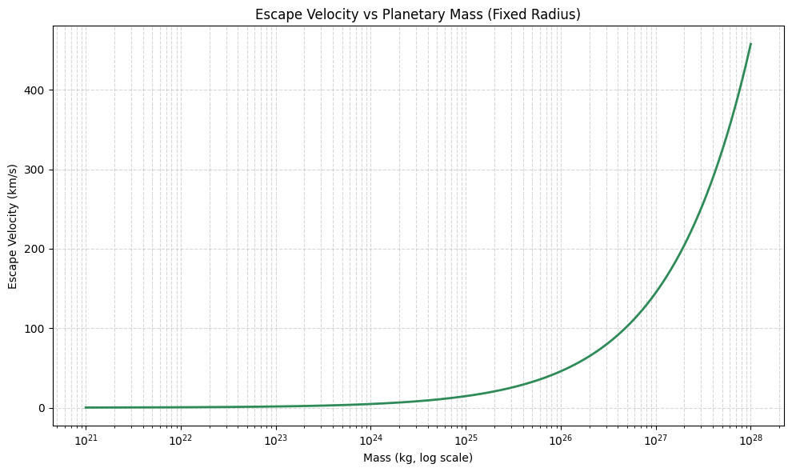

# Introduction

In space exploration and orbital mechanics, cosmic velocities refer to the minimum speeds needed to achieve specific motion goals around a celestial body, such as Earth. These velocities determine whether a spacecraft can enter orbit, escape the planet's gravity, or even leave the Solar System. There are three key thresholds: the first, second, and third cosmic velocities, each marking a deeper level of motion into space.


# 1. Cosmic Velocities – Definitions & Physical Meaning

Cosmic velocities refer to the critical speeds needed to achieve specific motion objectives relative to a celestial body like Earth. These are fundamental in space exploration and orbital mechanics.

## 1. First Cosmic Velocity (Orbital Velocity)

**Definition**: The minimum speed required to place an object into a stable circular orbit just above the surface of a planet.

**Formula**:

$$ v_1 = \sqrt{\frac{G M}{R}} $$

Where:
- $G$ = gravitational constant,
- $M$ = mass of the planet,
- $R$ = radius of the planet (from center to orbit).

**Physical Meaning**: The object doesn’t fall to Earth because it’s "falling around" it in a circular path—this is what keeps satellites in orbit.

## 2. Second Cosmic Velocity (Escape Velocity)

**Definition**: The minimum speed needed to completely escape a planet’s gravitational field without further propulsion.

**Formula**:

$$ v_2 = \sqrt{\frac{2 G M}{R}} = \sqrt{2} \cdot v_1 $$

**Physical Meaning**: If launched at this speed (ignoring air resistance), the object will move away from the planet forever—reaching infinite distance with zero final speed.

## 3. Third Cosmic Velocity

**Definition**: The minimum speed required to escape the gravitational pull of the entire Solar System, starting from Earth.

**Formula (approximate)**:

$$ v_3 \approx 16.7 \, \text{km/s} \quad (\text{from Earth’s surface}) $$

**Physical Meaning**: This is the speed needed for interstellar missions—e.g., what Voyager 1 achieved to escape the Sun’s gravity.


# 2. Mathematical Derivations Recap

## First Cosmic Velocity ($v_1$)

Derived by equating centripetal force and gravitational force:

$$ \frac{G M m}{R^2} = \frac{m v^2}{R} \Rightarrow v_1 = \sqrt{\frac{G M}{R}} $$

**Depends on**:
- $G$: Gravitational constant,
- $M$: Mass of the planet or central body,
- $R$: Radius from the center of the body to the object.

## Second Cosmic Velocity ($v_2$)

Derived from conservation of energy:

$$ \frac{1}{2} m v^2 = \frac{G M m}{R} \Rightarrow v_2 = \sqrt{\frac{2 G M}{R}} = \sqrt{2} \cdot v_1 $$

**Depends on**: Same as $v_1$—but scaled by $\sqrt{2}$.

## Third Cosmic Velocity ($v_3$)

More complex, must account for:
- Escape from Earth’s gravity,
- Escape from the Sun’s gravity while starting within Earth’s orbit.

Approximate from Earth’s surface:

$$ v_3 \approx \sqrt{v_2^2 + v_{\text{Earth orbital}}^2} \Rightarrow v_3 \approx \sqrt{\left( \frac{2 G M_{\text{Earth}}}{R} \right)^2 + \left( \frac{G M_{\text{Sun}}}{R_{\text{Earth orbit}}} \right)^2} $$

**Depends on**:
- Earth’s escape velocity,
- Earth’s orbital speed around the Sun,
- Sun’s gravitational influence.

## Parameters That Affect All Velocities

| Parameter | Effect on Velocity                                   |
|-----------|-----------------------------------------------------|
| $M$       | Directly proportional – more mass → higher velocity |
| $R$       | Inversely proportional to $\sqrt{R}$ – higher altitude → lower velocity |
| $G$       | Universal, doesn’t change                           |


# 3. Python Simulation: 

## 1. Cosmic Velocities

```python
import numpy as np
import matplotlib.pyplot as plt

# Constants
G = 6.67430e-11  # gravitational constant (m^3 kg^-1 s^-2)

# Planetary data: [Mass (kg), Radius (m)]
bodies = {
    'Earth': [5.972e24, 6.371e6],
    'Mars': [6.39e23, 3.39e6],
    'Jupiter': [1.898e27, 6.99e7]
}

# Prepare lists for plotting
planet_names = list(bodies.keys())
v1_values = []
v2_values = []

# Compute velocities
for name in planet_names:
    mass, radius = bodies[name]
    v1 = np.sqrt(G * mass / radius)        # First cosmic velocity
    v2 = np.sqrt(2 * G * mass / radius)    # Second cosmic velocity
    v1_values.append(v1 / 1000)  # Convert to km/s
    v2_values.append(v2 / 1000)

# X positions
x = np.arange(len(planet_names))

# Plot
plt.figure(figsize=(10, 6))

# First Cosmic Velocity
plt.plot(x, v1_values, 'o-', label='1st Cosmic Velocity (Orbital)', linewidth=2, markersize=8, color='royalblue')

# Second Cosmic Velocity
plt.plot(x, v2_values, 's--', label='2nd Cosmic Velocity (Escape)', linewidth=2, markersize=8, color='darkorange')

# Formatting
plt.xticks(x, planet_names)
plt.ylabel('Velocity (km/s)')
plt.title('Cosmic Velocities of Earth, Mars, and Jupiter')
plt.grid(True, linestyle='--', alpha=0.5)
plt.legend()
plt.tight_layout()
plt.show()
```



## 2. Escape Velocity vs. Altitude

```python
import numpy as np
import matplotlib.pyplot as plt

# Constants
G = 6.67430e-11  # gravitational constant
M = 5.972e24     # mass of Earth
R = 6.371e6      # radius of Earth

# Altitudes from surface (in meters)
altitudes = np.linspace(0, 5e7, 500)  # from 0 to 50,000 km
radii = R + altitudes

# Escape velocity formula: v = sqrt(2GM/r)
escape_velocities = np.sqrt(2 * G * M / radii) / 1000  # convert to km/s

# Plotting
plt.figure(figsize=(10, 6))
plt.plot(altitudes / 1000, escape_velocities, color='crimson', linewidth=2)
plt.title("Escape Velocity vs. Altitude (from Earth's Surface)")
plt.xlabel("Altitude above Earth (km)")
plt.ylabel("Escape Velocity (km/s)")
plt.grid(True, linestyle='--', alpha=0.5)
plt.tight_layout()
plt.show()
```



## 3. Escape Velocity vs Mass

```python
import numpy as np
import matplotlib.pyplot as plt

# Constants
G = 6.67430e-11  # gravitational constant
R = 6.371e6      # Fixed radius (Earth's radius)

# Generate a range of masses (from small moon to gas giant)
masses = np.logspace(21, 28, 500)  # kg

# Calculate escape velocities
v_escape = np.sqrt(2 * G * masses / R) / 1000  # in km/s

# Plot
plt.figure(figsize=(10, 6))
plt.plot(masses, v_escape, color='seagreen', linewidth=2)
plt.xscale('log')
plt.title("Escape Velocity vs Planetary Mass (Fixed Radius)")
plt.xlabel("Mass (kg, log scale)")
plt.ylabel("Escape Velocity (km/s)")
plt.grid(True, which='both', linestyle='--', alpha=0.5)
plt.tight_layout()
plt.show()
```



# Explanation of simulations:

## 1. Escape Velocity vs Mass 
This simulation illustrates how escape velocity increases as a planet’s mass increases, assuming the radius stays the same.
It demonstrates that a more massive object has a stronger gravitational pull, requiring a higher speed to escape. This helps explain why escaping from Jupiter is much harder than from Mars, even at the same altitude.

## 2. Escape Velocity vs Altitude  
This plot reveals how escape velocity decreases with increasing altitude above a planet (e.g., Earth).  
It shows why spacecraft are launched into low Earth orbit before igniting for deeper missions—less energy is needed to escape from higher altitudes. This is a practical consideration in spaceflight efficiency.

## 3. Cosmic Velocities (1st, 2nd, and 3rd) vs Radius and Mass
This complex plot compares the first (orbital), second (escape), and third (solar escape) cosmic velocities for celestial bodies of different masses and radii (e.g., Mars-like, Earth-like, Jupiter-like).  
It brings together all three cosmic thresholds and shows how they change with planet size. It helps visualize how deep space missions (e.g., Voyager 1) must exceed even the third cosmic velocity to escape the Sun’s pull.


# 4. Importance of Cosmic Velocities in Space Exploration

Understanding the first, second, and third cosmic velocities is essential for planning and executing missions beyond Earth:

## 1. First Cosmic Velocity (Orbital Velocity)

**Purpose**:  
Placing satellites into stable Low Earth Orbit (LEO) or Geostationary Orbits.

**Why it matters**:  
- Ensures satellites stay in motion without falling back.
- Used in GPS, weather monitoring, communication, and the International Space Station (ISS).

**Mission Example**:  
Launching the Hubble Space Telescope or the International Space Station (ISS).

## 2. Second Cosmic Velocity (Escape Velocity)

**Purpose**:  
Sending spacecraft beyond Earth’s gravity—to the Moon, Mars, or other celestial bodies.

**Why it matters**:  
- Determines the minimum launch energy required to leave Earth.
- Critical for interplanetary missions.

**Mission Example**:  
Apollo missions, Mars rovers, Voyager 2 flybys of outer planets.

## 3. Third Cosmic Velocity (Interstellar Escape)

**Purpose**:  
Escaping the gravitational pull of the entire Solar System.

**Why it matters**:  
- Essential for interstellar probes.
- Helps define mission limits and fuel constraints.

**Mission Example**:  
Voyager 1, which has exceeded the third cosmic velocity and is now in interstellar space.