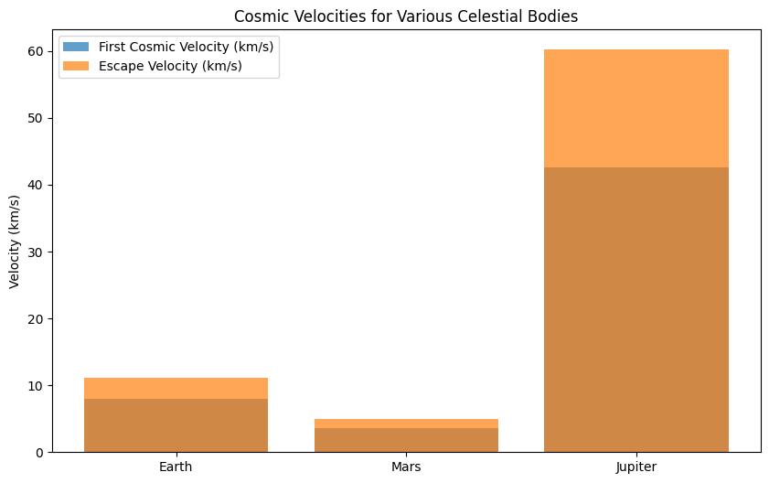
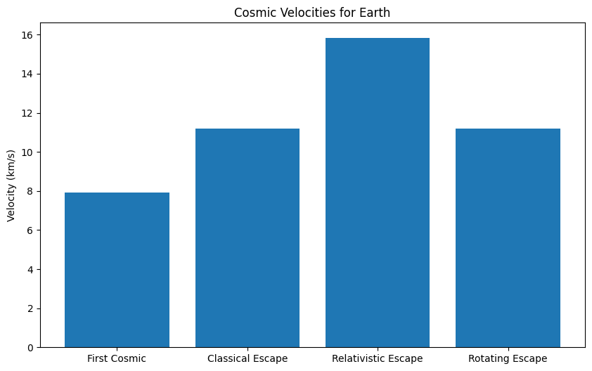
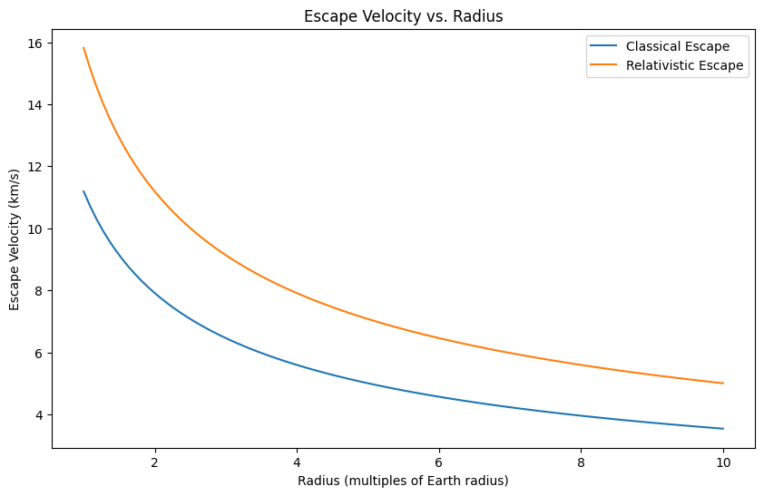
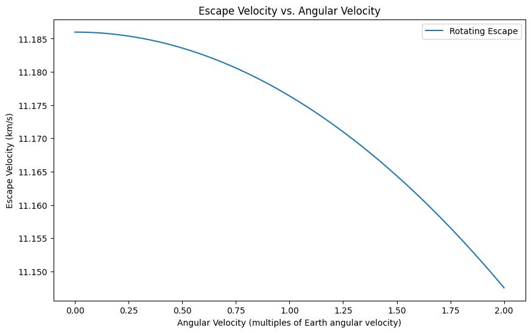

# Escape Velocities and Cosmic Velocities

## 1. Introduction

Escape velocity is the minimum velocity required for an object to escape the gravitational influence of a celestial body, without further propulsion. Beyond escape velocity, the object will not return to the body, assuming no other forces act on it (such as air resistance). There are also several types of cosmic velocities that define specific escape or orbiting conditions in a star system.

* **First Cosmic Velocity ($v_1$)**: The velocity required for an object to orbit the celestial body in a circular orbit.
* **Second Cosmic Velocity ($v_2$)**: The escape velocity, or the velocity required for an object to break free of a celestial body’s gravitational pull.
* **Third Cosmic Velocity ($v_3$)**: The velocity required for an object to escape the gravitational influence of the entire star system.

## 2. Mathematical Derivations of Cosmic Velocities

The formulas for these velocities are derived from Newtonian mechanics, specifically gravitational forces.

### First Cosmic Velocity ($v_1$)

The first cosmic velocity is the velocity required for a body to enter a stable circular orbit around a celestial body. For a circular orbit, the centripetal force is provided by gravity:

$$F_{\text{gravity}} = F_{\text{centripetal}}$$

$$\frac{G M m}{r^2} = \frac{m v_1^2}{r}$$

Where:

* $G$ is the gravitational constant
* $M$ is the mass of the celestial body (e.g., Earth)
* $m$ is the mass of the object in orbit
* $r$ is the radius of orbit
* $v_1$ is the first cosmic velocity

Canceling $m$ from both sides:

$$v_1 = \sqrt{\frac{G M}{r}}$$

### Second Cosmic Velocity ($v_2$)

The second cosmic velocity is the escape velocity—the minimum velocity required for an object to escape the gravitational pull of the celestial body. The energy required to escape is the sum of kinetic and potential energy. The total energy of the object at escape is zero (it reaches an infinite distance with zero velocity). The gravitational potential energy is:

$$U = -\frac{G M m}{r}$$

The total mechanical energy at the escape point is zero:

$$\frac{1}{2} m v_2^2 - \frac{G M m}{r} = 0$$

Solving for $v_2$:

$$v_2 = \sqrt{\frac{2 G M}{r}}$$

### Third Cosmic Velocity ($v_3$)

The third cosmic velocity is the velocity required to escape the gravitational influence of an entire star system, such as the Sun’s gravitational field. It can be derived from the escape velocity from the star system, considering the distance from the star’s center (usually the distance from the Sun's center to Earth):

$$v_3 = \sqrt{\frac{2 G M_{\text{star}}}{r_{\text{star}}}}$$

Where:

* $M_{\text{star}}$ is the mass of the star (e.g., Sun)
* $r_{\text{star}}$ is the distance from the star’s center (for instance, the distance from the Earth to the Sun)

## 3. Calculations for Different Celestial Bodies

Let’s calculate these velocities for Earth, Mars, and Jupiter.
The formula for escape velocity and orbital velocity depends on the mass and radius of the celestial body. We will calculate the first and second cosmic velocities, using the following known values:

**Earth:**

* Mass ($M_{\text{Earth}}$): $5.972 \times 10^{24} \, \text{kg}$
* Radius ($R_{\text{Earth}}$): $6.371 \times 10^{6} \, \text{m}$

**Mars:**

* Mass ($M_{\text{Mars}}$): $0.64171 \times 10^{24} \, \text{kg}$
* Radius ($R_{\text{Mars}}$): $3.396 \times 10^{6} \, \text{m}$

**Jupiter:**

* Mass ($M_{\text{Jupiter}}$): $1.898 \times 10^{27} \, \text{kg}$
* Radius ($R_{\text{Jupiter}}$): $6.991 \times 10^{7} \, \text{m}$

Using these values, we will compute the first and second cosmic velocities.

# Advanced Concepts in Escape and Cosmic Velocities

## 1. Gravitational Potential Energy in a Non-Spherical Potential

For non-spherical celestial bodies (e.g., rotating bodies like planets), the gravitational potential energy changes slightly due to the distribution of mass, particularly for objects that are not perfectly spherical. In such cases, the gravitational potential energy $U$ at a distance $r$ from the center of mass can be written as:

$$U = - \frac{GMm}{r} \left(1 + \frac{1}{2} \frac{r^2}{R_{\text{eq}}^2} \right)$$

Where:

* $R_{\text{eq}}$ is the equatorial radius of the planet.

The term $\frac{r^2}{R_{\text{eq}}^2}$ introduces a correction for the planet’s oblateness (flattening at the poles). This formula helps in considering real celestial bodies where $r$ is near the planet’s equator or poles.

## 2. Relativistic Correction to Escape Velocity

When objects move at speeds close to the speed of light, relativistic effects come into play. The relativistic escape velocity $v_{\text{rel}}$ is given by:

$$v_{\text{rel}} = \sqrt{\frac{2GM}{r} \left(1 + \frac{v_{\text{orbital}}^2}{c^2} \right)}$$

Where:

* $v_{\text{orbital}}$ is the orbital velocity of the object in question.
* $c$ is the speed of light.

At low velocities (non-relativistic), this reduces to the classical escape velocity formula, but for high velocities, the correction term accounts for relativistic effects.


## 3. Generalized Third Cosmic Velocity

The generalized third cosmic velocity $v_3$ accounts for a system where the object must escape not just the gravitational influence of a single star but also overcome the combined gravitational potential of the entire galaxy. For a multi-body system, the escape velocity from a galactic center at a distance $r_{\text{galaxy}}$ is:

$$v_3 = \sqrt{\frac{2 G M_{\text{galaxy}}}{r_{\text{galaxy}}} \left(1 + \frac{v_{\text{orbital}}^2}{c^2} \right)}$$

Where:

* $M_{\text{galaxy}}$ is the mass of the galaxy.
* $r_{\text{galaxy}}$ is the distance from the galactic center.

This formula considers the combined gravitational potential from the star system and the galactic center.

## 4. The Escape Velocity for a Rotating Body (Centrifugal Force Considerations)

For rotating bodies such as Earth, centrifugal forces also play a role in determining the velocity required to escape. The escape velocity $v_{\text{esc}}$ at the surface of a rotating body, taking into account centrifugal forces at latitude $\phi$, is given by:

$$v_{\text{esc}} = \sqrt{\frac{2GM}{r} + \omega^2 r^2 - 2\omega r^2 \sin \phi \cos \phi}$$

Where:

* $\omega$ is the angular velocity of the celestial body.
* $r$ is the radius at a specific latitude.
* $\phi$ is the latitude of the object from the axis of rotation (e.g., Earth's surface).

This formula takes into account the reduced effective escape velocity due to the centrifugal force at the equator.

## 5. Gravitational Binding Energy of a Planet

For a planet, the gravitational binding energy $E_b$, or the energy required to disperse a planet's mass to infinity, can be calculated by:

$$E_b = -\frac{3}{5} \frac{GM^2}{R}$$

Where:

* $M$ is the mass of the planet.
* $R$ is the radius of the planet.

This formula provides an understanding of the energy scale needed to disrupt a planet’s gravitational binding.

## 6. Cosmic Velocities of Earth, Mars, and Jupiter

```python
import numpy as np
import matplotlib.pyplot as plt

# Constants
G = 6.67430e-11  # Gravitational constant (m^3 kg^-1 s^-2)
M_earth = 5.972e24  # Mass of Earth (kg)
R_earth = 6.371e6  # Radius of Earth (m)
M_mars = 6.39e23  # Mass of Mars (kg)
R_mars = 3.390e6  # Radius of Mars (m)
M_jupiter = 1.898e27 # Mass of Jupiter (kg)
R_jupiter = 6.9911e7 # Radius of Jupiter (m)
M_sun = 1.989e30 # Mass of Sun (kg)
R_earthSun = 1.496e11 # Distance from earth to sun (m)
earth_orbital_velocity = 29780 # earth orbital velocity m/s

# Function to calculate first cosmic velocity
def first_cosmic_velocity(mass, radius):
    return np.sqrt(G * mass / radius)

# Function to calculate second cosmic velocity (escape velocity)
def escape_velocity(mass, radius):
    return np.sqrt(2 * G * mass / radius)

# Calculate velocities
v1_earth = first_cosmic_velocity(M_earth, R_earth)
v2_earth = escape_velocity(M_earth, R_earth)
v1_mars = first_cosmic_velocity(M_mars, R_mars)
v2_mars = escape_velocity(M_mars, R_mars)
v1_jupiter = first_cosmic_velocity(M_jupiter, R_jupiter)
v2_jupiter = escape_velocity(M_jupiter, R_jupiter)
v_sunEscape = escape_velocity(M_sun, R_earthSun)
v3_earth = np.sqrt(v_sunEscape**2 + earth_orbital_velocity**2) - earth_orbital_velocity

# Print results
print(f"Earth: v1 = {v1_earth/1000:.2f} km/s, v2 = {v2_earth/1000:.2f} km/s")
print(f"Mars: v1 = {v1_mars/1000:.2f} km/s, v2 = {v2_mars/1000:.2f} km/s")
print(f"Jupiter: v1 = {v1_jupiter/1000:.2f} km/s, v2 = {v2_jupiter/1000:.2f} km/s")
print(f"Earth: v3 = {v3_earth/1000:.2f} km/s")

# Visualization
bodies = ['Earth', 'Mars', 'Jupiter']
v1_values = [v1_earth/1000, v1_mars/1000, v1_jupiter/1000]
v2_values = [v2_earth/1000, v2_mars/1000, v2_jupiter/1000]

plt.figure(figsize=(10, 6))
plt.bar(bodies, v1_values, label='First Cosmic Velocity (km/s)', alpha=0.7)
plt.bar(bodies, v2_values, label='Escape Velocity (km/s)', alpha=0.7)
plt.ylabel('Velocity (km/s)')
plt.title('Cosmic Velocities for Various Celestial Bodies')
plt.legend()
plt.show()
```



## 7. Cosmic Velocities and Escape Velocity Visualizations
```python
import numpy as np
import matplotlib.pyplot as plt

# Constants
G = 6.67430e-11  # Gravitational constant (m^3 kg^-1 s^-2)
c = 299792458  # Speed of light (m/s)
M_earth = 5.972e24  # Mass of Earth (kg)
R_earth = 6.371e6  # Radius of Earth (m)
earth_angular_velocity = 7.27e-5 # Earth's angular velocity (rad/s)

# Function to calculate first cosmic velocity
def first_cosmic_velocity(mass, radius):
    return np.sqrt(G * mass / radius)

# Function to calculate second cosmic velocity (escape velocity)
def escape_velocity(mass, radius):
    return np.sqrt(2 * G * mass / radius)

# Function to calculate relativistic escape velocity
def relativistic_escape_velocity(mass, radius):
    return c * np.sqrt(1 - (1 + 2 * G * mass / (radius * c**2))**-2)

# Function to calculate escape velocity in a rotating frame
def rotating_escape_velocity(mass, radius, angular_velocity):
    rotational_velocity = angular_velocity * radius
    return np.sqrt(2 * G * mass / radius - rotational_velocity**2)

# Calculate velocities for Earth
v1_earth = first_cosmic_velocity(M_earth, R_earth)
v2_earth = escape_velocity(M_earth, R_earth)
v_esc_rel_earth = relativistic_escape_velocity(M_earth, R_earth)
v_esc_rot_earth = rotating_escape_velocity(M_earth, R_earth, earth_angular_velocity)

# Create a bar chart for comparison
velocities = {
    'First Cosmic': v1_earth / 1000,
    'Classical Escape': v2_earth / 1000,
    'Relativistic Escape': v_esc_rel_earth / 1000,
    'Rotating Escape': v_esc_rot_earth / 1000,
}

plt.figure(figsize=(10, 6))
plt.bar(velocities.keys(), velocities.values())
plt.ylabel('Velocity (km/s)')
plt.title('Cosmic Velocities for Earth')
plt.show()

# Example: Escape Velocity vs. Radius
radii = np.linspace(R_earth, 10 * R_earth, 100)
classical_escape = escape_velocity(M_earth, radii) / 1000
relativistic_escape = relativistic_escape_velocity(M_earth, radii) / 1000

plt.figure(figsize=(10, 6))
plt.plot(radii / R_earth, classical_escape, label='Classical Escape')
plt.plot(radii / R_earth, relativistic_escape, label='Relativistic Escape')
plt.xlabel('Radius (multiples of Earth radius)')
plt.ylabel('Escape Velocity (km/s)')
plt.title('Escape Velocity vs. Radius')
plt.legend()
plt.show()

# Example: Escape Velocity vs. Angular Velocity
angular_velocities = np.linspace(0, 2 * earth_angular_velocity, 100)
rotating_escape = rotating_escape_velocity(M_earth, R_earth, angular_velocities) / 1000

plt.figure(figsize=(10, 6))
plt.plot(angular_velocities / earth_angular_velocity, rotating_escape, label='Rotating Escape')
plt.xlabel('Angular Velocity (multiples of Earth angular velocity)')
plt.ylabel('Escape Velocity (km/s)')
plt.title('Escape Velocity vs. Angular Velocity')
plt.legend()
plt.show()
```





