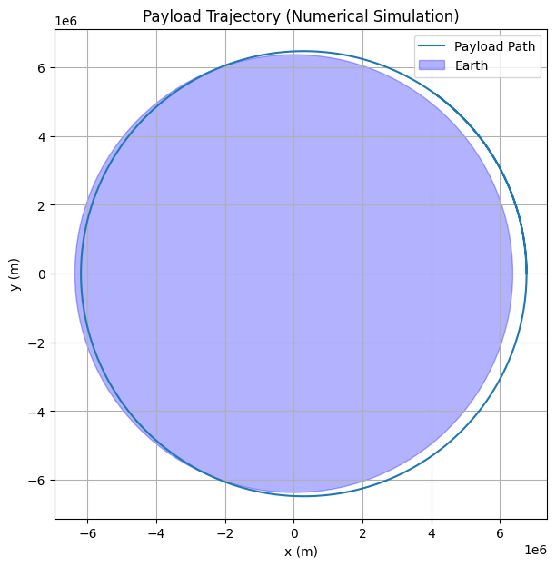
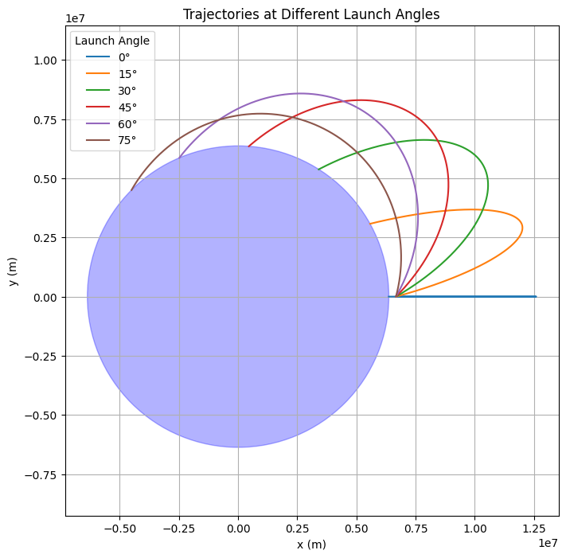
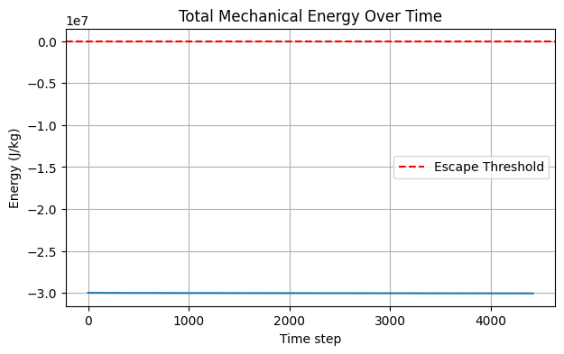

# 1. Analyze the Possible Trajectories of a Payload Released Near Earth

## Objective

When a payload is released from a spacecraft near Earth, its subsequent trajectory depends on its initial velocity and position relative to Earth. The shape of the path—elliptical, parabolic, or hyperbolic—is governed by Newton’s Law of Gravitation and the conservation of mechanical energy.

Understanding these paths is fundamental in planning:
- Satellite orbits,
- Escape missions,
- Reentry maneuvers,
- Interplanetary probes.

## Governing Force – Newton’s Law of Universal Gravitation

The force acting on the payload due to Earth’s gravity is:

$$ F = -\frac{G M m}{r^2} \hat{r} $$

Where:
- $G$: Gravitational constant ($6.674 \times 10^{-11} \, \text{Nm}^2/\text{kg}^2$),
- $M$: Mass of Earth,
- $m$: Mass of the payload,
- $r$: Distance from Earth’s center,
- $\hat{r}$: Unit vector from Earth to the payload.

## Total Mechanical Energy

The motion is governed by conservation of total mechanical energy:

$$ E = \frac{1}{2} m v^2 - \frac{G M m}{r} $$

This determines the trajectory type:

| Energy Condition | Trajectory Type | Description                             |
|------------------|-----------------|-----------------------------------------|
| $E < 0$          | Elliptical      | Closed orbit; bound to Earth            |
| $E = 0$          | Parabolic       | Just enough speed to escape; marginal escape |
| $E > 0$          | Hyperbolic      | Unbound; excess speed leads to escape   |

## Escape Velocity

The minimum speed required to escape Earth’s gravitational pull is:

$$ v_{\text{escape}} = \sqrt{\frac{2 G M}{r}} $$

- If the payload’s speed $v = v_{\text{escape}}$ → parabolic trajectory.
- If $v < v_{\text{escape}}$ → elliptical (or circular) trajectory.
- If $v > v_{\text{escape}}$ → hyperbolic trajectory.

## Shape of the Orbit: Conic Sections

The orbit a payload follows is a conic section with Earth at one focus. Its shape depends on the specific mechanical energy and eccentricity $e$:

| Eccentricity $e$ | Orbit Type  |
|------------------|-------------|
| $e = 0$          | Circular    |
| $0 < e < 1$      | Elliptical  |
| $e = 1$          | Parabolic   |
| $e > 1$          | Hyperbolic  |

Eccentricity can be derived using energy and angular momentum, but for initial velocity analysis, energy alone is sufficient to determine the type.


# 2. Numerical Analysis of Payload Trajectory Based on Initial Conditions

## Objective

Given the initial position, velocity, and altitude of a payload released near Earth, compute its path using numerical methods that solve Newton’s equations of motion under gravity.

This analysis helps determine whether the payload:
- Falls back to Earth (reentry),
- Enters orbit,
- Escapes Earth’s gravity.

## Physical Model

We use Newton’s second law and universal gravitation:

$$ F = m a = -\frac{G M m}{r^3} r \Rightarrow a = -\frac{G M}{r^3} r $$

Where:
- $r$: Position vector from Earth’s center,
- $a$: Acceleration,
- $r = \|r\|$: Magnitude of the position vector.

## Numerical Integration: Euler or Runge-Kutta

We use a numerical integration scheme (Euler or RK4) to compute $r(t)$ and $v(t)$ over time:

$$ \frac{dr}{dt} = v, \quad \frac{dv}{dt} = -\frac{G M}{r^3} r $$


# 3. How Trajectories Relate to Orbital Insertion, Reentry, and Escape

## Objective

Interpret the numerical results from Task 2 by linking trajectory types to actual space mission outcomes:
- Stable orbit (insertion),
- Reentry (falling back to Earth),
- Escape (leaving Earth’s gravity).

## 1. Orbital Insertion (Stable Orbit)

**Scenario**:  
The payload achieves a stable elliptical or circular orbit around Earth.

**Conditions**:
- Total mechanical energy $E < 0$.
- Velocity $v < v_{\text{escape}}$, but high enough to avoid crashing.
- Perigee (lowest point) stays above Earth’s surface.

**Result in Simulation**:
- The trajectory curves around Earth and doesn’t intersect with the planet.
- Path may be circular (if speed is just right) or elliptical (most common).

**Real-world Examples**:
- Satellites (e.g., Starlink),
- International Space Station (ISS),
- Lunar parking orbits before transfer burns.

## 2. Reentry (Atmospheric Fall or Crash)

**Scenario**:  
The payload’s speed is too low to sustain an orbit, causing it to fall back.

**Conditions**:
- $v < v_{\text{orbital}}$,
- Still $E < 0$, but perigee drops below Earth’s surface,
- Or starts with a downward velocity component.

**Result in Simulation**:
- The trajectory spirals or curves downward and eventually hits the Earth (passes inside Earth’s radius).

**Real-world Examples**:
- Returning space capsules (e.g., SpaceX Dragon),
- Space debris reentry,
- Rocket stage disposal.

## 3. Escape Trajectory (Leaving Earth’s Gravity)

**Scenario**:  
Payload reaches or exceeds escape velocity and is no longer gravitationally bound to Earth.

**Conditions**:
- $v \geq v_{\text{escape}}$,
- $E \geq 0$ (total mechanical energy $\geq 0$).

**Result in Simulation**:
- The trajectory becomes hyperbolic.
- Payload moves away from Earth and never returns.

**Real-world Examples**:
- Interplanetary probes (e.g., Voyager, Mars rovers),
- Asteroid missions (e.g., OSIRIS-REx),
- Escape burns after low Earth orbit (LEO).


# 4. Simulation

```python
import numpy as np
import matplotlib.pyplot as plt

# Constants
G = 6.67430e-11             # m^3/kg/s^2
M = 5.972e24                # kg (mass of Earth)
R_earth = 6.371e6           # m (radius of Earth)

# Initial conditions
altitude = 400e3            # 400 km above Earth
r0 = np.array([R_earth + altitude, 0])    # Start on x-axis
v0 = np.array([0, 7500], dtype=float)    # Tangential velocity (m/s), changed to float
# initialize to float array

# Time setup
dt = 1.0                    # seconds, changed to float
t_max = 6000                # total simulation time in seconds
steps = int(t_max / dt)

# Initialize position, velocity
r = r0.copy()
v = v0.copy()

# Storage for path
trajectory = [r.copy()]

# Euler integration
for _ in range(steps):
    r_mag = np.linalg.norm(r)
    a = -G * M * r / r_mag**3
    v += a * dt
    r += v * dt
    trajectory.append(r.copy())

trajectory = np.array(trajectory)

# Plot
plt.figure(figsize=(7, 7))
plt.plot(trajectory[:, 0], trajectory[:, 1], label='Payload Path')
plt.gca().add_patch(plt.Circle((0, 0), R_earth, color='blue', alpha=0.3, label='Earth'))
plt.xlabel('x (m)')
plt.ylabel('y (m)')
plt.title('Payload Trajectory (Numerical Simulation)')
plt.axis('equal')
plt.grid(True)
plt.legend()
plt.show()
```





## Explanation: Payload Trajectory Simulation

This Python script simulates and visualizes the trajectory of a payload released near Earth, using numerical integration to solve Newton’s equations of motion under gravitational force. The simulation determines the payload’s path based on its initial conditions.

### Parameters
- $G = 6.67430 \times 10^{-11} \, \text{m}^3/\text{kg}/\text{s}^2$: Gravitational constant.
- $M = 5.972 \times 10^{24} \, \text{kg}$: Mass of Earth.
- $R_{\text{Earth}} = 6.371 \times 10^6 \, \text{m}$: Radius of Earth.
- $\text{altitude} = 400 \times 10^3 \, \text{m}$: Initial altitude above Earth’s surface (400 km).
- $r_0 = [R_{\text{Earth}} + \text{altitude}, 0] = [6.771 \times 10^6, 0] \, \text{m}$: Initial position (on x-axis).
- $v_0 = [0, 7500] \, \text{m/s}$: Initial velocity (tangential, along y-axis).
- $dt = 1.0 \, \text{s}$: Time step for simulation.
- $t_{\text{max}} = 6000 \, \text{s}$: Total simulation time.
- $\text{steps} = 6000$: Number of time steps.

### Simulation Method
The script uses Euler’s method to numerically solve the equations of motion under gravitational force:

$$ F = -\frac{G M m}{r^3} r \quad \Rightarrow \quad a = -\frac{G M}{r^3} r $$

$$ \frac{dr}{dt} = v, \quad \frac{dv}{dt} = a $$

- **Acceleration**: Computes $a = -\frac{G M}{r^3} r$, where $r$ is the position vector and $r = \|r\|$.
- **Update**: Updates velocity ($v \gets v + a \cdot dt$) and position ($r \gets r + v \cdot dt$).
- Tracks the trajectory over 6000 steps (6000 seconds, or 100 minutes).

### Physical Calculations
- **Initial Setup**: The payload starts at an altitude of 400 km (low Earth orbit range), with a tangential velocity of 7500 m/s, which is close to the orbital velocity for this altitude. The orbital velocity for a circular orbit at radius $r$ is:

  $$ v_{\text{orbital}} = \sqrt{\frac{G M}{r}} $$

  Substituting $r = 6.771 \times 10^6 \, \text{m}$:

  $$ v_{\text{orbital}} \approx \sqrt{\frac{(6.67430 \times 10^{-11}) (5.972 \times 10^{24})}{6.771 \times 10^6}} \approx 7670 \, \text{m/s} $$

  Since $v_0 = 7500 \, \text{m/s}$ is slightly less than $v_{\text{orbital}}$, the orbit is likely elliptical with a perigee near the starting altitude.

- **Escape Velocity**: The escape velocity at this radius is:

  $$ v_{\text{escape}} = \sqrt{\frac{2 G M}{r}} \approx \sqrt{2} \cdot v_{\text{orbital}} \approx 10850 \, \text{m/s} $$

  Since $v_0 < v_{\text{escape}}$, the payload remains bound to Earth (no escape).

- **Total Mechanical Energy**:

  $$ E = \frac{1}{2} m v^2 - \frac{G M m}{r} $$

  With $v_0 = 7500 \, \text{m/s}$ and $r = 6.771 \times 10^6 \, \text{m}$, $E < 0$, confirming a bound (elliptical) orbit.

### Plot
- **Trajectory**:
  - Displays the payload’s path in the x-y plane, showing a nearly circular orbit around Earth.
  - The trajectory curves around the origin, consistent with $v_0$ being close to the circular orbital velocity.
- **Earth**: Represented as a blue circle with radius $R_{\text{Earth}} = 6.371 \times 10^6 \, \text{m}$, centered at the origin.
- **Axes and Labels**: x and y axes in meters, with a title "Payload Trajectory (Numerical Simulation)" and a legend identifying the payload path and Earth.
- **Equal Axes**: Ensures the orbit appears circular (as expected for a near-circular orbit).
- **Grid**: Added for better visualization of distances.


```python
import numpy as np
import matplotlib.pyplot as plt

# Constants
G = 6.67430e-11
M = 5.972e24
R_earth = 6.371e6

def simulate_angle_effects(speed=7500, alt_km=300):
    angles = [0, 15, 30, 45, 60, 75]
    r0_mag = R_earth + alt_km * 1e3
    dt = 1
    steps = 5000
    
    plt.figure(figsize=(8, 8))
    
    for angle_deg in angles:
        angle_rad = np.radians(angle_deg)
        vx = speed * np.cos(angle_rad)
        vy = speed * np.sin(angle_rad)
        
        r = np.array([r0_mag, 0.0])
        v = np.array([0.0, vy]) + np.array([vx, 0.0])
        
        path = []
        for _ in range(steps):
            r_mag = np.linalg.norm(r)
            if r_mag < R_earth:
                break
            a = -G * M * r / r_mag**3
            v += a * dt
            r += v * dt
            path.append(r.copy())
        
        path = np.array(path)
        plt.plot(path[:, 0], path[:, 1], label=f"{angle_deg}°")

    # Earth
    earth = plt.Circle((0, 0), R_earth, color='blue', alpha=0.3)
    plt.gca().add_patch(earth)
    
    plt.title("Trajectories at Different Launch Angles")
    plt.xlabel("x (m)")
    plt.ylabel("y (m)")
    plt.axis('equal')
    plt.grid(True)
    plt.legend(title="Launch Angle")
    plt.show()

simulate_angle_effects()
```





## Explanation: Payload Trajectory Simulation at Different Launch Angles

This Python script simulates and visualizes the trajectories of a payload released near Earth at various launch angles, using numerical integration to solve Newton’s equations of motion under gravitational force. The simulation explores how the launch angle affects the payload’s path.


### Simulation Method
The script uses Euler’s method to numerically solve the equations of motion under gravitational force for each launch angle:

$$ F = -\frac{G M m}{r^3} r \quad \Rightarrow \quad a = -\frac{G M}{r^3} r $$

$$ \frac{dr}{dt} = v, \quad \frac{dv}{dt} = a $$

- **Initial Velocity**: For each angle $\theta$ (in radians), the initial velocity components are:
  - $v_x = \text{speed} \cdot \cos(\theta)$ (radial component),
  - $v_y = \text{speed} \cdot \sin(\theta)$ (tangential component).
  - At $\theta = 0^\circ$, $v = [0, 7500]$ (purely tangential); at $\theta = 90^\circ$, $v = [7500, 0]$ (purely radial).
- **Acceleration**: Computes $a = -\frac{G M}{r^3} r$, where $r$ is the position vector and $r = \|r\|$.
- **Update**: Updates velocity ($v \gets v + a \cdot dt$) and position ($r \gets r + v \cdot dt$).
- **Stopping Condition**: Stops if the payload hits Earth ($r < R_{\text{Earth}}$).
- Simulates each trajectory for up to 5000 steps.

### Physical Analysis
- **Orbital Velocity**: The velocity for a circular orbit at radius $r = 6.671 \times 10^6 \, \text{m}$ is:

  $$ v_{\text{orbital}} = \sqrt{\frac{G M}{r}} \approx \sqrt{\frac{(6.67430 \times 10^{-11}) (5.972 \times 10^{24})}{6.671 \times 10^6}} \approx 7728 \, \text{m/s} $$

- **Escape Velocity**: The escape velocity at this radius is:

  $$ v_{\text{escape}} = \sqrt{\frac{2 G M}{r}} \approx \sqrt{2} \cdot v_{\text{orbital}} \approx 10930 \, \text{m/s} $$

- **Effect of Launch Angle**:
  - The initial speed is $7500 \, \text{m/s}$, which is less than $v_{\text{orbital}}$ (7728 m/s), suggesting elliptical orbits or reentry unless the angle provides sufficient tangential velocity.
  - At $\theta = 0^\circ$, the velocity is purely tangential ($v = [0, 7500]$), close to orbital velocity, leading to a near-circular or slightly elliptical orbit.
  - As $\theta$ increases, the tangential component decreases ($v_y = 7500 \cdot \sin(\theta)$), and the radial component increases ($v_x = 7500 \cdot \cos(\theta)$), reducing the angular momentum and causing the perigee to drop.
  - For higher angles (e.g., 60°, 75°), the payload lacks sufficient tangential velocity to maintain orbit, leading to reentry (perigee below Earth’s surface).

- **Total Mechanical Energy**:
  - Energy $E = \frac{1}{2} m v^2 - \frac{G M m}{r}$ is negative for $v = 7500 \, \text{m/s} < v_{\text{escape}}$, indicating bound trajectories (elliptical or reentry).
  - Angular momentum varies with $\theta$, affecting eccentricity and perigee.

### Plot
- **Trajectories**:
  - Displays the payload’s path for each launch angle in the x-y plane.
  - At $\theta = 0^\circ$, the trajectory is a near-circular orbit (blue line), as the tangential velocity is close to $v_{\text{orbital}}$.
  - As $\theta$ increases (15° to 75°), the orbits become more elliptical with lower perigees, eventually intersecting Earth’s surface (reentry) for larger angles (e.g., 60°, 75°).
- **Earth**: Represented as a blue circle with radius $R_{\text{Earth}} = 6.371 \times 10^6 \, \text{m}$, centered at the origin.
- **Axes and Labels**: x and y axes in meters, with a title "Trajectories at Different Launch Angles" and a legend identifying each angle.
- **Equal Axes**: Ensures orbits appear with correct geometry (e.g., circular for $\theta = 0^\circ$).
- **Grid**: Added for better visualization of distances.


```python
def energy_plot(speed=7600, alt_km=400, angle_deg=0):
    r0 = R_earth + alt_km * 1e3
    angle = np.radians(angle_deg)
    v = np.array([speed * np.cos(angle), speed * np.sin(angle)])
    r = np.array([r0, 0.0])
    
    dt = 1
    steps = 8000
    energy = []

    for _ in range(steps):
        r_mag = np.linalg.norm(r)
        if r_mag < R_earth:
            break
        kinetic = 0.5 * np.linalg.norm(v)**2
        potential = -G * M / r_mag
        total = kinetic + potential
        energy.append(total)
        
        a = -G * M * r / r_mag**3
        v += a * dt
        r += v * dt

    plt.figure(figsize=(7, 4))
    plt.plot(energy)
    plt.title("Total Mechanical Energy Over Time")
    plt.xlabel("Time step")
    plt.ylabel("Energy (J/kg)")
    plt.grid(True)
    plt.axhline(0, color='red', linestyle='--', label="Escape Threshold")
    plt.legend()
    plt.show()

energy_plot()
```




## Explanation: Total Mechanical Energy Simulation

This Python script simulates and visualizes the total mechanical energy of a payload released near Earth over time, using numerical integration to solve Newton’s equations of motion under gravitational force. The simulation helps determine whether the payload remains bound to Earth or can escape.


### Simulation Method
The script uses Euler’s method to numerically solve the equations of motion under gravitational force and computes the total mechanical energy at each step:

$$ F = -\frac{G M m}{r^3} r \quad \Rightarrow \quad a = -\frac{G M}{r^3} r $$

$$ \frac{dr}{dt} = v, \quad \frac{dv}{dt} = a $$

- **Acceleration**: Computes $a = -\frac{G M}{r^3} r$, where $r$ is the position vector and $r = \|r\|$.
- **Update**: Updates velocity ($v \gets v + a \cdot dt$) and position ($r \gets r + v \cdot dt$).
- **Energy Calculation**:
  - Kinetic energy per unit mass: $K = \frac{1}{2} \|v\|^2$,
  - Potential energy per unit mass: $U = -\frac{G M}{r}$,
  - Total mechanical energy per unit mass: $E = K + U$.
- **Stopping Condition**: Stops if the payload hits Earth ($r < R_{\text{Earth}}$).
- Tracks energy over 8000 steps.

### Physical Analysis
- **Initial Energy**:
  - Kinetic energy: $K = \frac{1}{2} (7600)^2 = 2.888 \times 10^7 \, \text{J/kg}$,
  - Potential energy: $U = -\frac{G M}{r} = -\frac{(6.67430 \times 10^{-11}) (5.972 \times 10^{24})}{6.771 \times 10^6} \approx -5.885 \times 10^7 \, \text{J/kg}$,
  - Total energy: $E = K + U \approx 2.888 \times 10^7 - 5.885 \times 10^7 = -2.997 \times 10^7 \, \text{J/kg}$.

- **Escape Threshold**: 
  - Escape occurs when $E \geq 0$. The plot shows $E \approx -3 \times 10^7 \, \text{J/kg}$, which is negative, indicating a bound orbit (elliptical or circular).
  - The escape velocity at $r = 6.771 \times 10^6 \, \text{m}$ is:

    $$ v_{\text{escape}} = \sqrt{\frac{2 G M}{r}} \approx \sqrt{\frac{2 (6.67430 \times 10^{-11}) (5.972 \times 10^{24})}{6.771 \times 10^6}} \approx 10850 \, \text{m/s} $$

  - Since $v = 7600 \, \text{m/s} < v_{\text{escape}}$, the payload remains bound, consistent with $E < 0$.

- **Orbital Velocity**:
  - Circular orbital velocity at this radius: $v_{\text{orbital}} = \sqrt{\frac{G M}{r}} \approx 7670 \, \text{m/s}$.
  - With $v = 7600 \, \text{m/s}$, the orbit is slightly elliptical (close to circular), as $v$ is just below $v_{\text{orbital}}$.

- **Energy Conservation**:
  - The plot shows energy is roughly constant at $\approx -3 \times 10^7 \, \text{J/kg}$, as expected in a conservative system (no drag or other forces).
  - Slight variations may be due to numerical errors from Euler’s method.

### Plot
- **Energy Over Time**:
  - Displays the total mechanical energy per unit mass ($E$) over 8000 time steps.
  - The energy remains constant at approximately $-3 \times 10^7 \, \text{J/kg}$, confirming conservation and a bound orbit.
- **Escape Threshold**:
  - A red dashed line at $E = 0$ marks the escape threshold. Since $E < 0$, the payload does not escape Earth’s gravity.
- **Axes and Labels**:
  - x-axis: Time step (each step = 1 second, so 8000 steps = 8000 seconds ≈ 133 minutes).
  - y-axis: Energy in $\text{J/kg}$.
  - Title: "Total Mechanical Energy Over Time".
- **Grid and Legend**: Includes a grid for readability and a legend identifying the escape threshold line.


