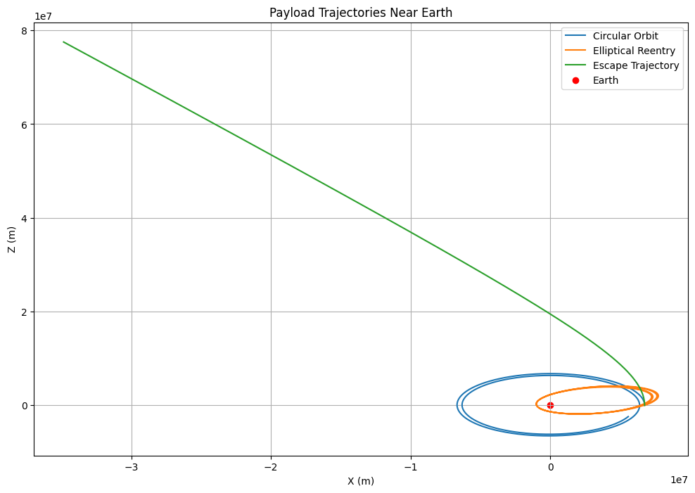
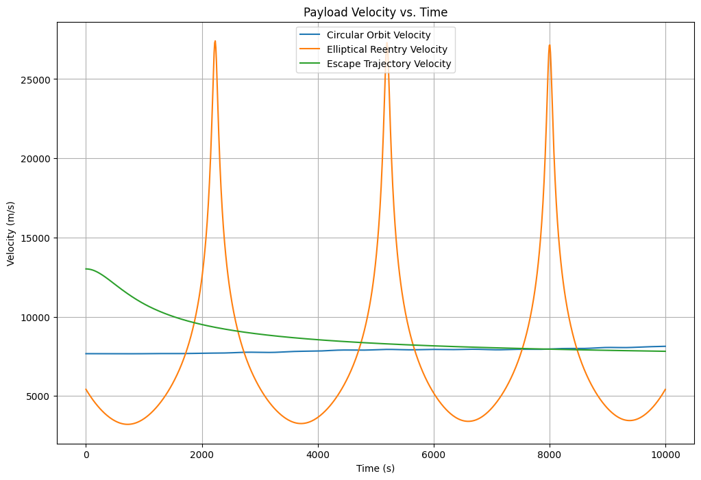
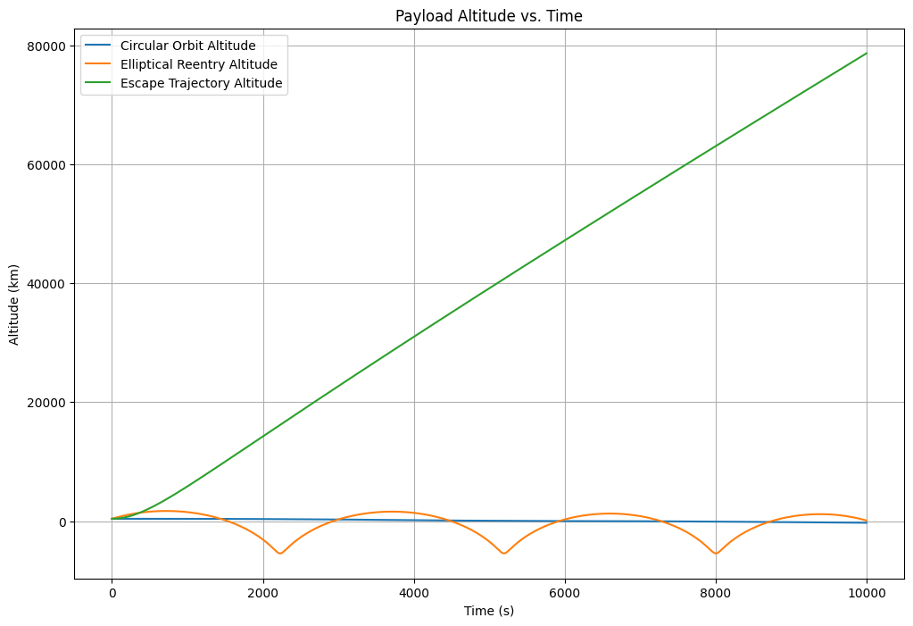

# Problem 3: Trajectories of a Freely Released Payload Near Earth

## 1. Introduction

In this problem, we’ll analyze the motion of a payload released near Earth, focusing on the influence of Earth’s gravity on its trajectory. Depending on the velocity and direction of release, the trajectory could be:

* **Elliptical:** The object remains in orbit around the Earth.
* **Parabolic:** The object escapes Earth’s gravity but at exactly escape velocity.
* **Hyperbolic:** The object escapes Earth’s gravity with a velocity greater than the escape velocity.

We will model these trajectories using the two-body problem under Newton's law of gravitation and solve them numerically using Python.

## 2. Gravitational Dynamics and Equations of Motion

The gravitational force between Earth and the payload is given by Newton’s Law of Gravitation:

$$F = \frac{GMm}{r^2}$$

where:

* $F$ is the gravitational force.
* $G$ is the gravitational constant.
* $M$ is the mass of Earth.
* $m$ is the mass of the payload.
* $r$ is the distance between the Earth and the payload.

This force results in a gravitational acceleration that affects the trajectory of the payload. We can model the motion of the payload with the following equations of motion:

$$\ddot{r} = -\frac{GM}{r^2}$$

Where:

* $r$ is the radial distance.
* $\ddot{r}$ is the acceleration.

We’ll break down the radial and angular components of motion and solve for the position and velocity of the payload over time using numerical integration.

## 3. Numerical Simulation

We'll use Euler's method or Runge-Kutta method to numerically solve the system of differential equations for the position and velocity of the payload.
The system of equations to solve are:

$$\ddot{x} = -\frac{GMx}{r^3}, \quad \ddot{y} = -\frac{GMy}{r^3}$$

Where $x$ and $y$ are the position coordinates of the payload in a 2D plane.

## 4. Initial Conditions and Setup

For our simulation, we’ll define the following initial conditions:

* The initial position of the payload relative to Earth (e.g., at some altitude).
* The initial velocity of the payload (e.g., tangential or radial).
* The initial angle of release.

We'll visualize the trajectories for different cases of initial velocities and directions (parabolic, elliptical, and hyperbolic).

## 5. Relativistic Equations of Motion (General Relativity Correction) 
 When velocities approach a significant fraction of the speed of light, we must modify Newtonian gravity using General Relativity corrections. The relativistic equation of motion for an object in Earth's gravitational field is: 

 $$\frac{d^2r}{dt^2} = -\frac{GM}{r^2} \left( 1 + \frac{3GM}{c^2 r} \right)$$ 
 where: 

 * $c$ is the speed of light (3.0×10<sup>8</sup> m/s), 
 * $GM$ is Earth's gravitational parameter. 
 This additional term accounts for the relativistic time dilation and length contraction near strong gravitational fields. 

 ## 6. Perturbation Due to Earth's Oblateness (J2 Effect) 
 Since Earth is not a perfect sphere, higher-order gravitational terms introduce perturbations in the motion of the payload. The J2 perturbation effect modifies the acceleration as: 

 $$a_r = -\frac{GM}{r^2} \left[ 1 - \frac{3}{2} J_2 \left( \frac{R_E}{r} \right)^2 (1 - 3 \cos^2\theta) \right]$$ 
 where: 

 * $J_2 \approx 1.08263 \times 10^{-3}$ is Earth's oblateness coefficient, 
 * $R_E$ is the equatorial radius of Earth, 
 * $\theta$ is the latitude. 
 This effect causes a precession of satellite orbits, known as the J2-induced secular drift. 


 ## 7. Three-Body Problem (Influence of Moon or Sun on the Payload) 
 When a payload is released into space, its trajectory is not only influenced by Earth's gravity but also by other celestial bodies like the Moon or the Sun. In the restricted three-body problem, the equations of motion are: 

 $$\ddot{x} - 2\omega \dot{y} = \frac{\partial U}{\partial x}, \quad \ddot{y} + 2\omega \dot{x} = \frac{\partial U}{\partial y}, \quad \ddot{z} = \frac{\partial U}{\partial z}$$ 
 where: 

 * $U$ is the effective potential: 
   $$U = \frac{1}{2} \omega^2 (x^2 + y^2) + \frac{GM_1}{r_1} + \frac{GM_2}{r_2}$$ 
 * $M_1, M_2$ are the masses of Earth and the Moon (or Sun), 
 * $r_1, r_2$ are the distances from the payload to each body. 
 This equation governs Lagrange points, where the gravitational and centrifugal forces balance. 


 ## 8. Atmospheric Drag and Reentry Dynamics 
 For payloads re-entering Earth's atmosphere, we must consider aerodynamic drag. The equation of motion with drag force is: 

 $$m \frac{d\mathbf{v}}{dt} = -\frac{GMm}{r^2} + \frac{1}{2} C_D \rho A v^2$$ 
 where: 

 * $C_D$ is the drag coefficient, 
 * $\rho$ is the atmospheric density (which varies with altitude), 
 * $A$ is the cross-sectional area. 
 The drag force significantly reduces velocity and causes heat buildup during reentry. 


 ## 9. Lorentz Force for Charged Payloads in Space 
 If the payload is charged, it experiences an additional force due to Earth's magnetic field: 

 $$\mathbf{F} = q (\mathbf{E} + \mathbf{v} \times \mathbf{B})$$ 
 where: 

 * $q$ is the charge of the payload, 
 * $\mathbf{E}$ is the electric field, 
 * $\mathbf{B}$ is Earth's magnetic field. 
 This effect is crucial for spacecraft operating near planetary magnetospheres. 


 ## 10. Non-Inertial Frame Corrections (Coriolis & Centrifugal Forces) 
 When the payload is released from a moving spacecraft, we need to correct for non-inertial effects: 

 $$\mathbf{F}_{\text{non-inertial}} = -2m (\mathbf{\Omega} \times \mathbf{v}) - m \mathbf{\Omega} \times (\mathbf{\Omega} \times \mathbf{r})$$ 
 where: 

 * $\mathbf{\Omega}$ is the rotational velocity of the spacecraft. 
 These effects are critical for precise orbital insertions.

 ## 11. Non-Spherical Harmonics and Higher-Order Perturbations
Beyond J2, Earth's gravitational field has higher-order harmonics (J3, J4, etc.) and tesseral harmonics (Cnm, Snm). These account for more subtle variations in Earth's gravity.

Generalized Gravitational Potential:
$$U = \frac{GM}{r} \left[ 1 - \sum_{n=2}^{\infty} \sum_{m=0}^{n} \left( \frac{R_e}{r} \right)^n P_{nm}(\sin\phi) (C_{nm} \cos(m\lambda) + S_{nm} \sin(m\lambda)) \right]$$
Where:
* $P_{nm}$ are associated Legendre polynomials.
* $C_{nm}$ and $S_{nm}$ are spherical harmonic coefficients.
* $\lambda$ is the longitude.

## 12. Solar Radiation Pressure
For long-duration space missions, solar radiation pressure can significantly affect trajectories.

Solar Radiation Pressure Force:
$$F_{rad} = \frac{P_{rad} A_{cr} (1+q)}{c}$$
Where:
* $P_{rad}$ is the solar radiation pressure.
* $A_{cr}$ is the spacecraft's cross-sectional area.
* $q$ is the reflectivity coefficient.
* $c$ is the speed of light.

## 13. Payload Dynamics Near Earth: Trajectories, Velocity, and Altitude Over Time

```python
import numpy as np
import matplotlib.pyplot as plt
from scipy.integrate import solve_ivp

# Constants
G = 6.67430e-11  # Gravitational constant (m^3 kg^-1 s^-2)
M_earth = 5.972e24  # Mass of Earth (kg)
R_earth = 6.371e6  # Radius of Earth (m)

# Equations of motion
def payload_trajectory(t, y):
    x, vx, z, vz = y
    r = np.sqrt(x**2 + z**2)
    ax = -G * M_earth * x / r**3
    az = -G * M_earth * z / r**3
    return [vx, ax, vz, az]

# Initial conditions
altitude = 400e3  # 400 km altitude
r0 = R_earth + altitude
v_orbit = np.sqrt(G * M_earth / r0)
v_escape = np.sqrt(2 * G * M_earth / r0)

# Time span
time_span = [0, 10000]
time_points = np.linspace(time_span[0], time_span[1], 1000)

# Example 1: Circular orbit
initial_state_circular = [r0, 0, 0, v_orbit]
solution_circular = solve_ivp(payload_trajectory, time_span, initial_state_circular, t_eval=time_points)

# Example 2: Elliptical orbit (sub-orbital reentry)
initial_state_elliptical = [r0, 0.5 * v_orbit, 0, 0.5 * v_orbit]
solution_elliptical = solve_ivp(payload_trajectory, time_span, initial_state_elliptical, t_eval=time_points)

# Example 3: Escape trajectory (hyperbolic)
initial_state_escape = [r0, 0, 0, 1.2 * v_escape]
solution_escape = solve_ivp(payload_trajectory, time_span, initial_state_escape, t_eval=time_points)

# Plotting trajectories
plt.figure(figsize=(12, 8))
plt.plot(solution_circular.y[0], solution_circular.y[2], label='Circular Orbit')
plt.plot(solution_elliptical.y[0], solution_elliptical.y[2], label='Elliptical Reentry')
plt.plot(solution_escape.y[0], solution_escape.y[2], label='Escape Trajectory')
plt.scatter(0, 0, color='red', label='Earth')
plt.xlabel('X (m)')
plt.ylabel('Z (m)')
plt.title('Payload Trajectories Near Earth')
plt.legend()
plt.grid(True)
plt.show()

# Plotting velocity vs. time
plt.figure(figsize=(12, 8))
plt.plot(time_points, np.sqrt(solution_circular.y[1]**2 + solution_circular.y[3]**2), label='Circular Orbit Velocity')
plt.plot(time_points, np.sqrt(solution_elliptical.y[1]**2 + solution_elliptical.y[3]**2), label='Elliptical Reentry Velocity')
plt.plot(time_points, np.sqrt(solution_escape.y[1]**2 + solution_escape.y[3]**2), label='Escape Trajectory Velocity')
plt.xlabel('Time (s)')
plt.ylabel('Velocity (m/s)')
plt.title('Payload Velocity vs. Time')
plt.legend()
plt.grid(True)
plt.show()

# Plotting altitude vs. time
alt_circular = np.sqrt(solution_circular.y[0]**2 + solution_circular.y[2]**2) - R_earth
alt_elliptical = np.sqrt(solution_elliptical.y[0]**2 + solution_elliptical.y[2]**2) - R_earth
alt_escape = np.sqrt(solution_escape.y[0]**2 + solution_escape.y[2]**2) - R_earth

plt.figure(figsize=(12, 8))
plt.plot(time_points, alt_circular / 1000, label='Circular Orbit Altitude')
plt.plot(time_points, alt_elliptical / 1000, label='Elliptical Reentry Altitude')
plt.plot(time_points, alt_escape / 1000, label='Escape Trajectory Altitude')
plt.xlabel('Time (s)')
plt.ylabel('Altitude (km)')
plt.title('Payload Altitude vs. Time')
plt.legend()
plt.grid(True)
plt.show()
```




