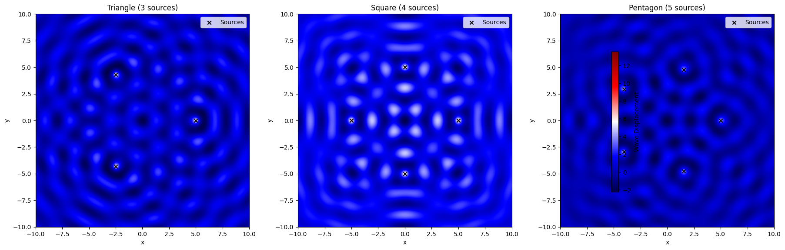
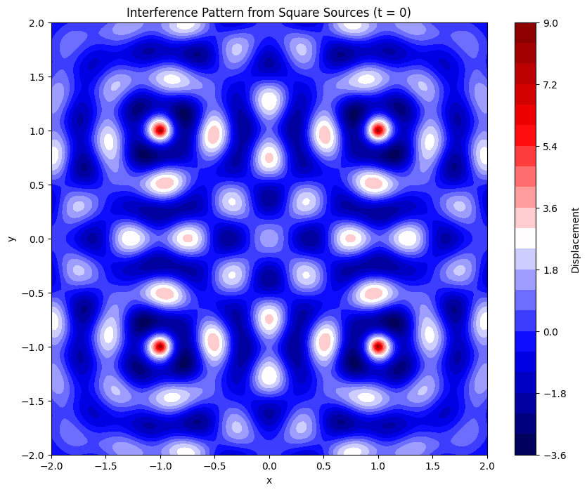
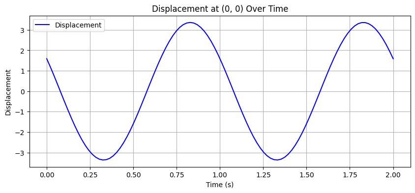
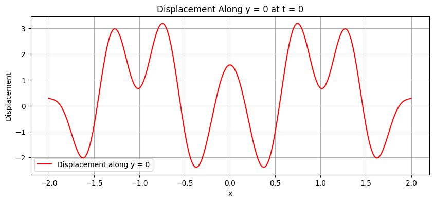

# Interference Patterns on a Water Surface
## A Simulation-Based Exploration Using Regular Polygons

### 1. Introduction
Wave interference is a fundamental concept in physics that describes how two or more waves combine when they overlap in space. On a water surface, this phenomenon is visually intuitive and can be observed when multiple ripples interact, forming patterns of reinforcement (constructive interference) or cancellation (destructive interference).

In this study, we simulate the interference patterns created by coherent wave sources placed at the vertices of regular polygons — such as triangles, squares, and pentagons. The regular placement ensures symmetry and makes it easier to study the resulting wave interactions.

###  2. Real-World Relevance
- **Noise-canceling headphones**: Use destructive interference to cancel ambient sound.
- **Optical instruments**: Lasers interfere to form holograms or measure distances with extreme precision.
- **Engineering and architecture**: Vibration patterns in structures are often analyzed using interference principles.

### 3. Wave Physics Background
Each point source creates a circular wave that propagates outward. The mathematical expression for a wave from a point source is shown below:

$$
\eta_i(x, y, t) = \frac{A}{r_i} \cdot \cos\Bigl(kr_i - \omega t + \phi_i\Bigr)
$$

Where:
- $\eta_i(x, y, t)$: Displacement at point $(x, y)$ and time $t$ from source $i$  
- $A$: Amplitude (constant for all sources)  
- $r_i = \sqrt{(x - x_i)^2 + (y - y_i)^2}$: Distance from the source to the point  
- $k = \frac{2\pi}{\lambda}$: Wave number (inverse of wavelength)  
- $\omega = 2\pi f$: Angular frequency (proportional to frequency)  
- $\phi_i$: Initial phase of the wave from source $i$

Since all waves are coherent, we assume:
- Same $A$, $\lambda$, $f$, and $\phi = 0$

### 4. Superposition Principle
The total surface displacement at any point is calculated using the principle of linear superposition. Below is the corresponding formula:

$$
\eta_{sum}(x, y, t) = \sum_{i=1}^{N} \eta_i(x, y, t)
$$

This summation produces the interference pattern:
- **Bright regions**: Constructive interference (waves add up)
- **Dark regions**: Destructive interference (waves cancel)

### 5. Graphical Representation
Below is a Python script that uses Matplotlib to generate and display the interference patterns for a triangular, square, and pentagonal arrangement of point sources.

```python
import numpy as np
import matplotlib.pyplot as plt

# Constants for wave properties
A = 1.0            # amplitude
wavelength = 2.0   # wavelength
frequency = 1.0    # frequency
phi = 0.0          # phase offset

k = 2 * np.pi / wavelength
omega = 2 * np.pi * frequency

# Create a grid of x, y points to evaluate wave displacements
x = np.linspace(-10, 10, 500)
y = np.linspace(-10, 10, 500)
X, Y = np.meshgrid(x, y)

def polygon_vertices(n_sides, radius=5, center=(0, 0)):
    """Returns the coordinates of the vertices of a regular polygon"""
    angles = np.linspace(0, 2*np.pi, n_sides, endpoint=False)
    cx, cy = center
    return [(cx + radius*np.cos(a), cy + radius*np.sin(a)) for a in angles]

def total_wave(X, Y, t, sources):
    """Calculates the total wave displacement by summing the waves from all sources"""
    eta = np.zeros_like(X)
    for (x0, y0) in sources:
        r = np.sqrt((X - x0)**2 + (Y - y0)**2) + 1e-6  # to avoid division by zero
        eta += (A / np.sqrt(r)) * np.cos(k * r - omega * t + phi)
    return eta

# Time snapshot for visualization
t = 0

# Create the figure for plotting
fig, axs = plt.subplots(1, 3, figsize=(18, 6))
titles = ['Triangle (3 sources)', 'Square (4 sources)', 'Pentagon (5 sources)']

# Generate and plot the interference patterns for each polygon
for ax, sides, title in zip(axs, [3, 4, 5], titles):
    sources = polygon_vertices(sides)  # Get the polygon vertices
    eta_sum = total_wave(X, Y, t, sources)  # Compute the total wave displacement
    im = ax.imshow(eta_sum, extent=(-10, 10, -10, 10), cmap='seismic', origin='lower')  # Plot the pattern
    ax.set_title(title)
    ax.set_xlabel('x')
    ax.set_ylabel('y')
    ax.scatter(*zip(*sources), color='black', marker='x', label='Sources')  # Mark the sources
    ax.legend()

# Add color bar for better understanding
fig.colorbar(im, ax=axs.ravel().tolist(), shrink=0.7, label='Wave Displacement')

# Adjust layout for better spacing
plt.tight_layout()
plt.show()
```



# Analysis of Graphs

### Triangle (3 Sources)
The interference pattern exhibits **three-fold symmetry**. Bright areas represent **constructive interference**, while dark areas show **destructive interference**.

### Square (4 Sources)
The interference pattern forms a **four-fold symmetric grid**, with regions of amplification and cancellation of waves.

### Pentagon (5 Sources)
The interference pattern becomes more complex with **five-fold symmetry**, showcasing intricate regions of constructive and destructive interference.


# 6.Formulas Used in the Code
#### 1. Distance to Source

$$
r_i = \sqrt{(x - x_i)^2 + (y - y_i)^2}
$$

**Explanation**: This is the Euclidean distance from a point $(x, y)$ to the wave source at $(x_i, y_i)$.  
**Why it's important**: Farther points receive weaker waves and are reached later.

**Example**: From $(0,0)$ to $(3,4)$:

$$
r = \sqrt{3^2 + 4^2} = 5
$$

---

#### 2. Wave Number

$$
k = \frac{2\pi}{\lambda}
$$

**Explanation**: Number of wave cycles per unit length.  
**Why it's important**: Controls how tightly packed the waves are.  
**Note**: $\lambda$ is the wavelength — distance between two crests.

---

#### 3. Angular Frequency

$$
\omega = 2\pi f
$$

**Explanation**: How quickly the wave oscillates (in time).  
**Why it's important**: High frequency → fast oscillation.  
**Note**: $f$ is frequency in Hz.

---

#### 4. Single Wave Equation

$$
\eta_i(x, y, t) = \frac{A}{r_i} \cdot \cos(kr_i - \omega t)
$$

**Explanation**: Displacement from a single wave source at a point in space and time.

- $A$ is the amplitude  
- $\frac{1}{r_i}$ models decay with distance  
- $\cos(kr_i - \omega t)$ describes wave oscillation

**Closer = stronger wave**; farther = weaker.

---

#### 5. Total Wave Equation (Superposition)

$$
\eta_{\text{sum}}(x, y, t) = \sum_{i=1}^{N} \eta_i(x, y, t)
$$

**Explanation**: Add up contributions from all sources.  
**Why it's important**: This is how interference patterns form.

---

#### 6. Constructive Interference Condition

$$
\Delta r = m \lambda \quad (m = 0, \pm1, \pm2, \dots)
$$

**Explanation**: Waves reinforce when path difference is a whole multiple of wavelength.

**Example**: If $\lambda = 2$, then $\Delta r = 2, 4, 6, \dots$

---

#### 7. Destructive Interference Condition

$$
\Delta r = \left(m + \frac{1}{2} \right)\lambda
$$

**Explanation**: Waves cancel when their path difference is a half multiple of the wavelength.

**Example**: If $\lambda = 2$, then $\Delta r = 1, 3, 5, \dots$

---

#### 8. Wave Decay Due to Distance

$$
\text{Amplitude} \propto \frac{1}{r_i}
$$

**Explanation**: Waves lose strength as they spread out.  
 Real-life: Drop a pebble — strong ripples near impact, weaker far out.

# 7. Visualizing Wave Interference: Square Source Dynamics

Here’s the enhanced Python script generating three graphs:

1. **Interference pattern at \( t = 0 \)**
2. **Time evolution at the center \( (0, 0) \)**
3. **Cross-sectional displacement along \( y = 0 \)**

```python
import numpy as np
import matplotlib.pyplot as plt

# Parameters
A = 1.0  # Amplitude
lambda_ = 0.5  # Wavelength
k = 2 * np.pi / lambda_  # Wave number
omega = 2 * np.pi  # Angular frequency (f = 1)
t = 0  # Initial time

# Define grid
x = np.linspace(-2, 2, 200)
y = np.linspace(-2, 2, 200)
X, Y = np.meshgrid(x, y)

# Source positions (square)
sources = [(1, 1), (1, -1), (-1, -1), (-1, 1)]

# Total wave displacement at t = 0
eta_sum = np.zeros_like(X)
for (x0, y0) in sources:
    r = np.sqrt((X - x0)**2 + (Y - y0)**2)
    eta_i = A / np.sqrt(r + 0.01) * np.cos(k * r - omega * t)  # Avoid division by zero
    eta_sum += eta_i

# Graph 1: 2D Interference Pattern
plt.figure(figsize=(10, 8))
plt.contourf(X, Y, eta_sum, levels=20, cmap='seismic')
plt.colorbar(label='Displacement')
plt.title('Interference Pattern from Square Sources (t = 0)')
plt.xlabel('x')
plt.ylabel('y')
plt.show()

# Graph 2: Time Evolution at (0, 0)
t_values = np.linspace(0, 2, 100)
eta_time = []
for t in t_values:
    eta = 0
    for (x0, y0) in sources:
        r = np.sqrt((0 - x0)**2 + (0 - y0)**2)
        eta += A / np.sqrt(r) * np.cos(k * r - omega * t)
    eta_time.append(eta)

plt.figure(figsize=(10, 4))
plt.plot(t_values, eta_time, 'b-', label='Displacement')
plt.title('Displacement at (0, 0) Over Time')
plt.xlabel('Time (s)')
plt.ylabel('Displacement')
plt.grid()
plt.legend()
plt.show()

# Graph 3: Cross-section along y = 0
eta_cross = np.zeros_like(x)
for i, x_val in enumerate(x):
    eta = 0
    for (x0, y0) in sources:
        r = np.sqrt((x_val - x0)**2 + (0 - y0)**2)
        eta += A / np.sqrt(r + 0.01) * np.cos(k * r)
    eta_cross[i] = eta

plt.figure(figsize=(10, 4))
plt.plot(x, eta_cross, 'r-', label='Displacement along y = 0')
plt.title('Displacement Along y = 0 at t = 0')
plt.xlabel('x')
plt.ylabel('Displacement')
plt.grid()
plt.legend()
plt.show()
```






# Results and Interpretation

## 2D Interference Pattern
The contour plot shows a symmetric pattern due to the square’s geometry. Bright red and blue areas indicate **constructive interference** (high positive/negative displacement), while white areas near zero show **destructive interference**.  
Diagonal lines of symmetry emerge from the equal spacing of sources.

## Time Evolution at (0, 0)
The reference point is arbitrary:  
The line plot reveals periodic oscillations, as waves from all sources interfere at the center. Peaks and troughs depend on the phase alignment over time.

## Cross-section Along $y = 0$
This graph shows how displacement varies along the x-axis at $y = 0$. Sharp peaks and dips highlight interference effects, with symmetry around $x = 0$.

## Discussion
The square arrangement produces a highly symmetric interference pattern, with **constructive interference** strongest where path differences are integer multiples of $\lambda$. **Destructive interference** dominates where path differences are half-wavelength multiples.The $\frac{1}{r}$ amplitude decay ensures distant points have weaker contributions, shaping the pattern’s spread. This simulation could be extended to other polygons (e.g., triangle or pentagon) or varying $\lambda$ to explore richer patterns.
