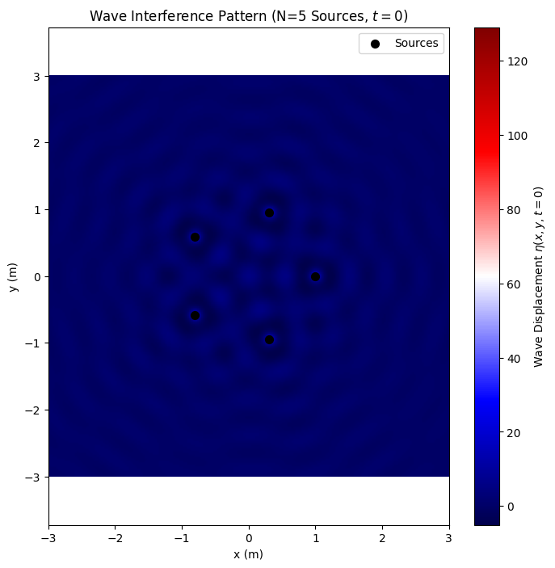
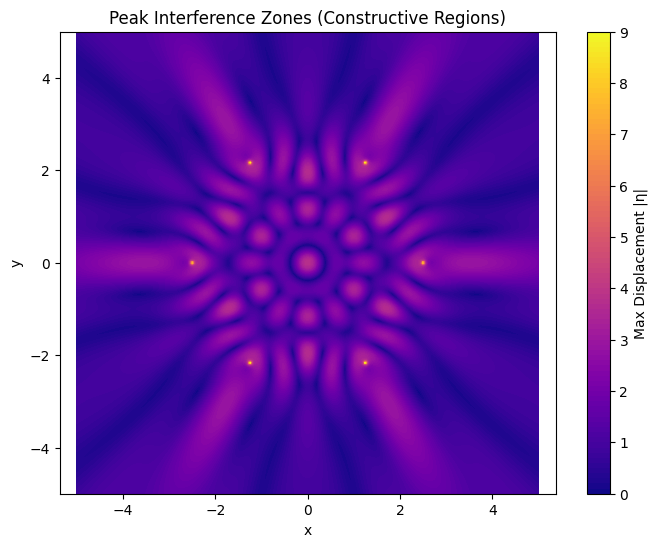

# Wave Interference from Polygonal Sources

## Problem Statement

The task is to analyze the interference patterns that form on the surface of water when multiple circular waves, each originating from a point source, superimpose. These sources are positioned at the vertices of a chosen regular polygon. The goal is to use both wave physics and numerical simulation to understand how coherent waves interact, producing patterns of constructive and destructive interference.

## Motivation

Wave interference is a fundamental concept in physics, where overlapping waves can amplify (constructive) or cancel (destructive) each other. On water, this can be observed beautifully with ripples meeting from multiple sources. This task leverages simple visual physics to explore:
- How coherent wave sources interfere.
- The influence of geometry on interference patterns.
- Superposition of circular waveforms.

By using polygonal source arrangements and a hands-on simulation, this becomes an intuitive way to understand wave mechanics and symmetry.

## Mathematical Model of a Single Wave

The wave emitted from a single point source at position $(x_0, y_0)$ is modeled as:

$$ \eta(x, y, t) = \frac{A}{r} \cdot \cos(kr - \omega t + \phi) $$

**Variables**:
- $\eta(x, y, t)$: Displacement of the water surface at position $(x, y)$ and time $t$.
- $A$: Amplitude of the wave.
- $r = \sqrt{(x - x_0)^2 + (y - y_0)^2}$: Distance from source to point.
- $k = \frac{2\pi}{\lambda}$: Wave number, with $\lambda$ as the wavelength.
- $\omega = 2\pi f$: Angular frequency, with $f$ as the wave frequency.
- $\phi$: Initial phase of the wave.

## Geometry: Polygon Wave Source Arrangement

- Choose a regular polygon (e.g., triangle, square, pentagon).
- Place one point wave source at each vertex.
- All sources emit identical, coherent waves with:
  - Same amplitude $A$, wavelength $\lambda$, and frequency $f$.
  - Same or constant phase differences.

Let the number of sides (and thus number of sources) be:  
$N = \text{Number of vertices}$

To calculate their positions, evenly distribute them around a circle:

$$ (x_i, y_i) = \left( R \cos(\theta_i), R \sin(\theta_i) \right), \quad \theta_i = \frac{2\pi i}{N} $$

## Superposition of Waves

To calculate the total wave displacement at a point $(x, y)$, sum the contributions from all sources:

$$ \eta_{\text{sum}}(x, y, t) = \sum_{i=1}^N \frac{A}{r_i} \cdot \cos(kr_i - \omega t + \phi_i) $$

Where:
- $r_i = \sqrt{(x - x_i)^2 + (y - y_i)^2}$ is the distance from the $i$-th source.
- $\phi_i$: Phase of the $i$-th source (typically 0 for all).

This creates complex interference patterns on the water surface, especially in symmetric arrangements like polygons.


## Simulation – Python Implementation

1.The following Python code simulates and visualizes the interference pattern formed at a fixed time snapshot (e.g., $t = 0$).

```python
import numpy as np
import matplotlib.pyplot as plt

# Parameters
A = 1.0          # Amplitude of each wave
lambda_ = 0.5    # Wavelength (m)
k = 2 * np.pi / lambda_  # Wave number
omega = 2 * np.pi * 1.0  # Angular frequency (assuming f = 1 Hz)
phi = 0.0        # Phase (same for all sources)
R = 1.0          # Radius of polygon (m)
N = 5            # Number of sources (e.g., pentagon)
t = 0.0          # Time snapshot

# Define source positions for a regular polygon
theta_i = np.linspace(0, 2 * np.pi, N, endpoint=False)  # Angles for N vertices
x_i = R * np.cos(theta_i)  # x-coordinates of sources
y_i = R * np.sin(theta_i)  # y-coordinates of sources

# Create a grid for the simulation
x = np.linspace(-3, 3, 200)  # x-range (m)
y = np.linspace(-3, 3, 200)  # y-range (m)
X, Y = np.meshgrid(x, y)     # 2D grid
eta_sum = np.zeros_like(X)   # Initialize wave displacement

# Calculate total wave displacement
for i in range(N):
    # Distance from i-th source to each point (x, y)
    r_i = np.sqrt((X - x_i[i])**2 + (Y - y_i[i])**2)
    # Avoid division by zero near sources
    r_i = np.where(r_i < 1e-10, 1e-10, r_i)
    # Wave contribution from i-th source
    eta_i = (A / r_i) * np.cos(k * r_i - omega * t + phi)
    eta_sum += eta_i

# Plot the interference pattern
plt.figure(figsize=(8, 8))
plt.imshow(eta_sum, extent=[-3, 3, -3, 3], cmap='seismic', origin='lower')
plt.colorbar(label='Wave Displacement $\eta(x, y, t=0)$')
plt.scatter(x_i, y_i, c='black', s=50, label='Sources')
plt.xlabel('x (m)')
plt.ylabel('y (m)')
plt.title(f'Wave Interference Pattern (N={N} Sources, $t=0$)')
plt.legend()
plt.axis('equal')
plt.show()
```



## Explanation

### Parameters
- $A = 1.0$: Amplitude of each wave.
- $\lambda = 0.5 \, \text{m}$: Wavelength, giving $k = \frac{2\pi}{\lambda}$.
- $\omega = 2\pi \cdot 1.0$: Angular frequency (assuming $f = 1 \, \text{Hz}$).
- $\phi = 0.0$: Phase (same for all sources).
- $R = 1.0 \, \text{m}$: Radius of the polygon.
- $N = 5$: Number of sources (pentagon arrangement).
- $t = 0$: Fixed time snapshot.

### Source Positions
Sources are placed at the vertices of a regular $N$-sided polygon:

$$ (x_i, y_i) = \left( R \cos\left( \frac{2\pi i}{N} \right), R \sin\left( \frac{2\pi i}{N} \right) \right) $$

### Wave Superposition
Computes the total displacement:

$$ \eta_{\text{sum}}(x, y, t) = \sum_{i=1}^N \frac{A}{r_i} \cdot \cos(kr_i - \omega t + \phi_i) $$

where $r_i = \sqrt{(x - x_i)^2 + (y - y_i)^2}$.

### Plot
- Displays the interference pattern as a 2D heatmap using the seismic colormap (red for positive, blue for negative).
- Marks source positions as black dots.
- Includes a colorbar for wave displacement $\eta$.
- Uses equal axes to preserve symmetry.


## Simulation – Python Implementation
2.This simulation ignores time and calculates the maximum possible displacement across time — a kind of “heatmap” showing where the strongest interference consistently occurs.

```python
import numpy as np
import matplotlib.pyplot as plt

# Parameters
A = 1
wavelength = 1.0
k = 2 * np.pi / wavelength
N = 6                      # Number of sources (hexagon)
R = 2.5                    # Polygon radius

# Grid
x_vals = np.linspace(-5, 5, 400)
y_vals = np.linspace(-5, 5, 400)
X, Y = np.meshgrid(x_vals, y_vals)

# Source positions
source_positions = [
    (R * np.cos(2 * np.pi * i / N), R * np.sin(2 * np.pi * i / N)) for i in range(N)
]

# Sum peak values over 1 period of wave
T = wavelength            # Period of the wave
frames = 100
t_vals = np.linspace(0, T, frames)

# Superposition
peak_map = np.zeros_like(X)
for t in t_vals:
    snapshot = np.zeros_like(X)
    for x0, y0 in source_positions:
        r = np.sqrt((X - x0)**2 + (Y - y0)**2) + 1e-6
        snapshot += A / np.sqrt(r) * np.cos(k * r - 2 * np.pi * t)
    peak_map = np.maximum(peak_map, np.abs(snapshot))

# Plot
plt.figure(figsize=(8, 6))
plt.contourf(X, Y, peak_map, levels=100, cmap='plasma')
plt.colorbar(label='Max Displacement |η|')
plt.title('Peak Interference Zones (Constructive Regions)')
plt.axis('equal')
plt.xlabel('x')
plt.ylabel('y')
plt.show()
```




## Explanation: Wave Interference Simulation

This Python script simulates and visualizes the peak interference pattern formed by multiple coherent wave sources arranged at the vertices of a regular hexagon, capturing the maximum displacement over one wave period.

### Parameters
- $A = 1.0$: Amplitude of each wave.
- $\lambda = 1.0 \, \text{m}$: Wavelength, giving $k = \frac{2\pi}{\lambda}$.
- $N = 6$: Number of sources (hexagon arrangement).
- $R = 2.5 \, \text{m}$: Radius of the polygon.
- $T = \lambda = 1.0 \, \text{m}$: Period of the wave (assuming wave speed $c = 1 \, \text{m/s}$, so $T = \lambda / c$).
- $t$: Time values sampled over one period ($t \in [0, T]$) with 100 frames.

### Source Positions
Sources are placed at the vertices of a regular $N$-sided polygon (hexagon):

$$ (x_i, y_i) = \left( R \cos\left( \frac{2\pi i}{N} \right), R \sin\left( \frac{2\pi i}{N} \right) \right) $$

For $N = 6$ and $R = 2.5 \, \text{m}$, the six sources are evenly spaced around a circle of radius 2.5 m.

### Wave Superposition
The script computes the total wave displacement at each point $(x, y)$ for multiple time snapshots and tracks the maximum absolute displacement over one period:

$$ \eta_{\text{sum}}(x, y, t) = \sum_{i=1}^N \frac{A}{\sqrt{r_i}} \cdot \cos(kr_i - 2\pi t) $$

Where:
- $r_i = \sqrt{(x - x_i)^2 + (y - y_i)^2}$ is the distance from the $i$-th source to point $(x, y)$.
- The phase $\phi_i = 0$ for all sources (coherent waves).
- The amplitude scales as $1/\sqrt{r_i}$, appropriate for 2D wave propagation (unlike $1/r_i$ in the previous model).
- Time term $-2\pi t$ assumes frequency $f = 1/T = 1 \, \text{Hz}$.

The peak map stores the maximum $|\eta_{\text{sum}}|$ over all time snapshots $t \in [0, T]$.

### Plot
- **Interference Pattern**: Displays the peak displacement as a 2D contour plot using the plasma colormap, highlighting constructive interference zones (high displacement).
- **Grid**: Covers a $10 \times 10 \, \text{m}$ area with 400x400 points for high resolution.
- **Colorbar**: Indicates maximum displacement $|\eta|$.
- **Title and Axes**: Labels the plot as "Peak Interference Zones (Constructive Regions)" with $x$ and $y$ axes in meters.
- **Equal Axes**: Ensures the pattern’s symmetry is preserved visually.


