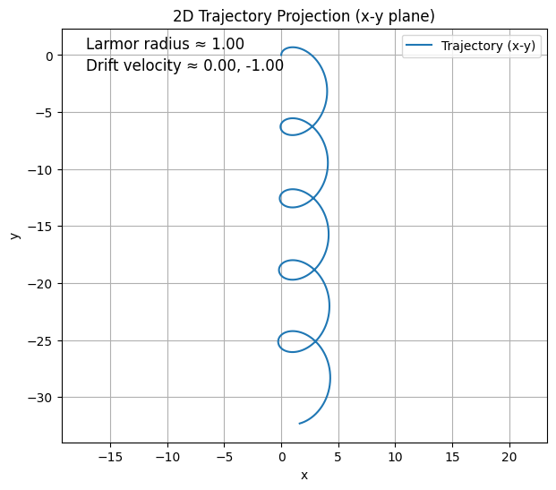
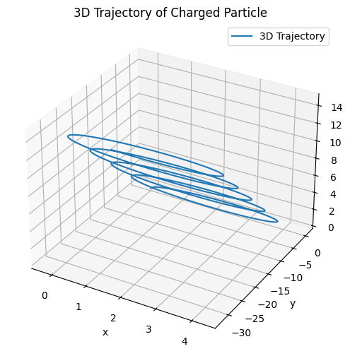
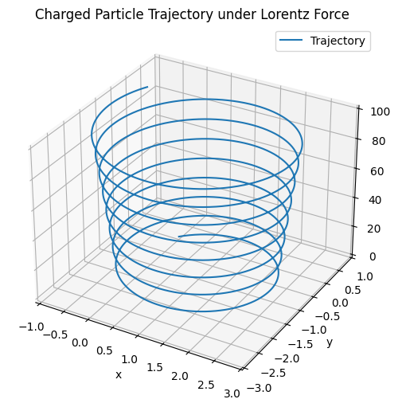

# 1. Exploration of Applications of the Lorentz Force

## Introduction

The Lorentz force is fundamental to the motion of charged particles in both electric and magnetic fields. It is given by:

$$ F = q E + q (v \times B) $$

Where:
- $F$ is the total force on the particle,
- $q$ is the particle’s electric charge,
- $E$ is the electric field vector,
- $B$ is the magnetic field vector,
- $v$ is the velocity of the particle.

This force determines the trajectory and acceleration of particles in various physical systems, especially in modern technology and fundamental physics.

## Key Systems Where the Lorentz Force Is Crucial

### 1. Particle Accelerators

**Application**: Accelerate charged particles to high speeds using electric fields and guide them with magnetic fields.

**Lorentz Role**:
- Electric fields provide acceleration (linear increase in speed).
- Magnetic fields bend the particle’s path, enabling circular or spiral motion.

**Example**: In a cyclotron, particles spiral outward due to the combined effect of magnetic deflection and increasing kinetic energy.

### 2. Mass Spectrometers

**Application**: Separate ions based on their mass-to-charge ratio.

**Lorentz Role**:
- A known $B$-field bends particle paths.
- The radius of curvature depends on mass and velocity:

$$ r = \frac{m v}{q B} $$

- By measuring the deflection, the mass of particles can be inferred.

### 3. Plasma Confinement in Fusion Reactors

**Application**: Contain hot ionized gas (plasma) for controlled fusion.

**Lorentz Role**:
- Charged particles spiral along magnetic field lines.
- Magnetic traps (e.g., tokamaks, stellarators) use complex $B$-fields to keep plasma from touching reactor walls.

### 4. Cathode Ray Tubes & CRT Monitors

**Application**: Use deflected electron beams to generate images on screens.

**Lorentz Role**:
- Magnetic or electric fields steer electron paths to target pixels on a phosphorescent screen.

### 5. Astrophysical Environments

**Application**: Motion of particles in cosmic magnetic fields.

**Lorentz Role**:
- Charged particles (cosmic rays, solar wind) spiral along planetary magnetic fields.
- Auroras are caused by electrons being steered by Earth’s $B$-field into the upper atmosphere.

## Role of $E$ and $B$ Fields

### Electric Fields ($E$)
- Affect particle motion along the field lines.
- Provide linear acceleration.
- Control energy gain in accelerators.
- Used in devices like capacitors, ion thrusters, and electric field traps.

### Magnetic Fields ($B$)
- Affect motion perpendicular to both velocity and field via:

$$ F_B = q (v \times B) $$

- Cause circular or helical motion.
- Useful for guiding and trapping particles without energy change.
- Essential in plasma containment, mass analysis, and beam focusing.


# 2. Simulating Particle Motion Under Lorentz Force

## Goal

Simulate and visualize how a charged particle moves when subject to different combinations of electric and magnetic fields, based on the Lorentz force law:

$$ F = q E + q (v \times B) $$

This will demonstrate:
- Circular motion (uniform magnetic field).
- Helical motion (magnetic field + initial velocity component along field).
- Drift motion (crossed $E$ and $B$ fields).

## Simulation Overview

We solve the particle’s equations of motion numerically using the Runge-Kutta method or Euler’s method.

We simulate:
- Position: $r(t)$,
- Velocity: $v(t)$.

## Governing Equations

The equations of motion are:

$$ \frac{dr}{dt} = v, \quad \frac{dv}{dt} = \frac{q}{m} \left( E + v \times B \right) $$


# 3. – Parameter Exploration of Lorentz Force Effects

## Objective

Explore how changing physical parameters affects a particle’s trajectory under the Lorentz force:

$$ F = q E + q (v \times B) $$

This helps understand:
- How field strengths bend or accelerate the motion.
- How initial velocity determines orbit radius or drift.
- How charge and mass influence acceleration and curvature.

## Theoretical Considerations

- **Stronger $B$**: Leads to tighter circular or helical motion.
- **Stronger $E$**: Causes faster drift or linear acceleration.
- **Larger charge $q$**: Results in more force, leading to tighter curvature or faster acceleration.
- **Larger mass $m$**: Slower response to fields due to greater inertia.


# 4. Visualization of Particle Motion and Key Physical Effects

## Objective

Use 2D and 3D plots to visualize the motion of a charged particle under the Lorentz force. Highlight important physical features such as:
- Larmor radius (the radius of circular motion in a magnetic field).
- Drift velocity (net particle motion in crossed $E$ and $B$ fields).

## Key Concepts

### Larmor Radius ($r_L$)

Occurs in uniform magnetic fields when $E = 0$.

Given by:

$$ r_L = \frac{m v_\perp}{q B} $$

where $v_\perp$ is the component of velocity perpendicular to the magnetic field.

### E × B Drift

When $E \perp B$, the particle undergoes a net drift.

Drift velocity:

$$ v_{\text{drift}} = \frac{E \times B}{B^2} $$

## Python Code: 2D and 3D Visualization with Highlights


```python
import numpy as np
import matplotlib.pyplot as plt

# Parameters
q = 1.0      # Charge
m = 1.0      # Mass
B = np.array([0.0, 0.0, 1.0])    # Magnetic field
E = np.array([1.0, 0.0, 0.0])    # Electric field (change for different cases)
v0 = np.array([0.0, 1.0, 0.5])   # Initial velocity
r0 = np.array([0.0, 0.0, 0.0])   # Initial position
dt = 0.01
steps = 3000

# Initialize
r = r0.copy()
v = v0.copy()
positions = [r.copy()]

for _ in range(steps):
    F = q * (E + np.cross(v, B))
    a = F / m
    v += a * dt
    r += v * dt
    positions.append(r.copy())

positions = np.array(positions)

# Calculate theoretical Larmor radius (if E = 0)
v_perp = np.linalg.norm(v0[:2])  # perpendicular to Bz
B_mag = np.linalg.norm(B)
r_L = m * v_perp / (q * B_mag) if B_mag != 0 else np.nan

# Calculate drift velocity
if B_mag != 0 and np.linalg.norm(E) > 0:
    v_drift = np.cross(E, B) / B_mag**2
else:
    v_drift = np.array([0.0, 0.0, 0.0])

# Plot 2D projection (x vs y)
plt.figure(figsize=(7, 6))
plt.plot(positions[:, 0], positions[:, 1], label='Trajectory (x-y)')
plt.title('2D Trajectory Projection (x-y plane)')
plt.xlabel('x')
plt.ylabel('y')
plt.axis('equal')
plt.grid(True)
plt.legend()

# Annotate Larmor radius
if not np.isnan(r_L):
    plt.text(0.05, 0.95, f'Larmor radius ≈ {r_L:.2f}', transform=plt.gca().transAxes, fontsize=12)

# Annotate drift velocity
if np.linalg.norm(v_drift) > 0:
    plt.text(0.05, 0.90, f'Drift velocity ≈ {v_drift[0]:.2f}, {v_drift[1]:.2f}', transform=plt.gca().transAxes, fontsize=12)

plt.show()

# 3D plot
from mpl_toolkits.mplot3d import Axes3D

fig = plt.figure(figsize=(8, 6))
ax = fig.add_subplot(111, projection='3d')
ax.plot3D(positions[:, 0], positions[:, 1], positions[:, 2], label='3D Trajectory')
ax.set_title("3D Trajectory of Charged Particle")
ax.set_xlabel("x")
ax.set_ylabel("y")
ax.set_zlabel("z")
ax.legend()
plt.show()
```


         





## Explanation:

This Python script simulates and visualizes the motion of a charged particle under the Lorentz force in both 2D and 3D, highlighting key physical effects such as the Larmor radius and E × B drift velocity.

### Parameters
- $q = 1.0$: Charge of the particle (arbitrary units).
- $m = 1.0$: Mass of the particle (arbitrary units).
- $B = [0, 0, 1.0]$: Magnetic field vector (along z-axis, strength 1.0).
- $E = [1.0, 0, 0]$: Electric field vector (along x-axis, strength 1.0).
- $v_0 = [0.0, 1.0, 0.5]$: Initial velocity (m/s, components in y and z).
- $r_0 = [0.0, 0.0, 0.0]$: Initial position (m, at origin).
- $dt = 0.01$: Time step for simulation.
- $\text{steps} = 3000$: Number of time steps.

### Plot
- **2D Plot**:
  - Displays the particle’s trajectory projected onto the x-y plane.
  - Shows circular or curved motion due to the magnetic field.
  - Annotates the Larmor radius ($r_L$) if $B \neq 0$.
  - Annotates the drift velocity components if $E \neq 0$.
  - Uses equal axes to preserve the shape of the trajectory.
  - Includes a grid and legend for clarity.

- **3D Plot**:
  - Shows the full 3D trajectory ($x$, $y$, $z$).
  - Highlights helical motion (due to $v_{0z} \neq 0$) combined with drift.
  - Labels axes in meters and includes a legend.


## Python Simulation (3D Motion)


```python
import numpy as np
import matplotlib.pyplot as plt
from mpl_toolkits.mplot3d import Axes3D

# Constants
q = 1.0         # Charge (C)
m = 1.0         # Mass (kg)
dt = 0.01       # Time step
steps = 5000    # Number of steps

# Initial Conditions
r = np.array([0.0, 0.0, 0.0])          # Initial position
v = np.array([1.0, 1.0, 2.0])          # Initial velocity

# Field Configuration
E = np.array([0.0, 0.0, 0.0])          # Electric field
B = np.array([0.0, 0.0, 1.0])          # Magnetic field

# You can try:
# E = [1, 0, 0], B = [0, 0, 1] → Crossed fields
# E = [0, 0, 0], B = [0, 0, 1] → Pure magnetic
# E = [0, 0, 1], B = [0, 0, 1] → Combined fields

# Storage
positions = [r.copy()]

# Euler Integration
for _ in range(steps):
    F = q * (E + np.cross(v, B))
    a = F / m
    v = v + a * dt
    r = r + v * dt
    positions.append(r.copy())

positions = np.array(positions)

# Plotting
fig = plt.figure(figsize=(10, 6))
ax = fig.add_subplot(111, projection='3d')
ax.plot3D(positions[:, 0], positions[:, 1], positions[:, 2], label='Trajectory')
ax.set_xlabel('x')
ax.set_ylabel('y')
ax.set_zlabel('z')
ax.set_title('Charged Particle Trajectory under Lorentz Force')
ax.legend()
plt.show()
```




## Explanation:

This Python script simulates and visualizes the 3D motion of a charged particle under the Lorentz force, demonstrating its trajectory influenced by electric and magnetic fields.

### Parameters
- $q = 1.0$: Charge of the particle (arbitrary units).
- $m = 1.0$: Mass of the particle (arbitrary units).
- $dt = 0.01$: Time step for simulation.
- $\text{steps} = 5000$: Number of time steps.
- $r_0 = [0.0, 0.0, 0.0]$: Initial position (m, at origin).
- $v_0 = [1.0, 1.0, 2.0]$: Initial velocity (m/s, components in x, y, z).
- $E = [0.0, 0.0, 0.0]$: Electric field vector (no electric field in this setup).
- $B = [0.0, 0.0, 1.0]$: Magnetic field vector (along z-axis, strength 1.0).

### Simulation Method
The script uses Euler’s method to numerically solve the equations of motion under the Lorentz force:

$$ F = q E + q (v \times B) $$

$$ \frac{dr}{dt} = v, \quad \frac{dv}{dt} = \frac{F}{m} = \frac{q}{m} \left( E + v \times B \right) $$

- **Force Calculation**: Computes $F = q (E + v \times B)$ at each step. Here, $E = 0$, so $F = q (v \times B)$.
- **Acceleration**: $a = F / m$.
- **Update**: Updates velocity ($v \gets v + a \cdot dt$) and position ($r \gets r + v \cdot dt$).
- Tracks positions over 5000 steps to form the trajectory.

### Physical Calculations
- **Larmor Radius ($r_L$)**:  
  Since $E = 0$, the particle undergoes circular or helical motion in a uniform magnetic field. The radius of the circular component (in the x-y plane, perpendicular to $B$) is:

  $$ r_L = \frac{m v_\perp}{q B} $$

  where $v_\perp = \sqrt{v_{0x}^2 + v_{0y}^2} = \sqrt{1.0^2 + 1.0^2} = \sqrt{2} \approx 1.414$, $q = 1.0$, $m = 1.0$, and $B = 1.0$. Thus, $r_L \approx 1.414$.

- **Helical Motion**:  
  The initial velocity component along $B$ (z-axis), $v_{0z} = 2.0$, causes linear motion along z, combining with the x-y circular motion to form a helix.

- **E × B Drift**:  
  Since $E = 0$, there is no drift velocity ($v_{\text{drift}} = \frac{E \times B}{B^2} = 0$).

### Plot
- **3D Plot**:
  - Displays the full 3D trajectory ($x$, $y$, $z$) of the particle.
  - Shows a helical path due to the magnetic field ($B$ along z) and non-zero $v_{0z}$.
  - The x-y plane exhibits circular motion with radius approximately equal to the Larmor radius.
  - Labels axes in meters (x, y, z) and includes a title and legend.
  - The plot spans a sufficient duration (5000 steps) to capture multiple helical loops.


