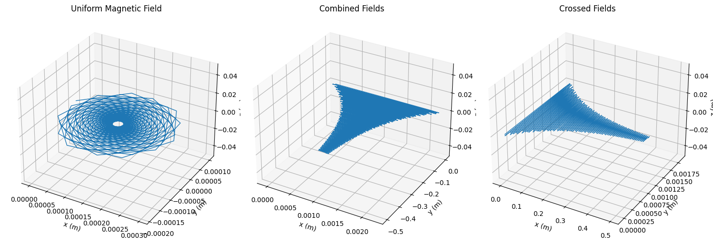
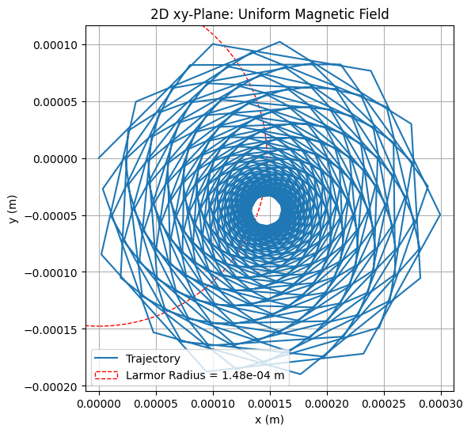
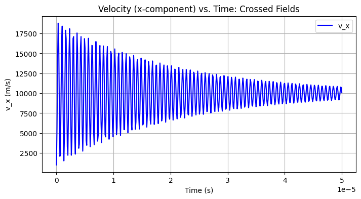
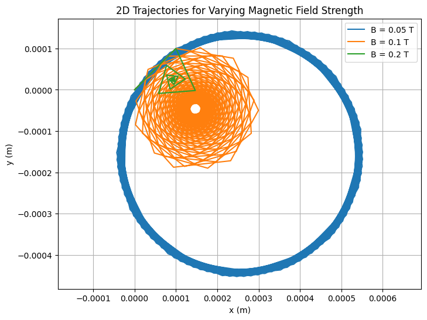
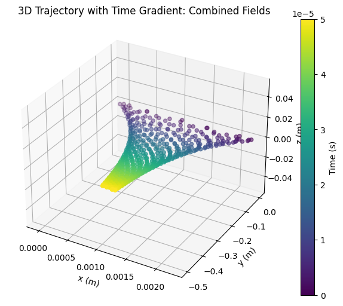

# Simulating the Effects of the Lorentz Force

## MOTIVATION

The Lorentz force describes how charged particles move in electric and magnetic fields. It is a key concept in electromagnetism, especially in technologies such as particle accelerators, mass spectrometers, fusion devices, and in astrophysics. Understanding this force helps us simulate and predict the motion of particles under the influence of fields.

# 1. What is the Lorentz Force?
The Lorentz force is the total force experienced by a charged particle when it moves in the presence of both electric and magnetic fields. It’s described by the equation:

$$
\mathbf{F} = q(\mathbf{E} + \mathbf{v} \times \mathbf{B})
$$

Where:

- **$F$** is the total force vector acting on the particle
- **$q$** is the electric charge of the particle
- **$E$** is the electric field vector
- **$v$** is the velocity vector of the particle
- **$B$** is the magnetic field vector
- **$×$** is the cross product (which determines the direction of the magnetic force)

This force causes charged particles to accelerate, change direction, or follow complex curved paths depending on the configuration of the fields.

---

# 2. Applications of the Lorentz Force
Understanding and controlling the Lorentz force is crucial in many physical systems and technologies:

- **Particle Accelerators**: Use magnetic and electric fields to steer and speed up particles for collisions and research (e.g., LHC at CERN).
- **Mass Spectrometers**: Separate particles based on mass-to-charge ratio using known magnetic fields.
- **Fusion Reactors (Tokamaks)**: Use strong magnetic fields to confine hot plasma — a collection of charged particles.
- **Cathode Ray Tubes**: Use electric and magnetic fields to control the electron beam that lights up the screen.
- **Auroras (Northern and Southern Lights)**: Caused by charged solar particles deflected by Earth’s magnetic field.

---

# 3. Special Motion Scenarios and Their Explanations

### a) Motion in a Uniform Magnetic Field ($E = 0$)
If there is no electric field and the magnetic field is constant, the particle experiences a force perpendicular to its velocity and the magnetic field. This results in circular or helical motion.

- The force does no work (it changes direction, not speed), so kinetic energy remains constant.
- The path depends on the angle between velocity and magnetic field:
  - **Perpendicular**: Circular path
  - **At an angle**: Helical path
  - **Parallel**: Straight line (no force)

#### Important Formulas:
- **Magnetic force**:

$$
\mathbf{F} = q (\mathbf{v} \times \mathbf{B})
$$

- **Larmor radius** (\(r_L\)):

$$
r_L = \frac{m v_{\perp}}{|q| B}
$$

- **Cyclotron frequency** (\(\omega\)):

$$
\omega = \frac{|q| B}{m}
$$

### b) Motion in a Uniform Electric Field ($B = 0$)
When only an electric field is present:

- The particle accelerates linearly in the direction of the electric field.
- The motion resembles free fall under gravity.

#### Formula:
- **Electric force**:

$$
\mathbf{F} = q \mathbf{E}
$$

### c) Motion in Crossed Fields ($E ⊥ B$)
In this case, the electric and magnetic fields are perpendicular to each other.

- The particle undergoes a drift — moving in a direction perpendicular to both $E$ and $B$.
- This drift velocity is the same regardless of mass or charge and is called the $E$ cross $B$ drift.

#### Formula:
- **Drift velocity** (\(\mathbf{v_d}\)):

$$
\mathbf{v_d} = \frac{\mathbf{E} \times \mathbf{B}}{B^2}
$$

---

# 4. Effect of Changing Physical Parameters
Each parameter influences the particle's path in different ways:

- **Charge $(q)$**: Determines direction of curvature. Opposite charges curve in opposite directions.
- **Mass $(m)$**: Affects how tightly a particle spirals in a magnetic field (smaller mass → tighter spiral).
- **Initial Velocity $(v)$**: Affects the size of the orbit and energy. If initial velocity is angled with respect to $(B)$, it creates helical motion.
- **Field Strength $(E, B)$**: Stronger magnetic fields decrease orbit radius. Stronger electric fields increase acceleration and drift speed.

---

# 5. Kinetic Energy of a Moving Particle
Even though the magnetic field affects the trajectory, it does not change the particle’s speed — hence, it does not do work. The electric field, however, adds energy to the particle.

#### Kinetic Energy Formula:
$$
K = \frac{1}{2} m v^2
$$

- In crossed fields, kinetic energy may oscillate but overall increases if the particle gains energy from $(E)$.

---

# 6. Visualization and Physical Interpretation
The resulting motion from different field setups is visually and physically rich:

- In a uniform magnetic field, the particle traces circular or helical paths.
- In an electric field, the path is a straight line with increasing speed.
- In crossed fields, the particle shows a cycloidal trajectory and net drift.

```python
import numpy as np
import matplotlib.pyplot as plt
from mpl_toolkits.mplot3d import Axes3D

# Constants
q = 1.6e-19  # Charge (C)
m = 1.67e-27  # Mass (kg)
dt = 1e-7    # Time step (s)
t_max = 5e-5 # Total time (s)
steps = int(t_max / dt)

# Lorentz force
def lorentz_force(v, E, B):
    return (q / m) * (E + np.cross(v, B))

# RK4 step
def rk4_step(r, v, E, B, dt):
    k1_v = lorentz_force(v, E, B)
    k1_r = v
    k2_v = lorentz_force(v + 0.5 * dt * k1_v, E, B)
    k2_r = v + 0.5 * dt * k1_r
    k3_v = lorentz_force(v + 0.5 * dt * k2_v, E, B)
    k3_r = v + 0.5 * dt * k2_r
    k4_v = lorentz_force(v + dt * k3_v, E, B)
    k4_r = v + dt * k3_r
    v_new = v + (dt / 6) * (k1_v + 2 * k2_v + 2 * k3_v + k4_v)
    r_new = r + (dt / 6) * (k1_r + 2 * k2_r + 2 * k3_r + k4_r)
    return r_new, v_new

# Simulation function
def simulate(E, B, r0, v0):
    r = np.zeros((steps, 3))
    v = np.zeros((steps, 3))
    r[0], v[0] = r0, v0
    for i in range(steps - 1):
        r[i + 1], v[i + 1] = rk4_step(r[i], v[i], E, B, dt)
    return r, v

# Initial conditions
r0 = np.array([0.0, 0.0, 0.0])
v0 = np.array([1000.0, 1000.0, 0.0])
scenarios = [
    (np.array([0.0, 0.0, 0.0]), np.array([0.0, 0.0, 0.1]), "Uniform Magnetic Field"),
    (np.array([1000.0, 0.0, 0.0]), np.array([0.0, 0.0, 0.1]), "Combined Fields"),
    (np.array([0.0, 1000.0, 0.0]), np.array([0.0, 0.0, 0.1]), "Crossed Fields")
]

# Graph 1: 3D Trajectories
fig = plt.figure(figsize=(15, 5))
for i, (E, B, title) in enumerate(scenarios, 1):
    r, _ = simulate(E, B, r0, v0)
    ax = fig.add_subplot(1, 3, i, projection='3d')
    ax.plot(r[:, 0], r[:, 1], r[:, 2], lw=1)
    ax.set_title(title)
    ax.set_xlabel('x (m)')
    ax.set_ylabel('y (m)')
    ax.set_zlabel('z (m)')
plt.tight_layout()
plt.show()

# Graph 2: 2D Projection with Larmor Radius
r, _ = simulate(scenarios[0][0], scenarios[0][1], r0, v0)  # Uniform B
plt.figure(figsize=(6, 6))
plt.plot(r[:, 0], r[:, 1], label='Trajectory')
v_perp = np.sqrt(v0[0]**2 + v0[1]**2)
r_L = m * v_perp / (q * 0.1)
circle = plt.Circle((0, 0), r_L, color='r', fill=False, linestyle='--', label=f'Larmor Radius = {r_L:.2e} m')
plt.gca().add_artist(circle)
plt.title("2D xy-Plane: Uniform Magnetic Field")
plt.xlabel('x (m)')
plt.ylabel('y (m)')
plt.legend()
plt.grid()
plt.axis('equal')
plt.show()

# Graph 3: Velocity vs. Time (x-component)
r, v = simulate(scenarios[2][0], scenarios[2][1], r0, v0)  # Crossed Fields
t = np.linspace(0, t_max, steps)
plt.figure(figsize=(8, 4))
plt.plot(t, v[:, 0], 'b-', label='v_x')
plt.title("Velocity (x-component) vs. Time: Crossed Fields")
plt.xlabel('Time (s)')
plt.ylabel('v_x (m/s)')
plt.grid()
plt.legend()
plt.show()
```

# 7. 3D Trajectories for All Scenarios



## Explanation:

## What It Is:
Three 3D plots showing a proton’s path in:
1. Just a magnetic field.
2. Magnetic plus electric field.
3. Crossed magnetic and electric fields.

## Why It Looks Like That:
The magnetic field makes the particle loop around due to:

$$
F = q \mathbf{v} \times \mathbf{B}
$$

Adding an electric field:

$$
F = q \mathbf{E}
$$

stretches the loops into a spiral or wavy path, depending on its direction.

## What It Means:
Shows how:

$$
F = q \mathbf{E} + q \mathbf{v} \times \mathbf{B}
$$

changes motion—circles for magnetic only, spirals or wiggles when electric is added. Think cyclotrons or plasma traps.

# 8. 2D Projection with Larmor Radius Annotation (Uniform Magnetic Field)



## Explanation:

## What It Is:
A 2D top-down view of the proton’s circular path in a magnetic field, with a red circle showing the Larmor radius.

## Why It Looks Like That:
The magnetic field forces the particle into a circle with radius:

$$
r_L = \frac{m v_{\perp}}{|q| B}
$$

where $(v_{\perp})$ is the speed perpendicular to $( B )$. The red circle matches this size.

## What It Means:
Confirms the particle follows:

$$
r_L = \frac{m v_{\perp}}{|q| B}
$$

in a magnetic field, like in a cyclotron where it spins in circles.

# 9.  Velocity vs. Time (x-component) for Crossed Fields



## Explanation:

## What It Is:
A line graph of the proton’s x-speed over time when electric and magnetic fields are perpendicular.

## Why It Looks Like That:
The speed waves because:

$$
F = q v \times B
$$

makes it loop, while:

$$
F = q E
$$

pushes it sideways. The drift speed is:

$$
v_d = \frac{E}{B} \left( \frac{B^2}{E} \right) = \frac{E}{B}
$$

## What It Means:
Shows how velocity changes with:

$$
\frac{d v}{d t} = \frac{q}{m} (E + v \times B)
$$

like in devices that filter particles by speed.


```python
import numpy as np
import matplotlib.pyplot as plt

# Constants
q = 1.6e-19
m = 1.67e-27
dt = 1e-7
t_max = 5e-5
steps = int(t_max / dt)

# Lorentz force
def lorentz_force(v, E, B):
    return (q / m) * (E + np.cross(v, B))

# RK4 step
def rk4_step(r, v, E, B, dt):
    k1_v = lorentz_force(v, E, B)
    k1_r = v
    k2_v = lorentz_force(v + 0.5 * dt * k1_v, E, B)
    k2_r = v + 0.5 * dt * k1_r
    k3_v = lorentz_force(v + 0.5 * dt * k2_v, E, B)
    k3_r = v + 0.5 * dt * k2_r
    k4_v = lorentz_force(v + dt * k3_v, E, B)
    k4_r = v + dt * k3_r
    v_new = v + (dt / 6) * (k1_v + 2 * k2_v + 2 * k3_v + k4_v)
    r_new = r + (dt / 6) * (k1_r + 2 * k2_r + 2 * k3_r + k4_r)
    return r_new, v_new

# Simulation function
def simulate(E, B, r0, v0):
    r = np.zeros((steps, 3))
    v = np.zeros((steps, 3))
    r[0], v[0] = r0, v0
    for i in range(steps - 1):
        r[i + 1], v[i + 1] = rk4_step(r[i], v[i], E, B, dt)
    return r, v

# Initial conditions
r0 = np.array([0.0, 0.0, 0.0])
v0 = np.array([1000.0, 1000.0, 0.0])

# Graph 4: B-field Variation
B_values = [0.05, 0.1, 0.2]
plt.figure(figsize=(8, 6))
for B_val in B_values:
    r, _ = simulate(np.array([0.0, 0.0, 0.0]), np.array([0.0, 0.0, B_val]), r0, v0)
    plt.plot(r[:, 0], r[:, 1], label=f'B = {B_val} T')
plt.title("2D Trajectories for Varying Magnetic Field Strength")
plt.xlabel('x (m)')
plt.ylabel('y (m)')
plt.legend()
plt.grid()
plt.axis('equal')
plt.show()
```

# 10. Parameter Exploration - $B$-field Variation (Uniform Magnetic Field)



## Explanation:

## What It Is:
A 2D plot comparing the proton’s circular paths for three magnetic field strengths (weak, medium, strong).

## Why It Looks Like That:
Stronger $( B )$ makes smaller circles since:

$$
r_L = \frac{m v_{\perp}}{|q| B}
$$

gets smaller as \( B \) grows, increasing the magnetic force:

$$
F = q v \times B
$$

## What It Means:
We can control circle size with $( B )$ in $( r_L )$, useful in cyclotrons or traps where:

$$
F = ma
$$

shapes orbits.


```python
import numpy as np
import matplotlib.pyplot as plt
from mpl_toolkits.mplot3d import Axes3D

# Constants
q = 1.6e-19
m = 1.67e-27
dt = 1e-7
t_max = 5e-5
steps = int(t_max / dt)

# Lorentz force
def lorentz_force(v, E, B):
    return (q / m) * (E + np.cross(v, B))

# RK4 step
def rk4_step(r, v, E, B, dt):
    k1_v = lorentz_force(v, E, B)
    k1_r = v
    k2_v = lorentz_force(v + 0.5 * dt * k1_v, E, B)
    k2_r = v + 0.5 * dt * k1_r
    k3_v = lorentz_force(v + 0.5 * dt * k2_v, E, B)
    k3_r = v + 0.5 * dt * k2_r
    k4_v = lorentz_force(v + dt * k3_v, E, B)
    k4_r = v + dt * k3_r
    v_new = v + (dt / 6) * (k1_v + 2 * k2_v + 2 * k3_v + k4_v)
    r_new = r + (dt / 6) * (k1_r + 2 * k2_r + 2 * k3_r + k4_r)
    return r_new, v_new

# Simulation function
def simulate(E, B, r0, v0):
    r = np.zeros((steps, 3))
    v = np.zeros((steps, 3))
    r[0], v[0] = r0, v0
    for i in range(steps - 1):
        r[i + 1], v[i + 1] = rk4_step(r[i], v[i], E, B, dt)
    return r, v

# Initial conditions
r0 = np.array([0.0, 0.0, 0.0])
v0 = np.array([1000.0, 1000.0, 0.0])

# Graph 5: 3D Scatter with Time Gradient
r, _ = simulate(np.array([1000.0, 0.0, 0.0]), np.array([0.0, 0.0, 0.1]), r0, v0)
fig = plt.figure(figsize=(8, 6))
ax = fig.add_subplot(111, projection='3d')
t = np.linspace(0, t_max, steps)
scatter = ax.scatter(r[:, 0], r[:, 1], r[:, 2], c=t, cmap='viridis')
plt.colorbar(scatter, label='Time (s)')
ax.set_title("3D Trajectory with Time Gradient: Combined Fields")
ax.set_xlabel('x (m)')
ax.set_ylabel('y (m)')
ax.set_zlabel('z (m)')
plt.show()
```

# 11.  3D Scatter with Time Color Gradient (Combined Fields)



## Explanation:

## What It Is:
A 3D scatter plot of the proton’s spiral path with colors from blue (start) to yellow (end) over time.

## Why It Looks Like That:
The magnetic field loops it with:

$$
F = q v \times B
$$

while the electric field pulls it along x with:

$$
F = q E
$$

making a stretched spiral over time:

$$
\frac{dr}{dt} = v
$$

## What It Means:
Shows motion from:

$$
a = \frac{q}{m} (E + v \times B)
$$

like gaining energy in an accelerator or drifting in a trap.
