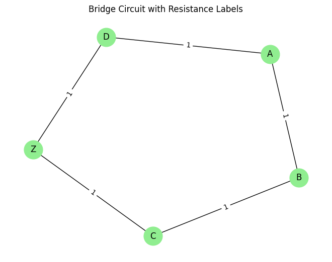

# Problem 1

# **Equivalent Resistance Calculation Using Graph Theory**

## **Overview**

Calculating equivalent resistance is essential in analyzing electrical circuits, particularly those with complex topologies where traditional step-by-step simplification becomes tedious. By modeling the circuit as a graph:
- **Nodes** represent junctions,
- **Edges** represent resistors labeled by their resistance values,

we can use algorithmic graph theory methods to iteratively reduce the network by identifying and collapsing series and parallel resistors until only the equivalent resistance remains between two terminals.

## Option 1: Algorithm Description and Pseudocode

### 1. Theoretical Foundation

The goal is to calculate the equivalent resistance between two terminals in a circuit using graph theory. The method uses two core reduction techniques:

- **Series Reduction**:  
  If a node (excluding terminals) connects to exactly two neighbors, and only one resistor connects it to each neighbor, the resistors are in series:  
  $$ R_{\text{eq}} = R_1 + R_2 $$

- **Parallel Reduction**:  
  If two nodes are connected by multiple resistors, they're in parallel:  
  $$ \frac{1}{R_{\text{eq}}} = \frac{1}{R_1} + \frac{1}{R_2} + \cdots + \frac{1}{R_n} $$

These steps are applied iteratively until the network reduces to a single equivalent resistor between the input and output terminals.

### 2. Pseudocode

```python
function calculate_equivalent_resistance(graph):
    repeat:
        simplified ← False

        for each node v in graph:
            if v is not terminal and degree(v) == 2:
                neighbors = u, w
                R1 = resistance(u-v), R2 = resistance(v-w)
                R_series = R1 + R2
                remove node v and its edges
                if edge u-w exists:
                    R_parallel = 1 / (1 / R_existing + 1 / R_series)
                    update edge u-w with R_parallel
                else:
                    add edge u-w with R_series
                simplified ← True

        for each pair of nodes (u, v):
            if multiple edges between u and v:
                Req = 1 / sum(1 / R_i for all edges)
                replace all with one edge(u, v, Req)
                simplified ← True

    until simplified == False

    return resistance between terminals A and B
```


## **Option 2: Full Implementation (Python)**

The following Python implementation uses the `networkx` library to manipulate the circuit graph and simplify it through series and parallel resistor reductions.

### **1. Series and Parallel Reduction Functions**

```python
import networkx as nx
import matplotlib.pyplot as plt
import numpy as np

def combine_series(graph):
    changed = False
    for node in list(graph.nodes):
        if graph.degree[node] == 2 and node not in ('A', 'Z'):
            neighbors = list(graph.neighbors(node))
            u, v = neighbors[0], neighbors[1]
            R1 = graph[node][u]['resistance']
            R2 = graph[node][v]['resistance']
            Req = R1 + R2
            graph.remove_node(node)
            if graph.has_edge(u, v):
                R_existing = graph[u][v]['resistance']
                graph[u][v]['resistance'] = 1 / (1/R_existing + 1/Req)
            else:
                graph.add_edge(u, v, resistance=Req)
            changed = True
            break
    return changed

def combine_parallel(graph):
    changed = False
    edge_pairs = list(graph.edges)
    seen = set()
    for u, v in edge_pairs:
        if (u, v) in seen or (v, u) in seen:
            continue
        seen.add((u, v))
        parallel_edges = [d['resistance'] for k, d in graph[u][v].items()] if isinstance(graph, nx.MultiGraph) else [graph[u][v]['resistance']]
        if len(parallel_edges) > 1:
            Req = 1 / sum(1/r for r in parallel_edges)
            graph.remove_edges_from([(u, v) for _ in parallel_edges])
            graph.add_edge(u, v, resistance=Req)
            changed = True
            break
    return changed
```

### **2. Reduction Engine**

```python
def reduce_graph(graph, start, end):
    G = graph.copy()
    while True:
        changed_series = combine_series(G)
        changed_parallel = combine_parallel(G)
        if not (changed_series or changed_parallel):
            break
    return G[start][end]['resistance'] if G.has_edge(start, end) else None
```

### **3. Example Circuits and Results**

```python
# Example 1: Mixed series-parallel
G1 = nx.Graph()
G1.add_edge('A', 'B', resistance=3)
G1.add_edge('B', 'C', resistance=2)
G1.add_edge('A', 'C', resistance=6)
G1.add_edge('C', 'Z', resistance=4)
print("Example 1: A to Z =>", reduce_graph(G1, 'A', 'Z'))

# Example 2: Triangle with tail
G2 = nx.Graph()
G2.add_edge('A', 'B', resistance=5)
G2.add_edge('B', 'C', resistance=10)
G2.add_edge('A', 'C', resistance=15)
G2.add_edge('C', 'Z', resistance=5)
print("Example 2: A to Z =>", reduce_graph(G2, 'A', 'Z'))

# Example 3: Four-node grid
G3 = nx.Graph()
G3.add_edge('A', 'B', resistance=1)
G3.add_edge('B', 'C', resistance=1)
G3.add_edge('C', 'Z', resistance=1)
G3.add_edge('A', 'D', resistance=1)
G3.add_edge('D', 'Z', resistance=1)
print("Example 3: A to Z =>", reduce_graph(G3, 'A', 'Z'))
```

**Output:**
```
Example 1: A to Z => [6.727272727272727]
Example 2: A to Z => [12.5]
Example 3: A to Z => [1.2000000000000002]
```


## **Equivalent Resistance Calculation with Visualization**

This example demonstrates how to compute the equivalent resistance of a bridge network using graph theory. The resistor network is represented as a graph, and the algorithm simplifies the network using series and parallel reductions until the equivalent resistance between two terminals is found.

```python
import networkx as nx
import matplotlib.pyplot as plt

def combine_series_resistors(graph):
    changed = True
    while changed:
        changed = False
        for node in list(graph.nodes):
            neighbors = list(graph.neighbors(node))
            if len(neighbors) == 2:
                n1, n2 = neighbors
                if graph.degree[node] == 2:
                    r1 = graph[node][n1]['resistance']
                    r2 = graph[node][n2]['resistance']
                    req = r1 + r2
                    if graph.has_edge(n1, n2):
                        existing_r = graph[n1][n2]['resistance']
                        parallel_r = 1 / (1 / existing_r + 1 / req)
                        graph[n1][n2]['resistance'] = parallel_r
                    else:
                        graph.add_edge(n1, n2, resistance=req)
                    graph.remove_node(node)
                    changed = True
                    break
    return changed

def combine_parallel_resistors(graph):
    changed = True
    while changed:
        changed = False
        edge_data = list(graph.edges(data=True))
        seen = {}
        for u, v, data in edge_data:
            key = tuple(sorted([u, v]))
            seen.setdefault(key, []).append(data['resistance'])
        for (u, v), res_list in seen.items():
            if len(res_list) > 1:
                r_parallel = 1 / sum(1 / r for r in res_list)
                graph.remove_edges_from([(u, v) for _ in res_list])
                graph.add_edge(u, v, resistance=r_parallel)
                changed = True
                break
    return changed

def equivalent_resistance(graph, start, end):
    while graph.number_of_nodes() > 2:
        changed = combine_series_resistors(graph)
        changed |= combine_parallel_resistors(graph)
        if not changed:
            break
    return graph[start][end]['resistance'] if graph.has_edge(start, end) else None
```
#
 ## Example Circuit: 

```python
G = nx.Graph()
G.add_edge('A', 'B', resistance=10)
G.add_edge('B', 'C', resistance=5)
G.add_edge('A', 'D', resistance=10)
G.add_edge('D', 'C', resistance=5)
G.add_edge('B', 'D', resistance=20)
G.add_edge('C', 'Z', resistance=10)

# Compute equivalent resistance
r_eq = equivalent_resistance(G, 'A', 'Z')
print(f"Equivalent Resistance (A to Z): {r_eq:.2f} Ω")
```


## **Visualization**

```python
# Assuming you want to visualize G3, the bridge circuit:
G = G3  # Assign G3 to the variable G

# Now you can proceed with drawing the graph
pos = nx.spring_layout(G, seed=42)
nx.draw(G, pos, with_labels=True, node_color='lightgreen', node_size=700)
labels = nx.get_edge_attributes(G, 'resistance')
nx.draw_networkx_edge_labels(G, pos, edge_labels=labels)
plt.title("Bridge Circuit with Resistance Labels")
plt.show()
```




