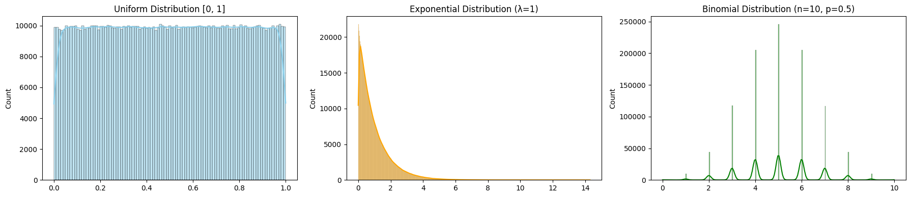
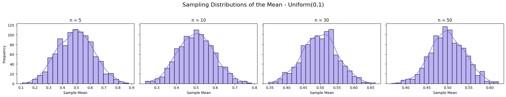
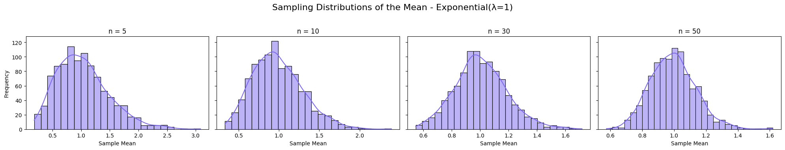
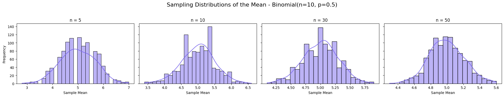
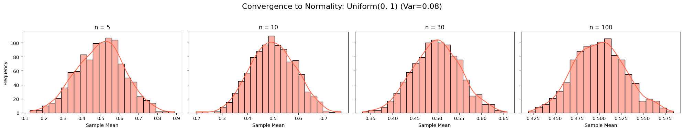
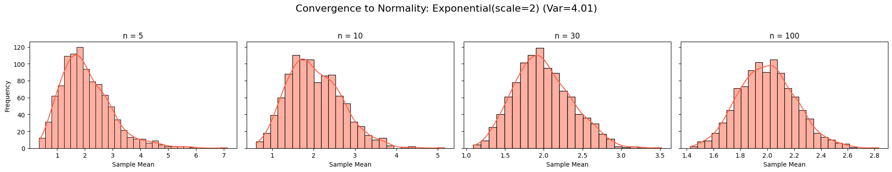
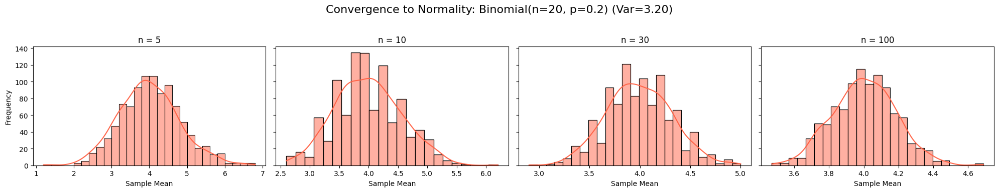

# 1. Simulating Sampling Distributions

## Objective

Simulate large population datasets from different probability distributions to study how their sample means behave a foundational step in exploring the Central Limit Theorem (CLT).

## Distributions Selected
- **Uniform distribution**: All values equally likely.
- **Exponential distribution**: Highly skewed, often used in time-between-events modeling.
- **Binomial distribution**: Discrete, based on probability of success/failure.

## Description of Populations

| Distribution   | Population Size | Mean (Expected) | Notes                       |
|----------------|-----------------|-----------------| ----------------------------|
| Uniform(0,1)   | 1,000,000       | $\approx 0.5$   | Symmetric, bounded          |
| Exponential    | 1,000,000       | $\approx 1.0$   | Skewed right, continuous    |
| Binomial       | 1,000,000       | $\approx 5.0$   | Discrete, symmetric when $p=0.5$ |


# 2. Parameter Exploration

## Objective

Explore how:
- The shape of the population distribution (e.g., symmetric vs. skewed),
- The population variance,
- The sample size $n$,

affect how quickly the sampling distribution of the mean converges to a normal distribution.

## Core Concept: CLT and Convergence

- The more skewed or non-normal a population is, the larger the sample size $n$ needed for the sample mean to appear normally distributed.
- The larger the population variance, the wider the sampling distribution of the sample mean.
- Regardless of the original shape, sample means tend to a normal distribution as $n \to \infty$.

## Quantitative Relationships

The standard deviation of the sampling distribution of the mean is:

$$ \sigma_{\bar{x}} = \frac{\sigma}{\sqrt{n}} $$

Where:
- $\sigma$ = standard deviation of the population,
- $n$ = sample size.


# 3. Practical Applications of the Central Limit Theorem

## Objective

Explain why the Central Limit Theorem matters in real-world scenarios and how it provides the mathematical foundation for making predictions, building models, and making decisions based on sampled data.

## Why CLT Is So Important

The CLT tells us that:
- The distribution of the sample mean approximates a normal distribution as the sample size increases, regardless of the population’s original shape.
- This principle is essential because in most practical cases, we don’t have access to the whole population, and we rely on samples.

## 1. Estimating Population Parameters

In scientific studies, economics, and medicine, we rarely get to study an entire population.

- Instead, we take samples (e.g., survey 1,000 people about income).
- Use the sample mean to estimate the true population mean.
- Thanks to CLT:
  - We know how the sample mean behaves.
  - We can compute confidence intervals for the population mean.
  - We can quantify the uncertainty of our estimate.

**Example**: Estimating average blood pressure in a population using a sample of 100 patients. CLT ensures the distribution of sample means is normal, allowing us to construct reliable confidence intervals for the true mean.

## 2. Quality Control in Manufacturing

In production, companies regularly inspect samples of their products to check for defects or inconsistencies.

- CLT allows manufacturers to:
  - Set up control charts (e.g., X̄-charts).
  - Detect when the average measurement of a product (e.g., weight, thickness) drifts from the target.
  - Determine if deviations are random or indicate a systematic problem.

**Example**: A factory samples 10 bolts from every batch. If the average diameter falls outside the control limits (based on CLT), the process is stopped and investigated.

## 3. Financial Modeling and Risk Management

In finance, risk and return estimates are often based on historical data samples.

- CLT enables:
  - Predicting average returns from sampled price data.
  - Constructing confidence intervals for expected investment returns.
  - Building Monte Carlo simulations based on assumed or sampled data.

**Example**: A portfolio manager uses past 30-day returns (samples) to predict future average return, and uses the CLT to compute the probability of large losses or gains.


# 4. Python Simulations

## Python Code: Generate Populations:

```python
import numpy as np
import matplotlib.pyplot as plt
import seaborn as sns

# Set seed for reproducibility
np.random.seed(42)

# Population size
N = 1000000  # 1 million values

# 1. Uniform Distribution [0, 1]
uniform_pop = np.random.uniform(0, 1, N)

# 2. Exponential Distribution (λ=1 → scale=1)
exp_pop = np.random.exponential(scale=1.0, size=N)

# 3. Binomial Distribution (n=10, p=0.5)
binom_pop = np.random.binomial(n=10, p=0.5, size=N)

# Plot the populations
fig, axs = plt.subplots(1, 3, figsize=(18, 4))

sns.histplot(uniform_pop, kde=True, ax=axs[0], color='skyblue')
axs[0].set_title("Uniform Distribution [0, 1]")

sns.histplot(exp_pop, kde=True, ax=axs[1], color='orange')
axs[1].set_title("Exponential Distribution (λ=1)")

sns.histplot(binom_pop, kde=True, ax=axs[2], color='green')
axs[2].set_title("Binomial Distribution (n=10, p=0.5)")

plt.tight_layout()
plt.show()
```




## Explanation: Population Distribution Simulation

This Python script generates and visualizes histograms of three population distributions with 1,000,000 samples each, using NumPy and Seaborn, to study their shapes.

### Parameters
- **Uniform Distribution [0, 1]**: Random values between 0 and 1, symmetric and bounded.
- **Exponential Distribution (λ=1)**: Positive values with right skew, scale parameter 1.0.
- **Binomial Distribution (n=10, p=0.5)**: Discrete values from 0 to 10, symmetric due to $p=0.5$.

### Simulation Method
- Uses `np.random.uniform`, `np.random.exponential`, and `np.random.binomial` to generate populations.
- Plots histograms with kernel density estimation (KDE) for each distribution.

### Plot
- Displays three subplots: Uniform (skyblue), Exponential (orange), and Binomial (green).
- Titles indicate the distribution parameters, with equal y-axis scales for comparison.


##  Python Code: CLT Sampling Simulation

```python
import numpy as np
import matplotlib.pyplot as plt
import seaborn as sns

# Use the populations from Task 1 (assume already defined)
distributions = {
    "Uniform(0,1)": np.random.uniform(0, 1, 1000000),
    "Exponential(λ=1)": np.random.exponential(1.0, 1000000),
    "Binomial(n=10, p=0.5)": np.random.binomial(10, 0.5, 1000000)
}

sample_sizes = [5, 10, 30, 50]
n_repeats = 1000

# Plotting
for dist_name, population in distributions.items():
    fig, axs = plt.subplots(1, len(sample_sizes), figsize=(20, 4), sharey=True)
    fig.suptitle(f'Sampling Distributions of the Mean - {dist_name}', fontsize=16)

    for i, n in enumerate(sample_sizes):
        sample_means = []
        for _ in range(n_repeats):
            sample = np.random.choice(population, size=n, replace=False)
            sample_means.append(np.mean(sample))

        sns.histplot(sample_means, kde=True, ax=axs[i], color='mediumslateblue')
        axs[i].set_title(f'n = {n}')
        axs[i].set_xlabel("Sample Mean")
        axs[i].set_ylabel("Frequency")

    plt.tight_layout(rect=[0, 0.03, 1, 0.95])
    plt.show()
```







## Explanation: Sampling Distributions of the Mean Simulation

This Python script simulates the sampling distributions of the mean for three population distributions (Uniform, Exponential, Binomial) at different sample sizes, illustrating the Central Limit Theorem (CLT).

### Parameters
- **Distributions**: Uniform(0,1), Exponential($\lambda=1$), Binomial($n=10$, $p=0.5$), each with 1,000,000 values.
- **Sample Sizes ($n$)**: 5, 10, 30, 50.
- **Repeats**: 1000 samples per size to compute sample means.

### Simulation Method
- For each distribution and sample size $n$, draws 1000 samples (without replacement).
- Computes the mean of each sample and plots the distribution of sample means.

### Plot
- Displays four subplots per distribution, showing histograms of sample means for $n=5$, 10, 30, 50.
- Overlays a kernel density estimate (KDE) curve.
- Uniform: Means center around 0.5, becoming more normal as $n$ increases.
- Exponential: Means center around 1.0, initially skewed but normalizing by $n=50$.
- Binomial: Means center around 5.0, nearly normal even at $n=5$ due to symmetry.


## Python Simulation: Explore Shape and Variance Effects

```python
import numpy as np
import matplotlib.pyplot as plt
import seaborn as sns

# Distributions with different shapes and variances
populations = {
    "Uniform(0, 1)": np.random.uniform(0, 1, 1000000),           # low variance, symmetric
    "Exponential(scale=2)": np.random.exponential(2, 1000000),   # high variance, skewed
    "Binomial(n=20, p=0.2)": np.random.binomial(20, 0.2, 1000000) # discrete + skewed
}

sample_sizes = [5, 10, 30, 100]
n_repeats = 1000

# Visualize how convergence depends on shape and variance
for name, pop in populations.items():
    pop_var = np.var(pop)
    print(f"Population: {name}, Variance: {pop_var:.4f}")
    
    fig, axs = plt.subplots(1, len(sample_sizes), figsize=(20, 4), sharey=True)
    fig.suptitle(f"Convergence to Normality: {name} (Var={pop_var:.2f})", fontsize=16)

    for i, n in enumerate(sample_sizes):
        means = [np.mean(np.random.choice(pop, size=n, replace=False)) for _ in range(n_repeats)]
        sns.histplot(means, kde=True, ax=axs[i], color='tomato')
        axs[i].set_title(f'n = {n}')
        axs[i].set_xlabel('Sample Mean')
        axs[i].set_ylabel('Frequency')
    
    plt.tight_layout(rect=[0, 0.03, 1, 0.95])
    plt.show()
```






## Explanation: Convergence to Normality Simulation

This Python script simulates the sampling distributions of the mean for three populations with different shapes and variances, demonstrating the Central Limit Theorem (CLT) convergence to normality.

### Parameters
- **Populations**:
  - Uniform(0,1): Low variance (0.08), symmetric.
  - Exponential(scale=2): High variance (4.01), skewed.
  - Binomial(n=20, p=0.2): Variance (3.20), discrete, skewed.
- **Sample Sizes ($n$)**: 5, 10, 30, 100.
- **Repeats**: 1000 samples per size.

### Simulation Method
- For each population and $n$, computes 1000 sample means (without replacement).
- Plots histograms of sample means with a kernel density estimate (KDE).

### Plot
- Displays four subplots per population, showing sample mean distributions for $n=5$, 10, 30, 100.
- Uniform: Quickly normal (even at $n=5$) due to symmetry, low variance.
- Exponential: Initially skewed, approaches normality by $n=100$, slower due to high variance.
- Binomial: Slightly skewed at $n=5$, nearly normal by $n=30$.

