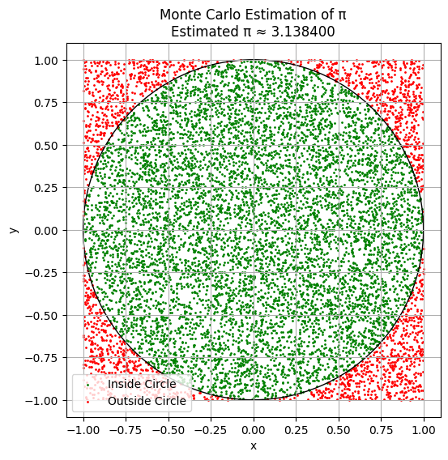
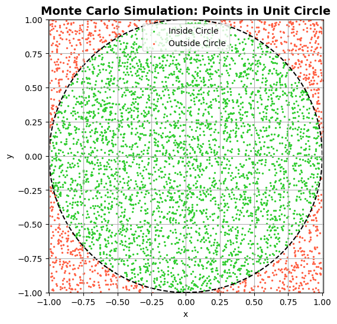
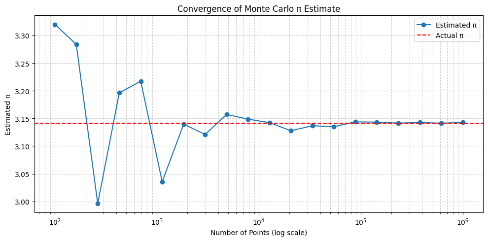
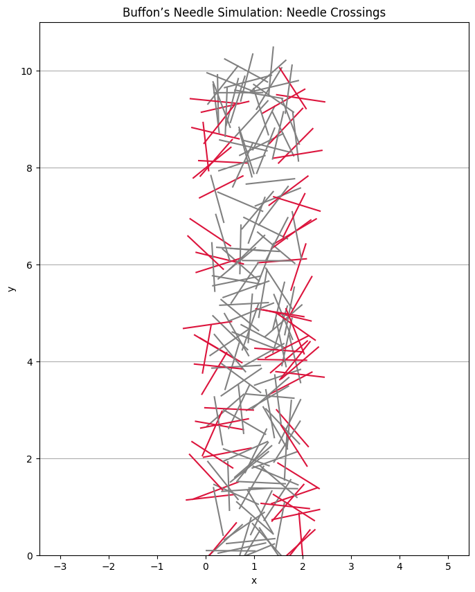
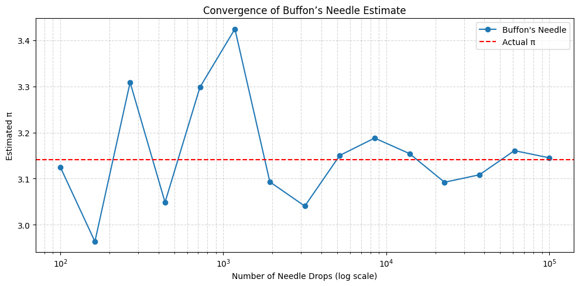

# Part 1: Estimating π Using a Circle

# 1. Theoretical Foundation: Estimating π Using Random Points in a Circle

## The Idea

Monte Carlo methods use random sampling to estimate values based on probability. To estimate $\pi$, we can simulate a simple geometric setup:
- A unit square with sides of length 1.
- A quarter circle (or full circle) inscribed inside that square.
- By randomly generating points in the square, we can compute the ratio of points that fall inside the circle.
- This ratio helps us estimate $\pi$ using geometry.

## Step-by-Step Geometric Insight

Consider:
- A unit circle centered at the origin $(0, 0)$, so the radius $r = 1$.
- A square bounding this circle, ranging from $(-1, -1)$ to $(1, 1)$.
- Area of the circle: $\pi r^2 = \pi \cdot 1^2 = \pi$.
- Area of the square: $(2 \cdot r)^2 = 4$.

The theoretical ratio of the areas is:

$$ \frac{\text{Area of Circle}}{\text{Area of Square}} = \frac{\pi}{4} $$

If we randomly generate points in the square, the fraction that fall inside the circle should approach this ratio:

$$ \frac{\text{Points in Circle}}{\text{Total Points}} \approx \frac{\pi}{4} $$

## Estimating π

Solving for $\pi$:

$$ \pi \approx 4 \cdot \left( \frac{\text{Points inside the circle}}{\text{Total points}} \right) $$

This estimate becomes more accurate as the number of points increases.


# Part 2: Estimating π Using Buffon’s Needle


# 1. Theoretical Foundation: Buffon’s Needle Problem

## What Is Buffon’s Needle?

Buffon’s Needle is a classic probability problem first posed by Georges-Louis Leclerc, Comte de Buffon in the 18th century. It shows how we can estimate the value of $\pi$ using a purely geometric probability experiment.

## The Setup

Imagine a floor with parallel lines spaced $d$ units apart.

Now, suppose we randomly drop a needle of length $L$ onto the floor. Some needles will cross one of the lines, and some won’t.

## Key Assumptions

- The needle length $L$ is less than or equal to the distance between lines $d$.
- Each drop is completely random in both:
  - The center position of the needle.
  - The angle the needle forms with respect to the lines.

## Theoretical Probability of a Crossing

The probability that the needle crosses a line is:

$$ P = \frac{2L}{\pi d} $$

Where:
- $L$: Needle length,
- $d$: Distance between lines,
- $\pi$: The constant we aim to estimate.

## Use Simulation to Estimate π

If we perform the experiment $N$ times and observe $C$ crossings, then the probability is approximated as:

$$ P \approx \frac{C}{N} $$

Substitute into the formula for $P$ and solve for $\pi$:

$$ \frac{C}{N} \approx \frac{2L}{\pi d} \quad \Rightarrow \quad \pi \approx \frac{2L \cdot N}{d \cdot C} $$

## Final Estimation Formula

$$ \pi \approx \frac{2 \cdot L \cdot N}{d \cdot C} $$

Where:
- $L$: Needle length,
- $d$: Distance between lines,
- $N$: Number of throws (total drops),
- $C$: Number of crossings.
#


# Simulations  (Part 1)


## 1. Monte Carlo Simulation to Estimate π

```python
import numpy as np
import matplotlib.pyplot as plt

# Number of random points
N = 10000

# Generate random (x, y) points in the square [-1, 1] × [-1, 1]
x = np.random.uniform(-1, 1, N)
y = np.random.uniform(-1, 1, N)

# Calculate distance from origin (0, 0)
dist = np.sqrt(x**2 + y**2)

# Count how many points fall inside the unit circle (r <= 1)
inside_circle = dist <= 1
n_inside = np.sum(inside_circle)

# Estimate π
pi_estimate = 4 * n_inside / N

# Print result
print(f"Estimated π with {N} points: {pi_estimate:.6f}")

# --- Optional: Plot points ---
plt.figure(figsize=(6,6))
plt.scatter(x[inside_circle], y[inside_circle], color='green', s=1, label='Inside Circle')
plt.scatter(x[~inside_circle], y[~inside_circle], color='red', s=1, label='Outside Circle')
circle = plt.Circle((0, 0), 1, color='black', fill=False)
plt.gca().add_patch(circle)
plt.gca().set_aspect('equal')
plt.title(f"Monte Carlo Estimation of π\nEstimated π ≈ {pi_estimate:.6f}")
plt.legend()
plt.xlabel("x")
plt.ylabel("y")
plt.grid(True)
plt.show()
```




## How It Works

Points are randomly scattered in a square.

We use the circle equation $$x^2 + y^2 \leq 1$$ to determine if they land inside the unit circle.

The ratio of inside points to total points approximates $\pi/4$, which we scale by 4 to estimate $\pi$.

## Observations

- With small $N$, results vary (more noise).
- With large $N$, estimate converges to true $\pi \approx 3.1416$.
- Visually, we can see the points inside the circle forming a filled disk.
#


## 2. Visualization of Monte Carlo Points

```python
import numpy as np
import matplotlib.pyplot as plt

# Number of points
N = 5000

# Generate random (x, y) in square [-1, 1] x [-1, 1]
x = np.random.uniform(-1, 1, N)
y = np.random.uniform(-1, 1, N)

# Determine if inside the unit circle
r_squared = x**2 + y**2
inside = r_squared <= 1

# Plot setup
plt.figure(figsize=(6, 6))
plt.scatter(x[inside], y[inside], color='limegreen', s=2, label='Inside Circle')
plt.scatter(x[~inside], y[~inside], color='tomato', s=2, label='Outside Circle')

# Add the actual circle boundary
circle = plt.Circle((0, 0), 1, color='black', fill=False, linestyle='--', linewidth=1.5)
plt.gca().add_patch(circle)

# Aesthetics
plt.title("Monte Carlo Simulation: Points in Unit Circle", fontsize=14, weight='bold')
plt.xlabel("x")
plt.ylabel("y")
plt.axis('equal')
plt.xlim(-1, 1)
plt.ylim(-1, 1)
plt.legend()
plt.grid(True)
plt.show()
```



#


 
 
## 3. Analysis of Convergence in Monte Carlo Estimation of 𝜋


```python
import numpy as np
import matplotlib.pyplot as plt

# Target: real value of π
true_pi = np.pi

# Simulate increasing numbers of points
sample_sizes = np.logspace(2, 6, num=20, dtype=int)  # from 100 to 1,000,000
pi_estimates = []

for N in sample_sizes:
    x = np.random.uniform(-1, 1, N)
    y = np.random.uniform(-1, 1, N)
    inside = (x**2 + y**2) <= 1
    pi_est = 4 * np.sum(inside) / N
    pi_estimates.append(pi_est)

# Plot convergence
plt.figure(figsize=(10, 5))
plt.plot(sample_sizes, pi_estimates, marker='o', linestyle='-', label='Estimated π')
plt.axhline(true_pi, color='red', linestyle='--', label='Actual π')
plt.xscale('log')
plt.xlabel("Number of Points (log scale)")
plt.ylabel("Estimated π")
plt.title("Convergence of Monte Carlo π Estimate")
plt.grid(True, which='both', linestyle='--', alpha=0.6)
plt.legend()
plt.tight_layout()
plt.show()
```




## Observations

| Sample Size (N)       | Behavior                              |
|-----------------------|---------------------------------------|
| Small $N$ (e.g. 100)  | Estimate fluctuates significantly    |
| Moderate $N$ (e.g. 1,000–10,000) | Estimate stabilizes but with visible noise |
| Large $N$ (≥ 100,000) | Estimate converges closer to $\pi \approx 3.1416$ |

## Discussion: Convergence Rate

Monte Carlo methods converge slowly:

$$ \text{Error} \propto \frac{1}{\sqrt{N}} $$

This means to reduce error by 10×, you need 100× more points.

Variance of estimate decreases with larger sample sizes, but at diminishing returns.

Convergence is stochastic—each run gives slightly different results.

## Computational Considerations

| Factor         | Impact                          |
|---------------|---------------------------------|
| $N$ (sample size) | Larger $N$ improves accuracy    |
| Runtime        | Increases linearly with $N$     |
| Memory         | Can be a limit with large arrays |
| Random seed    | Affects reproducibility         |

For accurate results in practice: use $N \geq 10^5$, and consider repeating runs and averaging.
#


# Simulations  (Part 2)

## 1.  Simulation of Needle Drops

```python
import numpy as np

# Parameters
L = 1.0         # needle length
d = 2.0         # distance between lines (must be >= L)
N = 10000       # number of needle drops

# Simulation: generate N random drops
x_centers = np.random.uniform(0, d / 2, N)           # distance from needle center to nearest line
theta = np.random.uniform(0, np.pi / 2, N)           # angle between needle and lines

# A crossing occurs if the vertical component exceeds x_center
crossings = x_centers <= (L / 2) * np.sin(theta)
C = np.sum(crossings)

# Estimate π
if C > 0:
    pi_estimate = (2 * L * N) / (d * C)
    print(f"Estimated π (Buffon's Needle, N={N}): {pi_estimate:.6f}")
else:
    print("No crossings detected — increase N or adjust parameters.")
```


## How It Works

- $x_{\text{center}}$: Random vertical distance from the needle’s center to the closest line.
- $\theta$: Random angle between the needle and the lines (uniformly distributed from 0 to $\pi/2$).

A crossing happens when the projection of half the needle’s length is long enough to touch a line, i.e.:

$$ \frac{L}{2} \cdot \sin(\theta) \geq x_{\text{center}} $$

## Result

We’ll get a printout like:

```rust
Estimated π (Buffon's Needle, N=10000): 3.168568
```
Which will improve with higher  $N$ due to the law of large numbers.
#


## 2. Visualization of Buffon’s Needle Simulation

```python
import numpy as np
import matplotlib.pyplot as plt

# Parameters
L = 1.0      # needle length
d = 2.0      # distance between parallel lines
N = 200      # number of needles to plot (for clarity)

# Generate random center positions and angles
x_centers = np.random.uniform(0, d, N)
y_centers = np.random.uniform(0, 10, N)         # extend vertically to see multiple lines
theta = np.random.uniform(0, np.pi, N)          # angle in radians

# Compute needle endpoints
x1 = x_centers - (L / 2) * np.cos(theta)
x2 = x_centers + (L / 2) * np.cos(theta)
y1 = y_centers - (L / 2) * np.sin(theta)
y2 = y_centers + (L / 2) * np.sin(theta)

# Check which needles cross a line
crossings = ((np.floor(x1 / d) != np.floor(x2 / d)))

# Plot
plt.figure(figsize=(8, 10))

# Draw horizontal parallel lines
num_lines = int(np.ceil(max(y_centers) + L))
for k in range(0, num_lines):
    plt.axhline(k * d, color='black', linewidth=0.5, alpha=0.5)

# Plot needles
for i in range(N):
    color = 'crimson' if crossings[i] else 'gray'
    plt.plot([x1[i], x2[i]], [y1[i], y2[i]], color=color, linewidth=1.5)

# Aesthetics
plt.title("Buffon’s Needle Simulation: Needle Crossings")
plt.xlabel("x")
plt.ylabel("y")
plt.axis("equal")
plt.xlim(0, d)
plt.ylim(0, max(y_centers) + L)
plt.grid(False)
plt.show()
```



## Plot Description

- Black horizontal lines = floor lines spaced by $d$.
- Each line segment = a needle dropped at a random angle and position.
- Red needles = crossed a line.
- Gray needles = did not cross a line.

This visual lets viewers see the randomness and how the crossing rate relates to estimating $\pi$.
#


## 3. Track Convergence of Buffon’s Needle

```python
import numpy as np
import matplotlib.pyplot as plt

# Parameters
L = 1.0
d = 2.0
true_pi = np.pi

# Logarithmically increasing sample sizes
sample_sizes = np.logspace(2, 5, num=15, dtype=int)  # from 100 to 100,000
pi_estimates_buffon = []

# Simulate and estimate π for each sample size
for N in sample_sizes:
    x_centers = np.random.uniform(0, d / 2, N)
    theta = np.random.uniform(0, np.pi / 2, N)
    crossings = x_centers <= (L / 2) * np.sin(theta)
    C = np.sum(crossings)
    if C > 0:
        pi_est = (2 * L * N) / (d * C)
    else:
        pi_est = np.nan  # Avoid division by zero
    pi_estimates_buffon.append(pi_est)

# Plot convergence
plt.figure(figsize=(10, 5))
plt.plot(sample_sizes, pi_estimates_buffon, marker='o', label="Buffon's Needle")
plt.axhline(true_pi, color='red', linestyle='--', label='Actual π')
plt.xscale('log')
plt.xlabel("Number of Needle Drops (log scale)")
plt.ylabel("Estimated π")
plt.title("Convergence of Buffon’s Needle Estimate")
plt.legend()
plt.grid(True, which='both', linestyle='--', alpha=0.5)
plt.tight_layout()
plt.show()
```




## Interpretation of Results

### Convergence Behavior

| Sample Size       | Behavior                        |
|-------------------|---------------------------------|
| Small $N$ (<1,000) | High variability, poor estimate |
| Moderate $N$      | Rough approximation             |
| Large $N$ (≥10,000) | Gradual convergence toward $\pi$ |

The estimation converges slowly due to random angle dependence.

Like the circle method, accuracy improves as $N \to \infty$
#

### Comparison: Buffon’s Needle vs. Circle-Based Method

| Feature            | Circle-Based Method         | Buffon’s Needle             |
|--------------------|-----------------------------|-----------------------------|
| Convergence rate   | $\propto \frac{1}{\sqrt{N}}$ | $\propto \frac{1}{\sqrt{N}}$ |
| Variance           | Lower                       | Higher (due to sine in denominator) |
| Visual intuition   | Clear geometry (circle area) | Historical, less intuitive  |
| Implementation     | Very simple                 | Slightly more complex       |
| Practical accuracy | More stable                 | More noisy without very large $N$ |
