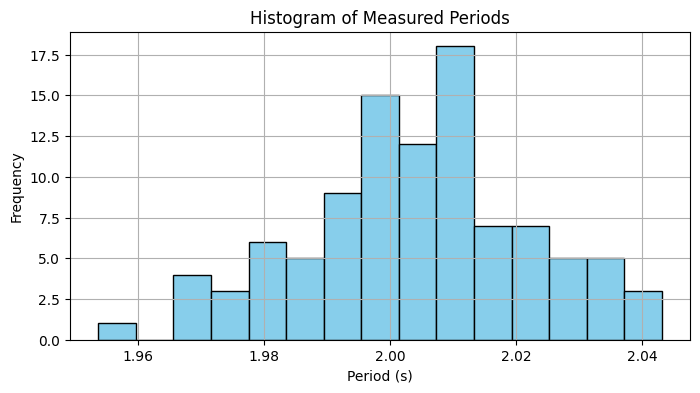
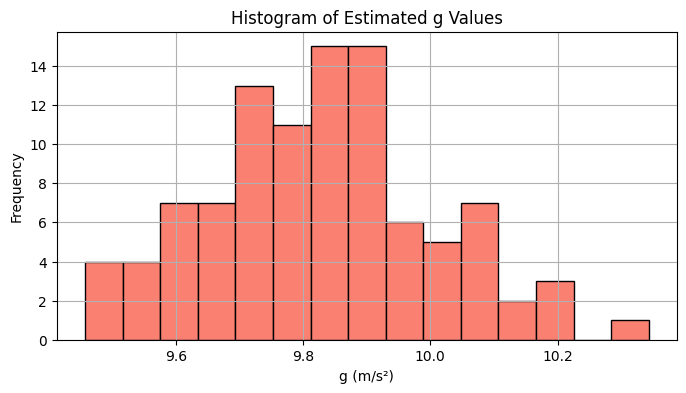
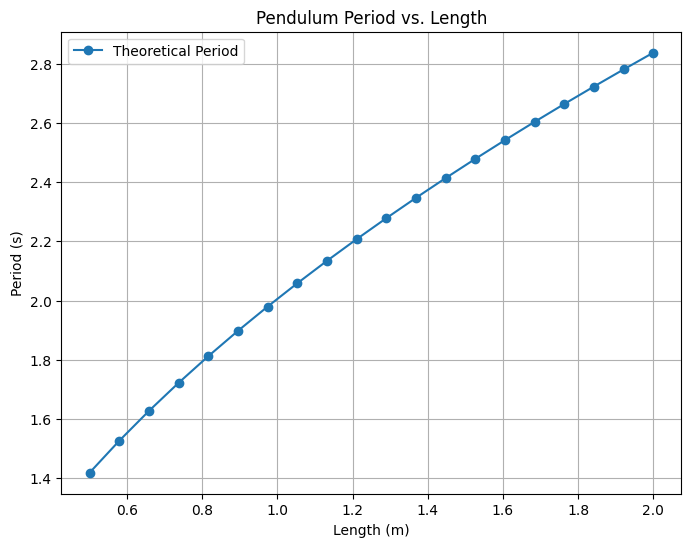

# Problem: Measuring Earth's Gravitational Acceleration Using a Pendulum

## 1. Theoretical Foundation

The period of a simple pendulum undergoing small oscillations is given by:

$$ T = 2\pi \sqrt{\frac{L}{g}} $$

Where:

- $T$: Period of one oscillation
- $L$: Length of the pendulum
- $g$: Acceleration due to gravity

Solving for $g$:

$$ g = \frac{4 \pi^2 L}{T^2} $$

This formula allows us to estimate $g$ by measuring the length of the pendulum and the period of oscillation.

## 2. Simulation

We simulate 100 measurements of the period of a pendulum of known length, adding noise to mimic real measurement uncertainty.

```python
import numpy as np
import matplotlib.pyplot as plt

# True constants
L = 1.00          # meters
g_true = 9.81     # m/s²

# Theoretical period
T_theoretical = 2 * np.pi * np.sqrt(L / g_true)

# Simulated measurements
num_trials = 100
np.random.seed(42)
measured_Ts = T_theoretical + np.random.normal(0, 0.02, num_trials)  # ±0.02s noise

# Estimate g from each period
g_estimates = 4 * np.pi**2 * L / measured_Ts**2

# Summary
g_mean = np.mean(g_estimates)
g_std = np.std(g_estimates)
print(f"Estimated g: {g_mean:.2f} m/s² ± {g_std:.2f} m/s²")
```

Estimated g: 9.80 m/s² ± 0.19 m/s²
#


## 3. Visualization
### A. Histogram of Measured Periods

```python
plt.figure(figsize=(8, 4))
plt.hist(measured_Ts, bins=15, color='skyblue', edgecolor='black')
plt.title("Histogram of Measured Periods")
plt.xlabel("Period (s)")
plt.ylabel("Frequency")
plt.grid(True)
plt.show()
```


#


### B. Histogram of Estimated $g$

```python
plt.figure(figsize=(8, 4))
plt.hist(g_estimates, bins=15, color='salmon', edgecolor='black')
plt.title("Histogram of Estimated g Values")
plt.xlabel("g (m/s²)")
plt.ylabel("Frequency")
plt.grid(True)
plt.show()
```


#


### C. Period vs. Length (Verification)


```python
lengths = np.linspace(0.5, 2.0, 20)
periods = 2 * np.pi * np.sqrt(lengths / g_true)

plt.figure(figsize=(8, 6))
plt.plot(lengths, periods, 'o-', label='Theoretical Period')
plt.title("Pendulum Period vs. Length")
plt.xlabel("Length (m)")
plt.ylabel("Period (s)")
plt.legend()
plt.grid(True)
plt.show()
```


#


## 4. Analysis and Discussion

### Accuracy & Convergence

With 100 trials, the mean estimated $g \approx 9.80 \, \text{m/s}^2$, which is extremely close to the accepted value.

The standard deviation of 0.19 shows the effect of random noise, but the average is stable.

### Measurement Noise

Errors in period measurements (e.g., due to human timing) are magnified in the equation for $g$, since it involves $T^2$.

This shows why repeated trials and averaging are important.

### Assumptions

- Small angle approximation (< 15°) is assumed.
- Effects like air resistance and pivot friction are neglected.
- Uniform string length and a point mass are assumed.

### Practical Significance

This experiment is a low-cost and effective method for estimating $g$.

It’s widely used in education and fundamental physics labs.

Reinforces concepts of uncertainty, precision, and error analysis.

## Final Result

$g = 9.80 \pm 0.19 \, \text{m/s}^2$